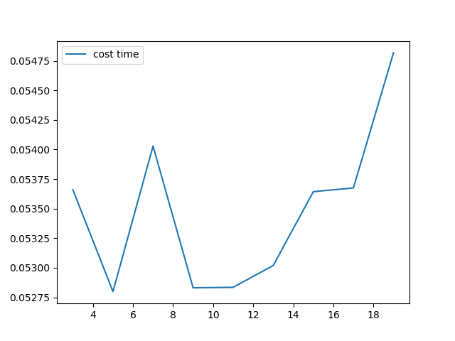
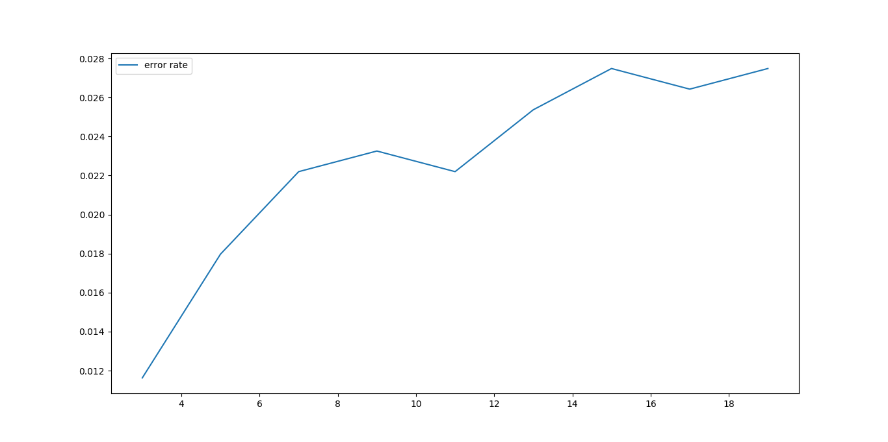

# 1. KNN简介
&emsp;&emsp;knn(k-nearest neighbor)分类算法是通过离他最近的k的邻居的类别进行投票的分类算法。knn是instance-based learning属于懒惰学习，也就是说并没有具体的学习过程,数据在使用时已经确定好要使用哪个特征值进行比较。
&emsp;&emsp;knn的具体操作思路是：从现有的数据集中筛选出k个和未知数据在已知特征上最近的k个样本然后通过投票或者其他办法获得目标类别。
&emsp;&emsp;算法过程：
- 1. 计算测试数据和训练数据之间的距离；
- 2. 选取k个距离最小的样本；
- 3. 通过投票获取目标类别。

&emsp;&emsp;knn本身很多都是未知的，比如选取哪个特征，特征距离度量，k值如何选取都堆最终的结果有一定的影响。

# 2 knn的影响因素
## 2.1 如何选取feature
&emsp;&emsp;这种情况大部分都是凭借研究员的经验和数据敏感度，现如今可以使用dnn进行特征提取。

## 2.2 如何选取k值
&emsp;&emsp;首先k应该取奇数保证投票时不会产生二义性的结果；k不宜过大，使得投票没有意义，所有的样本的投票结果相似；k不宜过小，样本不足。
&emsp;&emsp;常用方法是将k从$1~√{n}$进行遍历(n为样本量)，利用不同k的误差率进行选择。

## 2.3 距离度量
&emsp;&emsp;参考[距离度量]()

# 3 优缺点
## 3.1 优点
- knn算法是最简单有效的分类算法，简单且容易实现。

## 3.2 缺点
- 当训练数据集很大时，需要大量的存储空间，而且需要计算待测样本和训练数据集中所有样本的距离，所以非常耗时
- knn对于随机分布的数据集分类效果较差，对于类内间距小，类间间距大的数据集分类效果好，而且对于边界不规则的数据效果好于线性分类器。
- knn对于样本不均衡的数据效果不好，需要进行改进。改进的方法时对k个近邻数据赋予权重，比如距离测试样本越近，权重越大。
- knn很耗时，时间复杂度为O(n)，一般适用于样本数较少的数据集，当数据量大时，可以将数据以树的形式呈现，能提高速度，常用的有kd-tree和ball-tree。

# 4 实现
## 4.1 python实现
```python
class knn(object):
    def __init__(self, data, label):
        self.data = data
        self.label = label
        
    def distance(self, x):
        diff = np.tile(x, (self.data.shape[0], 1)) - self.data
        return ((diff ** 2).sum(axis=1)) ** 0.5
        
    def classify(self, x, k):
        distance = self.distance(x)
        distance = distance.argsort()
        cls_count = {}
        for i in range(k):
            vote_label = self.label[distance[i]]
            cls_count[vote_label] = cls_count.get(vote_label, 0) + 1
            
        sorted_cls = sorted(cls_count.items(), key=operator.itemgetter(1), reverse=True)
        return sorted_cls[0][0]
```
## 4.2 性能测试


