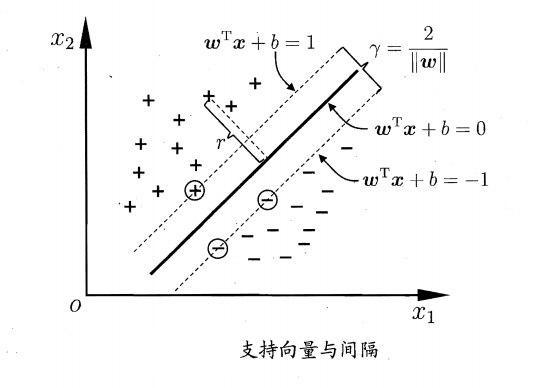
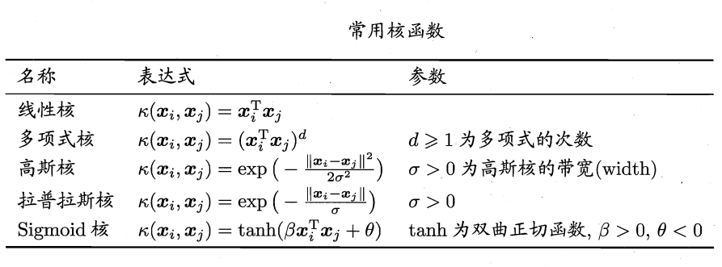
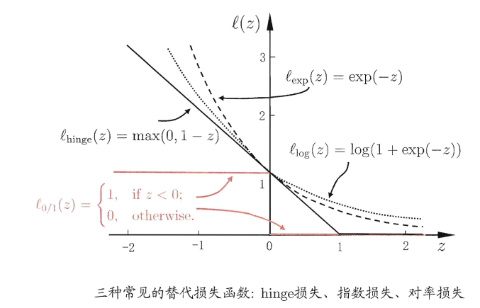
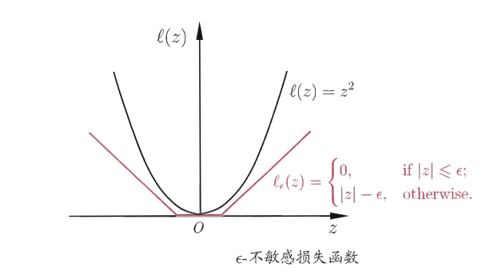
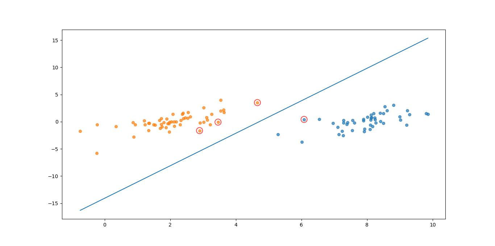
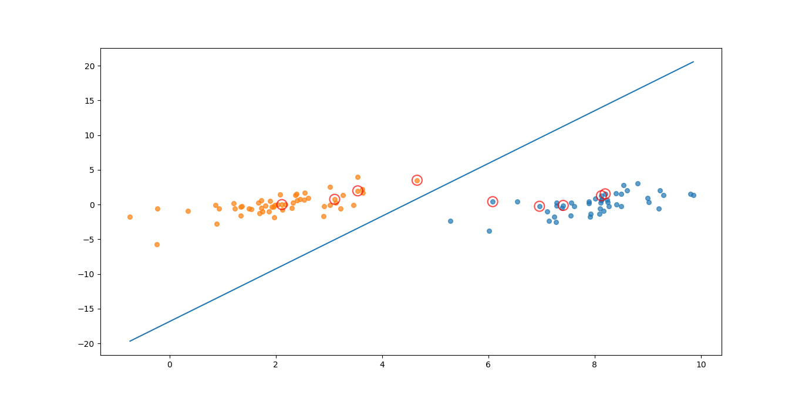
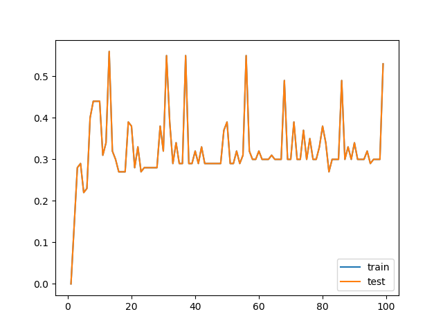

# 1 支持向量机
&emsp;&emsp;对于分类问题，训练数据集$D={(x_1,y_1),...,(x_m,y_m)}, y_i∈{-1,+1}$，可能存在很多将数据分类的超平面，而如何找到最佳的一个这就是支持向量机要解决的问题。
## 1.1 支持向量
&emsp;&emsp;见划分超平面用线性方程表示为：
$$
\textbf{w}^T\textbf{x}+b=0
$$
&emsp;&emsp;则样本空间任意点$x$到该超平面的距离为:
$$
r=\frac{\text{w}^T\textbf{x}+b}{||\textbf{w}||}
$$
&emsp;&emsp;假设对所有的训练集都正确可分且存在如下条件:
$$
\begin{aligned}
&\textbf{w}^T\textbf{x}_i+b≥gap,y_i=1;\\
&\textbf{w}^T\textbf{x}_i+b≤-gap,y_i=-1;\\
\end{aligned}
$$
&emsp;&emsp;定义训练集上使得上面的可分条件等号成立的点，即落在可分超平面上的点位支持向量(support vector)，两个不同类别的支持向量到超平面的距离之和为：
$$
γ=\frac{2}{||w||}
$$
&emsp;&emsp;$γ$称之为间隔。


&emsp;&emsp;欲找到最大间隔的划分超平面也就是使得:
$$
\begin{aligned}
& \mathop{max}\limits_{w,b} \frac{2}{||\textbf{w}||}\\
& s.t. y_i(\textbf{w}^T\textbf{x}_i+b)≥1, i=1,2,...,m \\
⇒& \mathop{max}\limits_{w,b}\frac{1}{2}||\textbf{w}||^w \\
& s.t. y_i(\textbf{w}^T\textbf{x}_i+b)≥1, i=1,2,...,m
\end{aligned}
$$

## 1.2 求解
&emsp;&emsp;可以将上面的问题通过拉格朗日乘子法得到对偶问题，对每个拉格朗日乘子添加约束$\alpha_i≥0$，则问题的拉格朗日函数可写为：
$$
L(\textbf{w},b,\textbf{α})=\frac{1}{2}||\textbf{w}||^2+\sum_{i=1}^m{α_i(1-y_i(\textbf{w}^T\textbf{x}_i+b))}
$$
&emsp;&emsp;分别对$w,b$求偏导:
$$
\begin{aligned}
    \textbf{w}=∑_{i=1}^m α_i y_i\textbf{x}_i\\
    -=∑_{i=1}^m α_i y_i
\end{aligned}
$$
&emsp;&emsp;带入得到原问题的对偶问题：
$$
\begin{aligned}
   &\mathop{max}\limits_α∑_{i=1}^m α_i-\frac{1}{2}∑_{i=1}^m∑_{j=1}^mα_iα_jy_iy_j\textbf{x}_i^T\textbf{x}_j\\
s.t. &∑_{i=1}^mα_iy_i=0,\\
&α_i≥0, i=1,2,...,m 
\end{aligned}
$$
&emsp;&emsp;解出$\textbf{α}$得到：
$$
f(\textbf{x})=∑_{i=1}^mα_iy_i\textbf{x}^T_i\textbf{x}+b
$$
&emsp;&emsp;需要注意的是$α_i$的解需要满足KKT条件：
$$
\left\{\begin{array}{l}
{\alpha_{i} \geqslant 0} \\
{y_{i} f\left(x_{i}\right)-1 \geqslant 0} \\
{\alpha_{i}\left(y_{i} f\left(x_{i}\right)-1\right)=0}
\end{array}\right.
$$
&emsp;&emsp;对于上式$α_i=0$或者$y_if(\textbf{x}_i)=1$成立，如果$α_i=0$则该样本不会对结果有影响；若$y_if(\textbf{x}_i)=1$则该样本就是支持向量。

## 1.3 SMO
&emsp;&emsp;上述问题的求解本身和样本量挂钩，SMO是一个解决上述问题的高效算法。
&emsp;&emsp;SMO 的基本思路是先固定$α_i$之外的所有参数，然后求向上的极值。由于存在约束$∑_{i=1}^mα_iy_i=0$，若固定$α_i$之外的其他变量,则$α_i$可由其他变量导出。SMO每次选择两个变量$α_i,α_j$，并固定其他参数。这样，在参数初始化后，SMO不断执行如下两个步骤直至收敛:
- 选取一对需要更新的变量$α_i$和$α_j$;
- 固定两个变量之外的其他参数，求解更新后的解。

&emsp;&emsp;注意到只需选取的$α_i$和$α_j$中有一个不满足KKT条件，目标函数就会在选代后减小。直观来看， KKT 条件违背的程度越大，则变量更新后可能导致的目标函数值减幅越大。于是，SMO先选取违背KKT条件程度最大的变量。第二个变量应选择一个使目标函数值减小最快的变量，但由于比较各变量所对应的目标函数值减幅的复杂度过高，因此 SMO 采用了一个启发式:使选取的两变量所对应样本之间的问隔最大. 种直观的解释是，这样的两个变量有很大的差别，与对两个相似的变量进行更新相比，对它们进行更新会带给目标函数值更大的变化。
&emsp;&emsp;而$b$的求值是通过所有支持向量$S=\left\{i | \alpha_{i}>0, i=1,2, \ldots, m\right\}$求解的平均值得到：
$$
b=\frac{1}{|S|} \sum_{s \in S}\left(y_{s}-\sum_{i \in S} \alpha_{i} y_{i} x_{i}^{\mathrm{T}} x_{s}\right)
$$
&emsp;&emsp;参考[SMO算法](https://blog.csdn.net/jesmine_gu/article/details/84024702)
## 1.4 核函数
&emsp;&emsp;对于非线性可分问题可以通过核函数映射将非线性可分问题转换成线性可分问题，即将问题转换成（$\phi$为映射函数）：
$$
f(\textbf{x})=\textbf{x}^Tφ(\textbf{x})+b
$$
&emsp;&emsp;同样的上面的目标问题就变成了:
$$
\begin{aligned}
&\min _{\boldsymbol{w}, b} \frac{1}{2}\|\boldsymbol{w}\|^{2}\\
&\text { s.t. } y_{i}\left(\boldsymbol{w}^{\mathrm{T}} \phi\left(\boldsymbol{x}_{i}\right)+b\right) \geqslant 1, \quad i=1,2, \ldots, m
\end{aligned}
$$
&emsp;&emsp;对偶问题：
$$
\begin{aligned}
   &\mathop{max}\limits_α∑_{i=1}^m α_i-\frac{1}{2}∑_{i=1}^m∑_{j=1}^mα_iα_jy_iy_jφ(\textbf{x}_i)^Tφ(\textbf{x}_j)\\
s.t. &∑_{i=1}^mα_iy_i=0,\\
&α_i≥0, i=1,2,...,m 
\end{aligned}
$$
&emsp;&emsp;为了避开求解特征空间映射的内积，则定义：
$$
\kappa\left(\boldsymbol{x}_{i}, \boldsymbol{x}_{j}\right)=\left\langle\phi\left(\boldsymbol{x}_{i}\right), \phi\left(\boldsymbol{x}_{j}\right)\right\rangle=\phi\left(\boldsymbol{x}_{i}\right)^{\mathrm{T}} \phi\left(\boldsymbol{x}_{j}\right)
$$
&emsp;&emsp;问题转换成：
$$
\begin{array}{ll}
{\max _{\alpha}} & {\sum_{i=1}^{m} \alpha_{i}-\frac{1}{2} \sum_{i=1}^{m} \sum_{j=1}^{m} \alpha_{i} \alpha_{j} y_{i} y_{j} \kappa\left(\boldsymbol{x}_{i}, \boldsymbol{x}_{j}\right)} \\
{\text { s.t. }} & {\sum_{i=1}^{m} \alpha_{i} y_{i}=0} \\
{} & {\alpha_{i} \geqslant 0, \quad i=1,2, \ldots, m}
\end{array}
$$
&emsp;&emsp;求解为：
$$
\begin{aligned}
f(\boldsymbol{x}) &=\boldsymbol{w}^{\mathrm{T}} \phi(\boldsymbol{x})+b \\
&=\sum_{i=1}^{m} \alpha_{i} y_{i} \phi\left(\boldsymbol{x}_{i}\right)^{\mathrm{T}} \phi(\boldsymbol{x})+b \\
&=\sum_{i=1}^{m} \alpha_{i} y_{i} \kappa\left(\boldsymbol{x}, \boldsymbol{x}_{i}\right)+b
\end{aligned}
$$
&emsp;&emsp;上式中$κ$便是核函数。
&emsp;&emsp;核函数：令$\mathcal{X}为输入空间，$κ(,)$定义在$\mathcal{X} \times \mathcal{X}$上的对称函数，则$κ$是核函数当且仅当对任意数据$D={x_1,...,x_m}$，核矩阵$K$总是半正定的。
$$
\mathbf{K}=\left[\begin{array}{ccccc}
{\kappa\left(\boldsymbol{x}_{1}, \boldsymbol{x}_{1}\right)} & {\cdots} & {\kappa\left(\boldsymbol{x}_{1}, \boldsymbol{x}_{j}\right)} & {\cdots} & {\kappa\left(\boldsymbol{x}_{1}, \boldsymbol{x}_{m}\right)} \\
{\vdots} & {\ddots} & {\vdots} & {\ddots} & {\vdots} \\
{\kappa\left(\boldsymbol{x}_{i}, \boldsymbol{x}_{1}\right)} & {\cdots} & {\kappa\left(\boldsymbol{x}_{i}, \boldsymbol{x}_{j}\right)} & {\cdots} & {\kappa\left(\boldsymbol{x}_{i}, \boldsymbol{x}_{m}\right)} \\
{\vdots} & {\ddots} & {\vdots} & {\ddots} & {\vdots} \\
{\kappa\left(\boldsymbol{x}_{m}, \boldsymbol{x}_{1}\right)} & {\cdots} & {\kappa\left(\boldsymbol{x}_{m}, \boldsymbol{x}_{j}\right)} & {\cdots} & {\kappa\left(\boldsymbol{x}_{m}, \boldsymbol{x}_{m}\right)}
\end{array}\right]
$$


&emsp;&emsp;若$κ_1,κ_2$为核函数则：
- 对任意正数$γ_1,γ_2$其线性组合$γ_1κ_1+γ_2κ_2$也是核函数；
- 两者的直积$κ_1⊗κ_2(x,z)=κ_1(x,z)κ_2(x,z)$也是核函数；
- 对任意函数$g(x)$,$κ(x,z)=g(x)κ_1(x,z)g(z)$也是核函数。

## 1.5 软间隔
&emsp;&emsp;如果数据并不是线性可分的，则可以允许支持向量在一些样本上出错，即软间隔。硬间隔要求所有样本满足可分条件，软间隔要求不满足约束的样本金坑能的少，则优化条件为：
$$
\min _{\boldsymbol{w}, b} \frac{1}{2}\|\boldsymbol{w}\|^{2}+C \sum_{i=1}^{m} \ell_{0 / 1}\left(y_{i}\left(\boldsymbol{w}^{\mathrm{T}} \boldsymbol{x}_{i}+b\right)-1\right)
$$
&emsp;&emsp;其中$C>0,\ell_{0 / 1}$为0/1损失函数：
$$
\ell_{0 / 1}(z)=\left\{\begin{array}{ll}
{1,} & {\text { if } z<0} \\
{0,} & {\text { otherwise }}
\end{array}\right.
$$
&emsp;&emsp;当$C→∞$时，所有样本满足约束即硬间隔，如果$C$为有限值则允许部分不满足约束。但是01损失函数数学性不好不易求解因此可以用以下损失哈市农户代替：
- hinge损失$\ell_{hinge}(z)=max(0,1-z)$;
- 指数损失：$\ell_{exp}(z)=e^{-z}$;
- 对率损失：$\ell_{log}(z)=log(1+e^{-z})$。



&emsp;&emsp;如果使用hingle损失则优化条件为：
$$
\min_{\boldsymbol{w}, b} \frac{1}{2}\|\boldsymbol{w}\|^{2}+C \sum_{i=1}^{m} \max \left(0,1-y_{i}\left(\boldsymbol{w}^{\mathrm{T}} \boldsymbol{x}_{i}+b\right)\right)
$$
&emsp;&emsp;引入松弛变量$\xi_i≥0$，则得到软间隔支持向量机：
$$
\begin{aligned}
&\min_{\boldsymbol{w}, \boldsymbol{b}, \boldsymbol{ξ}_{\boldsymbol{i}}} \frac{1}{2}\|\boldsymbol{w}\|^{2}+C \sum_{i=1}^{m} \xi_{i}\\
&s.t. y_{i}\left(\boldsymbol{w}^{\mathrm{T}} \boldsymbol{x}_{i}+b\right) \geqslant 1-\xi_{i} \\
&\xi_{i} \geqslant 0, i=1,2, \dots, m   
\end{aligned}
$$
&emsp;&emsp;利用上面同样的解法，引入拉格朗日乘子：
$$
\begin{aligned}
L(\boldsymbol{w}, b, \boldsymbol{\alpha}, \boldsymbol{\xi}, \boldsymbol{\mu})=& \frac{1}{2}\|\boldsymbol{w}\|^{2}+C \sum_{i=1}^{m} \xi_{i} \\
&+\sum_{i=1}^{m} \alpha_{i}\left(1-\xi_{i}-y_{i}\left(\boldsymbol{w}^{\mathrm{T}} \boldsymbol{x}_{i}+b\right)\right)-\sum_{i=1}^{m} \mu_{i} \xi_{i}
\end{aligned}
$$
&emsp;&emsp;对偶问题为：
$$
\begin{array}{ll}
{\max _{\alpha}} & {\sum_{i=1}^{m} \alpha_{i}-\frac{1}{2} \sum_{i=1}^{m} \sum_{j=1}^{m} \alpha_{i} \alpha_{j} y_{i} y_{j} \boldsymbol{x}_{i}^{\mathrm{T}} \boldsymbol{x}_{j}} \\
{\text { s.t. }} & {\sum_{i=1}^{m} \alpha_{i} y_{i}=0} \\
{} & {0 \leqslant \alpha_{i} \leqslant C, \quad i=1,2, \ldots, m}
\end{array}
$$
&emsp;&emsp;KKT条件为：
$$
\left\{\begin{array}{l}
{\alpha_{i} \geqslant 0, \quad \mu_{i} \geqslant 0} \\
{y_{i} f\left(x_{i}\right)-1+\xi_{i} \geqslant 0} \\
{\alpha_{i}\left(y_{i} f\left(x_{i}\right)-1+\xi_{i}\right)=0} \\
{\xi_{i} \geqslant 0, \mu_{i} \xi_{i}=0}
\end{array}\right.
$$

## 1.6 正则化
&emsp;&emsp;软间隔支持向量机无论替换成什么损失函数都具有以下形式：
$$
\min _{f} \Omega(f)+C \sum_{i=1}^{m} \ell\left(f\left(\boldsymbol{x}_{i}\right), y_{i}\right)
$$
&emsp;&emsp;其中第一项为结构风险，用于描述模型本身的性质；第二行为经验风险，用于猫鼠数据和模型的契合程度。从经验风险最小化的角度来看，$Ω(f)$表述了我们希望获得具有何种性质的模型(例如希望获得复杂度较小的模型),这为引入领域知识和用户意图提供了途径;另一方面，该信息有助于削减假设空间从而降低了最小化训练误差的过拟合风险.从这个角度来说，上式称为"正则化"(regularization) 问题，$Ω(f)$称为正则化项，C则称为正则化常数
## 1.7 支持向量回归(Support Vector Regression)
&emsp;&emsp;SVR假设能够容忍$f(x)$和$y$之间最多有$ε$的偏差，则相当于构建了一个宽度为$2ε$的间隔带，落入间隔里面便是正确预测的样本否则为预测错误的样本。则SVR问题的形式为：
$$
\min _{\boldsymbol{w}, b} \frac{1}{2}\|\boldsymbol{w}\|^{2}+C \sum_{i=1}^{m} \ell_{i}\left(f\left(\boldsymbol{x}_{i}\right)-y_{i}\right)
$$
&emsp;&emsp;$C$为正则化常数，$\ell_{ε}$为$ε-不敏感损失函数：
$$
\ell_{\epsilon}(z)=\left\{\begin{array}{ll}
{0,} & {\text { if }|z| \leqslant \epsilon} \\
{|z|-\epsilon,} & {\text { otherwise }}
\end{array}\right.
$$

&emsp;&emsp;引入松弛边来那个则优化问题变为：

$$
\begin{aligned}
&\min _{\boldsymbol{w}, b, \xi_{i}, \hat{\xi}_{i}} \frac{1}{2}\|\boldsymbol{w}\|^{2}+C \sum_{i=1}^{m}\left(\xi_{i}+\hat{\xi}_{i}\right)\\
&\text { s.t. } f\left(x_{i}\right)-y_{i} \leqslant \epsilon+\xi_{i}\\
&y_{i}-f\left(\boldsymbol{x}_{i}\right) \leqslant \epsilon+\hat{\xi}_{i}\\
&\xi_{i} \geqslant 0, \hat{\xi}_{i} \geqslant 0, i=1,2, \ldots, m
\end{aligned}
$$

&emsp;&emsp;用拉格朗日乘子法求解：

$$
\begin{array}{l}
{L(\boldsymbol{w}, b, \boldsymbol{\alpha}, \hat{\boldsymbol{\alpha}}, \boldsymbol{\xi}, \hat{\boldsymbol{\xi}}, \boldsymbol{\mu}, \hat{\boldsymbol{\mu}})} \\
{=\frac{1}{2}\|\boldsymbol{w}\|^{2}+C \sum_{i=1}^{m}\left(\xi_{i}+\hat{\xi}_{i}\right)-\sum_{i=1}^{m} \mu_{i} \xi_{i}-\sum_{i=1}^{m} \hat{\mu}_{i} \hat{\xi}_{i}} \\
{+\sum_{i=1}^{m} \alpha_{i}\left(f\left(\boldsymbol{x}_{i}\right)-y_{i}-\epsilon-\xi_{i}\right)+\sum_{i=1}^{m} \hat{\alpha}_{i}\left(y_{i}-f\left(\boldsymbol{x}_{i}\right)-\epsilon-\hat{\xi}_{i}\right)}
\end{array}
$$
&emsp;&emsp;SVR对偶问题为：

$$
\begin{aligned}
\max _{\boldsymbol{\alpha}, \hat{\boldsymbol{\alpha}}} & \sum_{i=1}^{m} y_{i}\left(\hat{\alpha}_{i}-\alpha_{i}\right)-\epsilon\left(\hat{\alpha}_{i}+\alpha_{i}\right) \\
&-\frac{1}{2} \sum_{i=1}^{m} \sum_{j=1}^{m}\left(\hat{\alpha}_{i}-\alpha_{i}\right)\left(\hat{\alpha}_{j}-\alpha_{j}\right) \boldsymbol{x}_{i}^{\mathrm{T}} \boldsymbol{x}_{j} \\
\text { s.t. } & \sum_{i=1}^{m}\left(\hat{\alpha}_{i}-\alpha_{i}\right)=0 \\
& 0 \leqslant \alpha_{i}, \hat{\alpha}_{i} \leqslant C
\end{aligned}
$$

&emsp;&emsp;KKT条件为：

$$
\left\{\begin{array}{l}
{\alpha_{i}\left(f\left(\boldsymbol{x}_{i}\right)-y_{i}-\epsilon-\xi_{i}\right)=0} \\
{\hat{\alpha}_{i}\left(y_{i}-f\left(\boldsymbol{x}_{i}\right)-\epsilon-\hat{\xi}_{i}\right)=0} \\
{\alpha_{i} \hat{\alpha}_{i}=0, \xi_{i} \hat{\xi}_{i}=0} \\
{\left(C-\alpha_{i}\right) \xi_{i}=0,\left(C-\hat{\alpha}_{i}\right) \hat{\xi}_{i}=0}
\end{array}\right.
$$

# 2 实现
## 2.1 代码实现
&emsp;&emsp;k_tup中将mode设为'line'或者rbf便可以切换有核和无核。
```python
class platt_smo(object):
    '''
    @brief  引入核函数
    '''
    def __init__(self, data, label, c, toler, k_tup):
        data = np.mat(data)
        label = np.mat(label)
        
        self.x = data
        self.c = c
        self.label = label.transpose()
        self.tol = toler
        self.m = np.shape(data)[0]
        self.alphas = np.mat(np.zeros((self.m,1)))
        self.b = 0
        self.e_cache = np.mat(np.zeros((self.m, 2)))
        self.k = np.mat(np.zeros((self.m,self.m)))
        for i in range(self.m):
            self.k[:,i] = kernel_trans(self.x, self.x[i,:], k_tup)
            
    def calc_ek(self, k):
        fk = float(np.multiply(self.alphas,self.label).T* self.k[:,k] + self.b)
        ek = fk - float(self.label[k])
        return ek
        
    def select_j_rand(self, i, m):
    	j = i                                 
    	while (j == i):
    		j = int(random.uniform(0, m))
    	return j
 
    def select_j(self, i, ei):
    	max_k = -1; 
    	max_delta_e = 0; 
    	ej = 0 						
    	self.e_cache[i] = [1,ei]  									
    	valid_ecache_list = np.nonzero(self.e_cache[:,0].A)[0]		
    	if (len(valid_ecache_list)) > 1:						
    		for k in valid_ecache_list:   						
    			if k == i: 
    			    continue 							
    			ek = self.calc_ek(k)							
    			delta_e = abs(ei - ek)						
    			if (delta_e > max_delta_e):						
    				max_k = k; 
    				max_delta_e = delta_e; 
    				ej = ek
    		return max_k, ej									
    	else:   												
    		j = self.select_j_rand(i, self.m)							
    		ej = self.calc_ek(j)								
    	return j, ej 			

    def update_ek(self, k):
    	ek = self.calc_ek(k)									
    	self.e_cache[k] = [1,ek]									
     
    def clip_alpha(self, aj,h,l):
    	if aj > h: 
    		aj = h
    	if l > aj:
    		aj = l
    	return aj

    def innerl(self, i):	
    	ei = self.calc_ek(i)
    	if ((self.label[i] * ei < -self.tol) and (self.alphas[i] < self.c)) or ((self.label[i] * ei > self.tol) and (self.alphas[i] > 0)):
    		j,ej = self.select_j(i, ei)
    		alpha_i_old = self.alphas[i].copy(); 
    		alpha_j_old = self.alphas[j].copy();
    		if (self.label[i] != self.label[j]):
    			l = max(0, self.alphas[j] - self.alphas[i])
    			h = min(self.c, self.c + self.alphas[j] - self.alphas[i])
    		else:
    			l = max(0, self.alphas[j] + self.alphas[i] - self.c)
    			h = min(self.c, self.alphas[j] + self.alphas[i])
    		if l == h: 
    			return 0

    		eta = 2.0 * self.k[i,j] - self.k[i,i] - self.k[j,j] #changed for kernel
    		if eta >= 0: 
    			return 0
    			
    		self.alphas[j] -= self.label[j] * (ei - ej)/eta
    		self.alphas[j] = self.clip_alpha(self.alphas[j],h,l)
    		self.update_ek(j)
    		if (abs(self.alphas[j] - alpha_j_old) < 0.00001): 
    			#print("alpha_j变化太小")
    			return 0

    		self.alphas[i] += self.label[j]*self.label[i]*(alpha_j_old - self.alphas[j])
    		self.update_ek(i)
    		b1 = self.b - ei- self.label[i]*(self.alphas[i]-alpha_i_old)*self.k[i,i] - self.label[j]*(self.alphas[j]-alpha_j_old)*self.k[i,j]
    		b2 = self.b - ej- self.label[i]*(self.alphas[i]-alpha_i_old)*self.k[i,j]- self.label[j]*(self.alphas[j]-alpha_j_old)*self.k[j,j]
    		if (0 < self.alphas[i]) and (self.c > self.alphas[i]): 
    		    self.b = b1
    		elif (0 < self.alphas[j]) and (self.c > self.alphas[j]): 
    		    self.b = b2
    		else: 
    		    self.b = (b1 + b2)/2.0
    		
    		return 1
    	else: 
    		return 0
 
    def smo_p(self, epochs):
    	iter = 0 																						
    	entire_set = True; 
    	alpha_pairs_changed = 0
    	while (iter < epochs) and ((alpha_pairs_changed > 0) or (entire_set)):							
    		alpha_pairs_changed = 0
    		if entire_set:																					
    			for i in range(self.m):        
    				alpha_pairs_changed += self.innerl(i)												
    				#print("全样本遍历:第%d次迭代 样本:%d, alpha优化次数:%d" % (iter,i,alpha_pairs_changed))
    			iter += 1
    		else: 																						
    			non_bound_is = np.nonzero((self.alphas.A > 0) * (self.alphas.A < self.c))[0]						
    			for i in non_bound_is:
    				alpha_pairs_changed += self.innerl(i)
    				#print("非边界遍历:第%d次迭代 样本:%d, alpha优化次数:%d" % (iter,i,alpha_pairs_changed))
    			iter += 1
    			
    		if entire_set:																				
    			entire_set = False
    		elif (alpha_pairs_changed == 0):																
    			entire_set = True  
    			
    		#print("迭代次数: %d" % iter)
    		
    	return self.b,self.alphas 		
```

## 2.2 结果


&emsp;&emsp;有核的k影响错误率：

&emsp;&emsp;手写识别笔记本跑不动不跑了。

# 3 参考
[对偶问题](https://blog.csdn.net/fkyyly/article/details/86488582)
[【机器学习】：SMO算法理解](https://blog.csdn.net/jesmine_gu/article/details/84024702)
[《机器学习实战》—SVM](https://blog.csdn.net/weixin_42314808/article/details/81001586)