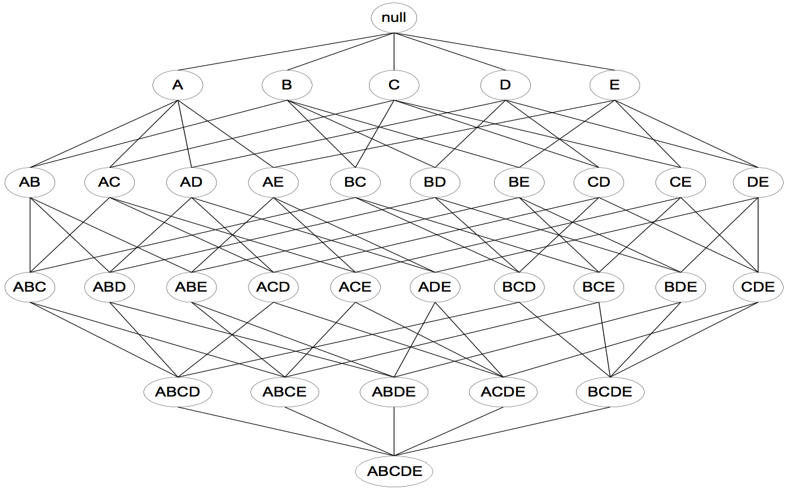
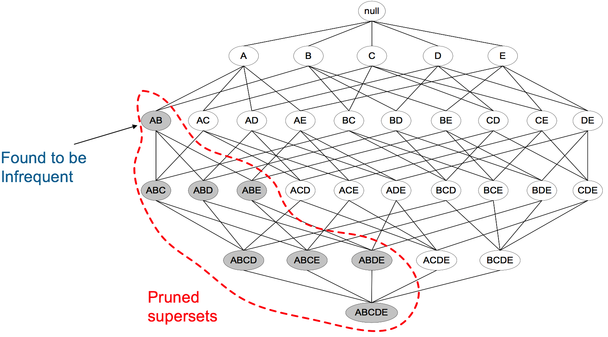
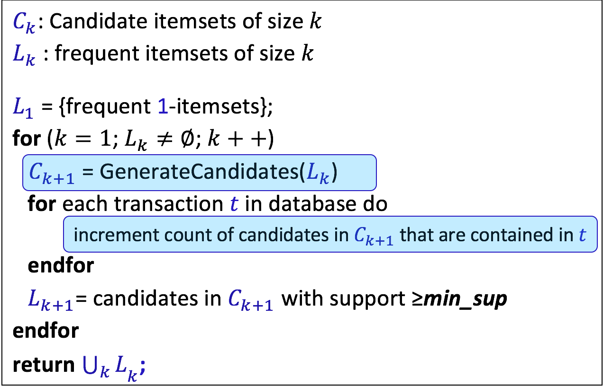
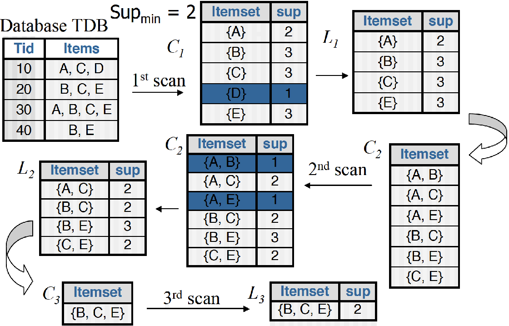
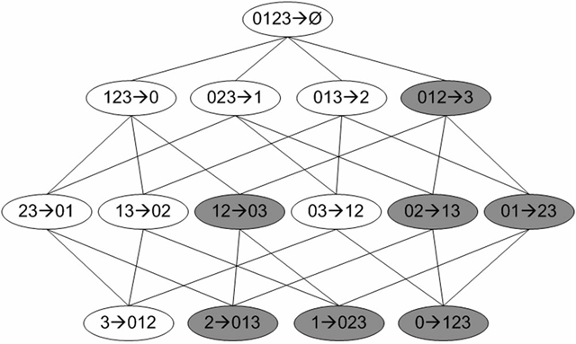

# 1 基础概念
&emsp;&emsp;举个例子零售商希望从交易记录中发现“某种商业规律”，所谓的商业规律，是一个经济学术语，简单来说是因为某些事物间存在的彼此关联和依赖的关系，从而导致这些事物成对或者按照某种确定的先后关系成对出现的情况，即客户购买一个商品之后会不会很大程度上购买另一件商品如果是则而这有关联，关联分析就是找出隐藏的关联对。
- 项：在关联分析中被研究的对象；
- 项集：这些对象所组成的一个集合；
- k项集：包含k个元素的项集；
- 频数：一个项集出现的次数；
- 支持度：一个项集出现的频率：
$$
support(x)=\frac{count(x)}{|D|} × 100%
$$
- 频繁项集（frequent item sets）是经常出现在一块儿的物品的集合，它暗示了某些事物之间总是结伴或成对出现。本质上来说，不管是因果关系还是相关关系，都是共现关系，所以从这点上来讲，频繁项集是覆盖量（coverage）这个指标的一种度量关系,一般为当一个项集的支持度大于某一阙值时便为频繁交集；

# 2 关联规则
&emsp;&emsp;关联规则（association rules）暗示两种物品之间可能存在很强的关系，它更关注的是事物之间的互相依赖和条件先验关系。它暗示了组内某些属性间不仅共现，而且还存在明显的相关和因果关系，关联关系一种更强的共现关系。所以从这点上来将，关联规则是准确率（accuracy）这个指标的一种度量关系。给定两个项集X和Y，关联规则便是形如$X\rightarrow Y$的表达式，X称为关联规则的前件，Y称为关联规则的后件，且$X\cap Y= \phi$。
## 2.1 关联分析算法过程
&emsp;&emsp;置信度用来度量关联规则：
$$
confidence(x→Y)=\frac{support(X∪Y)}{support(X)}
$$

1. 发现所有的频繁项集;
2. 从频繁项集中找出关联规则,对于频繁项集$X$，取一个非空真子集$Y$,$S=X-Y$，若$confidence(S→Y)≥minconf$，则$S→Y$是一个关联规则，$minconf$为置信度阈值。

# 3 多层次关联规则
&emsp;&emsp;如果计算关联规则时考虑的对象过细，则可能会出现某些商品出现频率太低的情况从而导致分析不够全面。这时，不妨对商品进行归归类。比如将伊利牛奶、蒙牛牛奶都归属为牛奶一类，而将吐司和牛角包都归为面包一类，你可能会发现牛奶与牛角包之间的关联规则，这种关联规则很明显就跨了一个层次。
## 3.1 关联规则兴趣度的其他度量方式
### 3.1.1 lift
$$
lift=(X,Y)=\frac{confidence(X→Y)}{support(Y)}=\frac{P(X∪Y)}{P(X)P(Y)}
$$
### 3.1.2 cosine
$$
cosine(X,Y)=\frac{P(X∪Y)}{√{P(X)P(Y)}}=\frac{support(X∪Y)}{√{support(X)support(Y)}}
$$

# 3 Aprior算法
## 3.1 频繁项集搜索
&emsp;&emsp;下图为通过暴力搜索的搜索树：

- Apriori定律1：如果一个集合是频繁项集，则它的所有子集都是频繁项集;
- Apriori定律2：如果一个集合不是频繁项集，则它的所有超集都不是频繁项集。
&emsp;&emsp;因此可以利用以上两条进行关联搜索。



## 3.2 从频繁集中挖掘关联规则
&emsp;&emsp;下图给出了从项集{0,1,2,3}产生的所有关联规则，其中阴影区域给出的是低可信度的规则。如果{0,1,2}➞{3}是一条低可信度规则，那么所有其他以3作为后件（箭头右部包含3）的规则均为低可信度的。即如果某条规则并不满足最小可信度要求，那么该规则的所有子集也不会满足最小可信度要求。反之，如果{0，1，3}->{2}，则说明{2}这个频繁项作为后件，可以进入到下一轮的迭代层次搜索中，继续和本轮得到的规则列表的右部进行组合。直到搜索一停止为止：


# 4 FP-growth算法
&emsp;&emsp;FP-growth算法基于Apriori构建，但采用了高级的数据结构减少扫描次数，大大加快了算法速度。FP-growth算法只需要对数据库进行两次扫描，而Apriori算法对于每个潜在的频繁项集都会扫描数据集判定给定模式是否频繁，因此FP-growth算法的速度要比Apriori算法快。FP即FrequentPattern，FP树的根节点是空集，其他结点由单个元素以及这个元素在数据集中的出现次数组成，出现次数越多的元素越接近根节点。此外，结点之间通过链接（link）相连，只有在数据中同时出现的元素才会被连起来，连起来的元素形成频繁集。同一个元素可以在FP树中多次出现，根据位置不同，对应着不同的频繁项集。可以为FP树设置最小支持度，过滤掉出现次数太少的元素。
## 4.1 算法步骤
&emsp;&emsp;算法基本过程：
- 扫描数据，得到所有频繁一项集的的计数。然后删除支持度低于阈值的项，将1项频繁集放入项头表，并按照支持度降序排列；
- 扫描数据，将读到的原始数据剔除非频繁1项集，并按照支持度降序排列。
- 读入排序后的数据集，插入FP树，插入时按照排序后的顺序，插入FP树中，排序靠前的节点是祖先节点，而靠后的是子孙节点。如果有共用的祖先，则对应的公用祖先节点计数加1。插入后，如果有新节点出现，则项头表对应的节点会通过节点链表链接上新节点。直到所有的数据都插入到FP树后，FP树的建立完成；
- 从项头表的底部项依次向上找到项头表项对应的条件模式基。从条件模式基递归挖掘得到项头表项项的频繁项集；
- 如果不限制频繁项集的项数，则返回步骤4所有的频繁项集，否则只返回满足项数要求的频繁项集。

&emsp;&emsp;得到了FP树和项头表以及节点链表，首先要从项头表的底部项依次向上挖掘。对于项头表对应于FP树的每一项，要找到它的条件模式基。所谓条件模式基是以要挖掘的节点作为叶子节点所对应的FP子树。得到这个FP子树，将子树中每个节点的的计数设置为叶子节点的计数，并删除计数低于支持度的节点。从这个条件模式基，就可以递归挖掘得到频繁项集。

# 5 实现
## 5.1 Apriori
```python
def create_c1(data):
	c1 = []
	for item in data:
		if [item] not in c1:
			c1.append([item])
		
	c1.sort()
	return map(frozenset, c1)
	
def scan_d(data, c_k, min_support):
	'''
	@brief	计算support
	'''
	ss_cnt = {}
	for item in data:
		for can in c_k:
			if can.issubset(item):
				if not ss_cnt.has_key(can):
					ss_cnt[can] = 1
				else:
					ss_cnt[can] += 1
	
	num_items = len(data)
	ret_list = []
	support_data = {}
	for key in ss_cnt:
		support = ss_cnt[key] / num_items
		if support >= min_support:
			ret_list.insert(0, key)
		
		support_data[key] = support
	
	return ret_list, support_data
	
def aprior_gen(lk, k):
	ret_list = []
	for i in range(len(lk)):
		for j in range(i + 1, len(lk)):
			l1 = list(lk[i])[:k-2]
			l2 = list(lk[j])[:k-2]
			l2.sort()
			l1.sort()
			if l1 == l2:
				ret_list.append(lk[i] | lk[j])
	
	return ret_list
	
def apriori(data, min_support=0.5):
	c1 = create_c1(data)
	d = map(set, data)
	l1, support_data = scan_d(d, c1, min_support)
	l = [l1]
	k = 2
	while len(l[k - 2]) > 0:
		ck = aprior_gen(l[k - 2], k)
		lk, sup_k = scan_d(d, ck, min_support)
		support_data.update(sup_k)
		l.append(lk)
		k += 1
	
	return l, support_data
	
def generate_rules(l, support_data, min_conf=0.7):  #support_data is a dict coming from scanD
    big_rule_list = []
    for i in range(1, len(l)):#only get the sets with two or more items
        for freq_set in l[i]:
            h1 = [frozenset([item]) for item in freq_set]
            if (i > 1):
                rules_from_conseq(freq_set, h1, support_data, big_rule_list, min_conf)
            else:
                calc_conf(freq_set, h1, support_data, big_rule_list, min_conf)
    return big_rule_list         

def calc_conf(freq_set, h, support_data, brl, min_conf=0.7):
    prunedh = [] #create new list to return
    for conseq in h:
        conf = support_data[freq_set]/support_data[freq_set-conseq] #calc confidence
        if conf >= min_conf: 
            print(freq_set-conseq,'-->',conseq,'conf:',conf)
            brl.append((freq_set-conseq, conseq, conf))
            prunedh.append(conseq)
    return prunedh

def rules_from_conseq(freq_set, h, support_data, brl, min_conf=0.7):
    m = len(h[0])
    if (len(freq_set) > (m + 1)): #try further merging
        hmp1 = aprioriGen(h, m+1)#create hm+1 new candidates
        hmp1 = calc_conf(freq_set, hmp1, support_data, brl, min_conf)
        if (len(hmp1) > 1):    #need at least two sets to merge
            rules_from_conseq(freq_set, hmp1, support_data, brl, min_conf)
            
def pntRules(rulelist, item_meaning):
    for rule_tup in rulelist:
        for item in rule_tup[0]:
            print(item_meaning[item])
        print("           -------->")
        for item in rule_tup[1]:
            print(item_meaning[item])
        print("confidence: %f" % rule_tup[2])
```
# 6 参考
[关联分析算法](https://www.cnblogs.com/LittleHann/p/9398219.html#_lab2_0_0)
[数据挖掘十大算法之Apriori详解](https://blog.csdn.net/baimafujinji/article/details/53456931)
[机器学习实战——第十二章－FP-growth](https://blog.csdn.net/youhuakongzhi/article/details/87943503)
[获得数据频繁集的神器：FP Tree算法](http://mp.ofweek.com/iot/a245673123776)