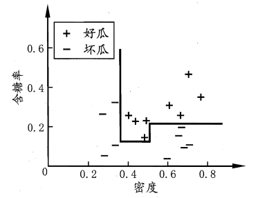
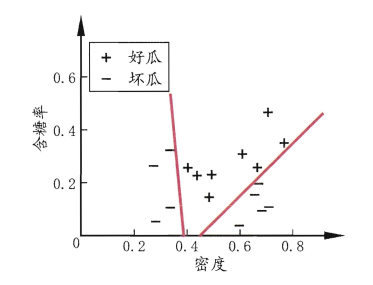
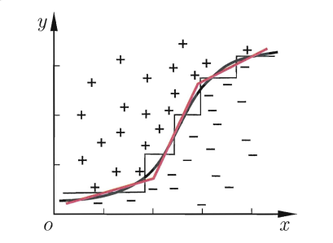
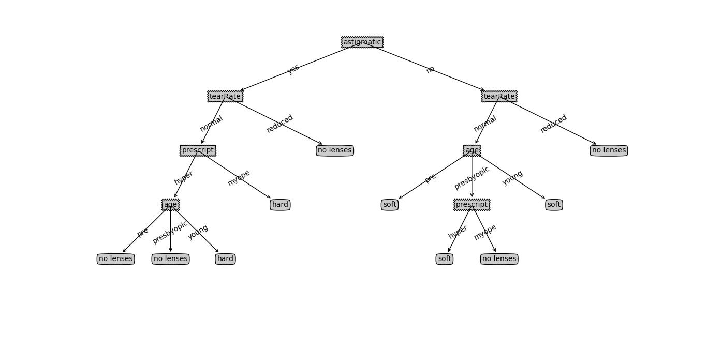
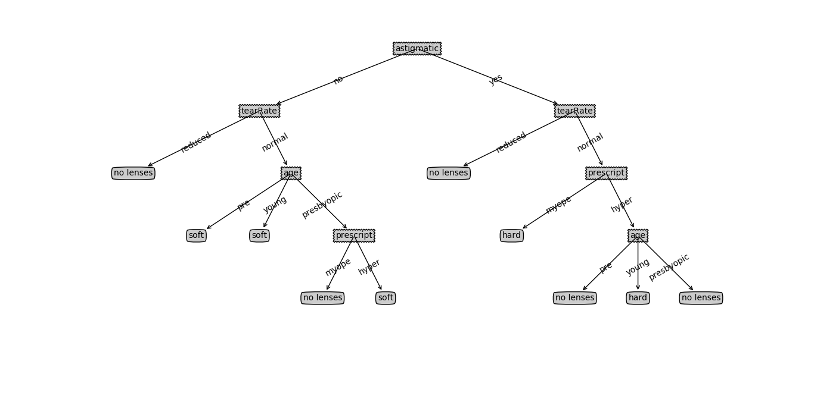
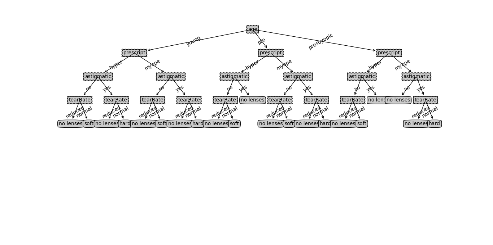
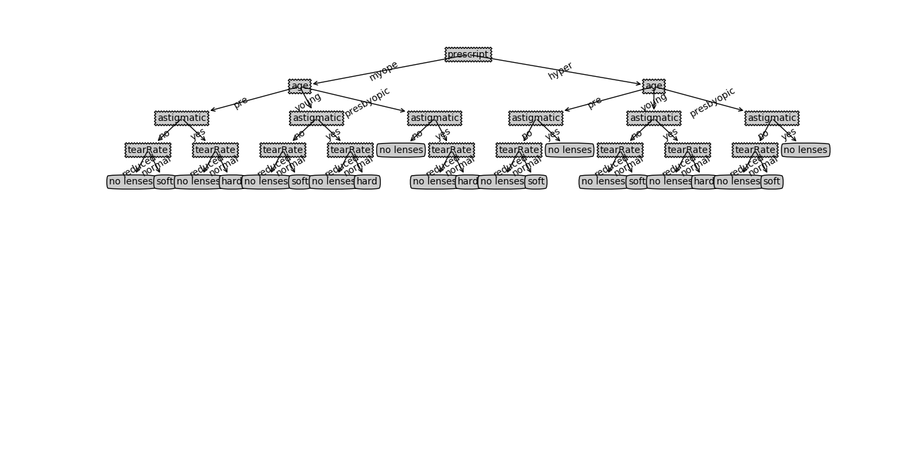
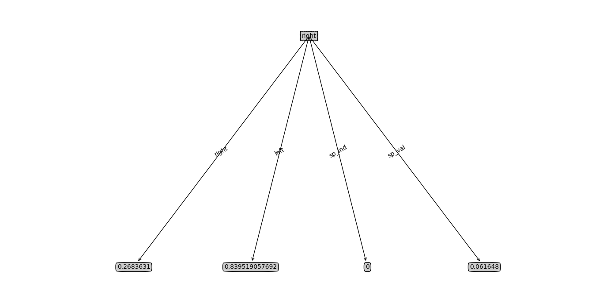
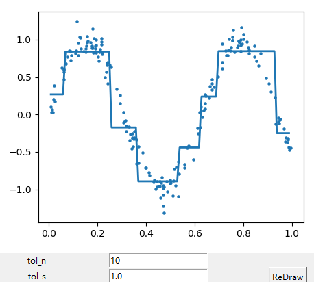

[toc]
# 1 决策树
## 1.1 基本概念
&emsp;&emsp;决策树（Decision tree）由一个决策图和可能的结果（包括资源成本和风险）组成， 用来创建到达目标的规划。决策树建立并用来辅助决策，是一种特殊的树结构。决策树是一个利用像树一样的图形或决策模型的决策支持工具，包括随机事件结果，资源代价和实用性。决策树属于只能非参数学习算法、可以用于解决(多)分类问题，回归问题。 回归问题的结果，叶子结点的平均值是回归问题的解。
&emsp;&emsp;根节点：决策树具有数据结构里面的二叉树、树的全部属性。
&emsp;&emsp;非叶子节点 ：（决策点） 代表测试的条件，数据的属性的测试。
&emsp;&emsp;叶子节点 ：分类后获得分类标记。
&emsp;&emsp;分支： 测试的结果。

## 1.2 决策树的分类
- 分类树分析是当预计结果可能为离散类型（例如三个种类的花，输赢等）使用的概念；
- 回归树分析是当局域结果可能为实数（例如房价，患者住院时间等）使用的概念；
- CART分析是结合了上述二者的一个概念。CART是Classification And Regression Trees的缩写。


## 1.3 决策树的构造
&emsp;&emsp;决策树的构造过程：
- 1. 以当前数据集为根节点；
- 2. 找出可以将数据划分的最大的特征，新建子节点将数据划分；
- 3. 如果结果未满足预期重复2过程生成新的子节点。

## 1.4 决策树的划分选择
### 1.4.1 信息增益
&emsp;&emsp;信息熵是度量样本集合纯度的一种指标，可用于数据划分。假定样本集合$D$中第$k$类样本所占的比例为$p_k(k=1,...,m)$则$D$的信息熵定义为：
$$
Ent(D)=-\sum_{k=1}^{m} {p_k log_2{p_k} }
$$
&emsp;&emsp;当$Ent(D)$的值越小，则$D$中的数据纯度越高，也就是说处于同一类的概率越高。
&emsp;&emsp;假定离散属性$a$有$V$个可能的取值:$a^1,...,a^{V}$，若使用属性$a$的数据进行划分会产生$V$个分支，则第$v$个分支包含了$D$中属性为$a^v$的样本，该样本集为$D^v$，则可根据下面的公式计算出信息增益：
$$
Gain(D, a)=Ent(D) - \sum_{v=1}^V{\frac{|D^v|} {|D|} {Ent(D^v)} }
$$
&emsp;&emsp;信息增益越大，则使用属性$a$进行划分所带来的数据纯度提升越大。因此可以使用$a=\argmax_{a∈A}Gain(D,a)$选择划分的性质。

### 1.4.2 增益率
&emsp;&emsp;信息增益准则对可取值数目较多的属性有所偏好，为减少这种
偏好可能带来的不利影响，可以使用增益率进行划分：
$$
Gain_ratio(D,a)=\frac{Gain(D,a)}{IV(a)}
$$
$$
IV(a)=-\sum_{v=1}^{V}\frac{|D^v|}{|D|}log_2{\frac{|D^v|}{|D|}}
$$
&emsp;&emsp;属性$a$可能取值数目越多$IV(a)$的值通常越大。
&emsp;&emsp;增益率准则对可取值数目较少的属性有所偏好。

### 1.4.3 基尼系数
$$
Gini(D)=\sum_{k=1}^{|Y|}{\sum_{k^{'}≠k}{p_k p_{k^{'}}}}=1-\sum_{k=1}^{|Y|}{p_k^2}
$$
&emsp;&emsp;Gini(D)反映了数据集$D$随机抽取两个样本其类别标记不一致的概率，$Gini(D)$越小，数据集$D$的纯度越高。
&emsp;&emsp;属性$a$的基尼系数：
$$
Gini_index(D,a)=\sum_{v=1}^{V}\frac{|D^v|}{|D|}{Gini(D^v)}
$$
&emsp;&emsp;使用基尼系数进行划分时采用$a=\argmin_{a∈A}{Gini_index(D,a)}$

## 1.5 决策树剪枝
&emsp;&emsp;决策树容易产生过拟合，因此需要使用剪枝处理避免过拟合。决策树剪枝基本分为预剪枝和后剪枝。
&emsp;&emsp;预剪枝是指在决策树生成过程中，对每个结点在划
分前先进行估计，若当前结点的划分不能带来决策树泛化性能提升，则停止划
分并将当前结点标记为叶结点。
&emsp;&emsp;后剪枝则是先从训练集生成一棵完整的决策树，然后自底向上地对非叶结点进行考察，若将该结点对应的子树替换为叶结点能带来决策树泛化性能提升，则将该子树替换为叶结点。
&emsp;&emsp;后剪枝的计算量代价比预剪枝方法大得多，特别是在大样本集中，不过对于小样本的情况，后剪枝方法还是优于预剪枝方法。

## 1.6 缺失值处理
- 1.抛弃缺失值
抛弃极少量的缺失值的样本对决策树的创建影响不是太大。但是如果属性缺失值较多或是关键属性值缺失,创建的决策树将是不完全的,同时可能给用户造成知识上的大量错误信息,所以抛弃缺失值一般不采用。只有在数据库具有极少量的缺失值同时缺失值不是关键的属性值时,且为了加快创建决策树的速度,才采用抛弃属性缺失值的方式创建决策树。
- 2. 补充缺失值
缺失值较少时按照我们上面的补充规则是可行的。但如果数据库的数据较大,缺失值较多(当然,这样获取的数据库在现实中使用的意义已不大,同时在信息获取方面基本不会出现这样的数据库),这样根据填充后的数据库创建的决策树可能和根据正确值创建的决策树有很大变化。
- 3. 概率化缺失值
对缺失值的样本赋予该属性所有属性值的概率分布,即将缺失值按照其所在属性已知值的相对概率分布来创建决策树。用系数F进行合理的修正计算的信息量,F=数据库中缺失值所在的属性值样本数量去掉缺失值样本数量/数据库中样本数量的总和,即F表示所给属性具有已知值样本的概率。
- 4. 缺失值单独分支

## 1.7 多变量决策树
&emsp;&emsp;若把每个属性视为坐标空间中的一个坐标轴，则 d 个属性描述的样本就对应了 d 维空间中的一个数据点，对样本分类则意味着在这个坐标空间中寻
找不同类样本之间的分类边界.决策树所形成的分类边界有一个明显的特点:
轴平行 (axis-parallel) ，即它的分类边界由若干个与坐标轴平行的分段组成。
这样的分类边界使得学习结果有较好的可解释性，因为每一段划分都直接对应了某个属性取值.但在学习任务的真实分类边界比较复杂时，必须使用很多段划分才能获得较好的近似。若能使用斜的划分边界，如图中红色线段所示，则决策树模型将大为简化"多变量决策树" (multivariate decision tree) 就是能实现这样的"斜划分"甚至更复杂划分的决策树。每个非叶结点是一个形如$\sum^d_{i=1}{w_ia_i=t}$的线性分类器，其中$w_i$是属性$a_i$的权重，$w_i,t$可在该结点所含的样本集和属性集上学得。如下三张图所示，第一张是决策树，第二张是多变量决策树，第三张是二者对比：




# 2 决策树算法与实现
## 2.1 ID3
### 2.1.1 算法原理
&emsp;&emsp;ID3使用信息熵进行节点划分，具体过程如下：
- 1. 使用所有没有使用的属性并计算与之相关的样本熵值；
- 2. 选取其中熵值最小的属性；
- 3. 生成包含该属性的节点；
- 4. 重复上过程直到达到预期。

### 2.1.2 实现
&emsp;&emsp;下面为决策树代码：
```python
class desicion_tree(object):
    def __init__(self, info_func):
        self.info_func = info_func
        
    def vote_classify(self, cls_list):
        cls_count = {}
        for i in range(k):
            vote_label = self.label[distance[i]]
            cls_count[vote_label] = cls_count.get(vote_label, 0) + 1
            
        sorted_cls = sorted(cls_count.items(), key=operator.itemgetter(1), reverse=True)
        return sorted_cls[0][0]
        
    def split_dataset(self, data_set, axis, value):
        '''
        @brief  划分数据集
        @param  data_set    数据
        @param  axis        划分依据的特征
        @param  value       需要返回的feaure
        '''
        ret = []
        for vec in data_set:
            if vec[axis] == value:
                ret_vec = vec[:axis]
                ret_vec.extend(vec[axis+1:])
                ret.append(ret_vec)
                
        return ret
    
    def choose_best_feature(self, dataset):
        if self.info_func is shannon.get_ent:
            return self.choose_best_shannon(dataset)
        else:
            best_feature = 0
            max_info = 0
            for i in range(len(dataset[0]) - 1):
                info = self.info_func(dataset, i)
                if info > max_info:
                    max_info = info
                    best_feature = i
                    
            return best_feature
            
    def choose_best_shannon(self, dataset):
        '''
        @brief  选择最好的feature进行划分
        '''
        basic_ent = shannon.get_ent(dataset)
        best_feature = -1
        best_gain = 0.0
        for i in range(len(dataset[0]) - 1):
            feature_list = [ele[i] for ele in dataset]
            feature_list = set(feature_list)
            cur_ent = 0.0
            for value in feature_list:
                sub_dataset = self.split_dataset(dataset, i, value)
                prob = len(sub_dataset)/float(len(dataset))
                cur_ent += prob * shannon.get_ent(sub_dataset)
            
            gain = basic_ent - cur_ent
            if gain > best_gain:
                best_gain = gain
                best_feature = i
                
        return best_feature
    
    def create_tree(self, dataset, labels):
        cls_list = [ele[-1] for ele in dataset]
        if cls_list.count(cls_list[0]) == len(cls_list):
            return cls_list[0]
            
        if len(dataset[0]) == 1:
            return self.vote_classify(cls_list)
            
        best_feature = self.choose_best_feature(dataset)
        best_label = labels[best_feature]
        cur_tree = {best_label:{}}
        
        del labels[best_feature]
        feature_vals = [ele[best_feature] for ele in dataset]
        feature_vals = set(feature_vals)
        for val in feature_vals:
            sub_labels = labels[:]
            cur_tree[best_label][val] = self.create_tree(self.split_dataset(dataset, best_feature, val), sub_labels)
            
        return cur_tree
    
    '''
    决策树分类
    '''
    def classify(self, dec_tree, feature_labels, test_vec):
        root = dec_tree.keys()[0]
        child = dec_tree[root]
        feature_id = feature_labels.index(root)
        key = test_vec[feature_id]
        value = child[key]
        if isinstance(value, dict):
            cls_label = self.classify(value, feature_labels, test_vec)
        else:
            cls_label = value
        
        return cls_label
    
    '''
    存储决策树
    '''
    def save(self, cur_tree, file):
        '''
        @brief  存储树结构
        '''
        with open(file, 'w') as f:
            pickle.dump(cur_tree, f)
            
    def load(self, cur_tree, file):
        with open(file, 'r') as f:
            return pickle.load(f)
```
&emsp;&emsp;下面为信息熵等的计算代码：
```python
def get_ent(dataset):
    '''
    @brief  计算信息熵
    '''
    label_count = {}
    for vec in dataset:
        label = vec[-1]
        if label not in label_count.keys():
            label_count[label] = 0
        
        label_count[label] += 1
        
    ent = 0.0
    for key in label_count:
        for key in label_count:
            prob = float(label_count[key]) / len(dataset)
            ent -= prob * math.log(prob, 2)
    
    return ent
    
    
def get_gain(dataset, axis):
    '''
    @brief  计算数据集的信息增益
    @param  axis    当前属性
    @param  dataset 每一行数据的最后一个分量为类标
    '''
    ent = get_ent(dataset)
    values = [line[axis] for line in dataset]
    values = set(values)
    gain = ent
    for value in values:
        sub_dataset = [line for line in dataset if line[axis] == value]
        sub_ent = get_ent(sub_dataset)
        gain -= len(sub_dataset)/len(dataset) * sub_ent
        
    return gain
    
    
def get_iv(dataset, axis):
    values = [line[axis] for line in dataset]
    values = set(values)
    iv = 0.0
    for value in values:
        sub_dataset = [line for line in dataset if line[axis] == value]
        iv -= len(sub_dataset)/len(dataset)
        
    return iv
    
    
def get_gain_ratio(dataset, axis):
    '''
    @brief  计算增益率
    '''
    gain = get_gain(dataset, axis)
    iv = get_iv(dataset, axis)
    return gain / iv
        

def get_gini(dataset):
    '''
    @brief  计算基尼值
    '''
    label_count = {}
    for vec in dataset:
        label = vec[-1]
        if label not in label_count.keys():
            label_count[label] = 0
        
        label_count[label] += 1
        
    gini = 1
    for key in label_count:
        prop = label_count[key]/len(dataset)
        gini -= prop * prop
        
    return gini
    

def get_gini_ratio(dataset, axis):
    '''
    @brief  计算基尼系数
    '''
    values = [line[axis] for line in dataset]
    values = set(values)
    gini = 0.0
    for value in values:
        sub_dataset = [line for line in dataset if line[axis] == value]
        prop = len(sub_dataset) / len(dataset)
        gini += prop * get_gini(sub_dataset)
        
    return gini
```
### 2.1.3 可视化结果
&emsp;&emsp;以下按次序分别为使用信息熵，信息增益，增益率，基尼系数构建的决策树:





## 2.2 C4.5
### 2.2.1 算法原理
&emsp;&emsp;C4.5和ID3唯一不同之处是使用信息增益率进行数据划分，其他和ID3相同
### 2.2.2 代码实现
&emsp;&emsp;代码实现参考上面的ID3中使用信息增益进行构建的代码。

## 2.3 CART
### 2.3.1 算法原理
&emsp;&emsp;CART分类树算法使用基尼系数来代替信息增益比。
#### 2.3.1.1 CART分类树算法对连续特征和离散特征的处理
&emsp;&emsp;CART分类树算法对连续值的处理，思想和C4.5相同，都是将连续的特征离散化。唯一区别在选择划分点时，C4.5是信息增益比，CART是基尼系数。
&emsp;&emsp;具体思路:$m$个样本的连续特征$A$有$m$个，从小到大排列$a_1,a_2,...,a_m$,则CART取相邻两样本值的平均数做划分点,一共取$m-1$个，其中第$i$个划分点$T_i$表示为：$T_i=(a_i + a_{i+1})/2$。分别计算以这$m-1$个点作为二元分类点时的基尼系数。选择基尼系数最小的点为该连续特征的二元离散分类点。比如取到的基尼系数最小的点为$a_t$，则小于$a_t$的值为类别$1$，大于$a_t$的值为类别$2$，这样就做到了连续特征的离散化。
&emsp;&emsp;注意的是，与ID3、C4.5处理离散属性不同的是，如果当前节点为连续属性，则该属性在后面还可以参与子节点的产生选择过程。
&emsp;&emsp;CART分类树算法对离散值的处理，采用的思路：不停的二分离散特征。
&emsp;&emsp;CART采用的是不停的二分会考虑把特征A分成{A1}和{A2,A3}、{A2}和{A1,A3}、{A3}和{A1,A2}三种情况，找到基尼系数最小的组合。

#### 2.3.1.2 CART算法流程
- (1) 对于当前节点的数据集为D，如果样本个数小于阈值或没有特征，则返回决策子树，当前节点停止递归。
- (2) 计算样本集D的基尼系数，如果基尼系数小于阈值，则返回决策树子树，当前节点停止递归。
- (3) 计算当前节点现有的各个特征的各个特征值对数据集D的基尼系数，对于离散值和连续值的处理方法和基尼系数的如上。缺失值的处理方法和C4.5算法里描述的相同。
- (4) 在计算出来的各个特征的各个特征值对数据集D的基尼系数中，选择基尼系数最小的特征$A$和对应的特征值$a$。根据这个最优特征和最优特征值，把数据集划分成两部分$D_1$和$D_2$，同时建立当前节点的左右节点，做节点的数据集$D$为$D_1$，右节点的数据集$D$为$D_2$。
- (5) 对左右的子节点递归的调用1-4步，生成决策树。

#### 2.3.1.3 CART回归树
&emsp;&emsp;分类树和回归树的区别:
- 分类树与回归树的区别在样本的输出，如果样本输出是离散值，这是分类树；样本输出是连续值，这是回归树。分类树的输出是样本的类别，回归树的输出是一个实数。
- 连续值的处理方法不同。
- 决策树建立后做预测的方式不同。
- 分类模型：采用基尼系数的大小度量特征各个划分点的优劣。
回归模型：采用和方差度量，度量目标是对于划分特征A，对应划分点s两边的数据集$D_1$和$D_2$，求出使$D_1$和$D_2$各自集合的均方差最小，同时$D_1$和$D_2$的均方差之和最小。

#### 2.3.1.4 CART树剪枝
&emsp;&emsp;CART树的生成：基于训练数据集，递归构建二叉决策树。CART树的剪枝：用验证数据集对生成的树进行剪枝并选择最优子树，损失函数最小作为剪枝的标准。
&emsp;&emsp;CART分类树的剪枝策略在度量损失的时候用基尼系数；CART回归树的剪枝策略在度量损失的时候用均方差。
&emsp;&emsp;剪枝损失函数:
$$
C_{α}(T_t)=C(T_t)+\alpha|T_t|
$$
&emsp;&emsp;α为正则化参数(和线性回归的正则化一样)，$C(T_t)$为训练数据的预测误差，$|T_t|$是子树T叶子节点数量。当α = 0时，即没有正则化，原始生成的CART树即为最优子树。当α = ∞时，正则化强度最大，此时由原始的生成CART树的根节点组成的单节点树为最优子树。当然，这是两种极端情况，一般来说，α越大，剪枝剪的越厉害，生成的最优子树相比原生决策树就越偏小。
&emsp;&emsp;算法过程：
- 1. 初始化$a_{min}=∞$,最优子树集合为$ω=\{T\}$;
- 2. 从叶子结点开始自下而上计算内部节点$t$的训练误差损失函数$C_α(T_t)$（回归树为均方差，分类树为基尼系数），叶子节点数$|T_t|$，以及正则化阈值$α=min{\frac{C(T)-C(T_t)}{|T_t| - 1}, α_{min}}$，更新$α_{min} = α$
- 3. 得到所有节点的α值的集合$M$;
- 4. 从$M$中选择最大的值$α_k$，自上而下的访问子树$t$的内部节点，如果$\frac{C(T)-C(T_t)}{|T_t| - 1}≤α_k$时，进行剪枝。并决定叶子节点$t$的值。如果是分类树，这是概率最高的类别，如果是回归树，这是所有样本输出的均值。这样得到$α_k$对应的最优子树$T_k$;
- 5. 最优子树集合$ω = ω∪T_k$，$M = M - {α_k}$。
- 6. 如果$M$不为空，则回到步骤4。否则就已经得到了所有的可选最优子树集合ω。
- 7. 采用交叉验证在ω选择最优子树$T_α$。

### 2.3.2 代码实现
#### 2.3.2.1 CART树构建
```python
def reg_leaf(dataset):
    return np.mean(dataset[:,-1])
    
def reg_err(dataset):
    return np.var(dataset[:,-1]) * np.shape(dataset)[0]
    
def bin_split_data(dataset, feature, value):
    rst = dataset[np.nonzero(dataset[:,feature] > value)[0], :]
    snd = dataset[np.nonzero(dataset[:,feature] <= value)[0], :]
    return rst, snd
    

def create_tree(dataset, leaftype=reg_leaf, err_type=reg_err, ops=(1,4)):
    feat, val = choose_best_split(dataset, leaftype, err_type, ops)
    if feat is None:
        return val
    
    ret_tree = {}
    ret_tree['sp_ind'] = feat
    ret_tree['sp_val'] = val
    
    l_set, r_set = bin_split_data(dataset, feat, val)
    ret_tree['left'] = create_tree(l_set, leaftype, err_type, ops)
    ret_tree['right'] = create_tree(r_set, leaftype, err_type, ops)
    return ret_tree


def choose_best_split(dataset, leaftype=reg_leaf, err_type=reg_err, ops=(1,4)):
    tol_s, tol_n = ops
    if len(set(dataset[:,-1].T.tolist()[0])) == 1:
        #所有的元素相同
        return None,leaftype(dataset)
        
    m,n = np.shape(dataset)
    s = err_type(dataset)
    best_s = np.inf
    best_id = 0
    best_val = 0
    for id in range(n - 1):
        for val in set((dataset[:, id].T.A.tolist())[0]):
            rst, snd = bin_split_data(dataset, id, val)
            if (np.shape(rst)[0] < tol_n) or (np.shape(snd)[0] < tol_n):
                continue
                
            new_s = err_type(rst) + err_type(snd)
            if new_s < best_s:
                best_id = id
                best_val = val
                best_s = new_s
    
    if (s - best_s) < tol_s:
        return None, leaftype(dataset)
        
    rst, snd = bin_split_data(dataset, best_id, best_val)
    if (np.shape(rst)[0] < tol_n) or (np.shape(snd)[0] < tol_n):
        return None, leaftype(dataset)
        
    return best_id, best_val
```
#### 2.3.2.2 CART剪枝
```python
def is_tree(obj):
    return (type(obj).__name__ == 'dict')
    
def get_mean(tree):
    if is_tree(tree['right']):
        tree['right'] = get_mean(tree['right'])
    
    if is_tree(tree['left']):
        tree['left'] = get_mean(tree['left'])
        
    return (tree['right'] + tree['left']) / 2.0
    
def prune(tree, dataset):
    '''
    @brief  后剪枝
    '''
    if np.shape(dataset)[0] == 0:
        return get_mean(tree)
        
    l_set, r_set = None, None
    if (is_tree(tree['right'])) or is_tree(tree['left']):
        l_set, r_set = bin_split_data(dataset, tree['sp_ind'], tree['sp_val'])
        
    if is_tree(tree['left']):
        tree['left'] = prune(tree['left'], l_set)
    
    if is_tree(tree['right']):
        tree['right'] = prune(tree['right'], r_set)
        
    if not is_tree(tree['right']) and not is_tree(tree['left']):
        l_set, r_set = bin_split_data(dataset, tree['sp_ind'], tree['sp_val'])
        err_nomerge = np.sum(np.pow(l_set[:-1] - tree['left'], 2)) + np.sum(np.pow(r_set[:-1] - tree['right'], 2))
        tree_mean = (tree['left'] + tree['right'])/2.0
        err_merge = np.sum(np.power(dataset[:,-1] - tree_mean, 2))
        if err_merge < err_nomerge:
            print('merging')
            return tree_mean
        else:
            return tree
    else:
        return tree
```

### 2.3 结果



[CART](https://www.cnblogs.com/keye/p/10564914.html)

# 3 总结
## 3.1 对比
|算法|支持模型|树结构|特征选择|连续值处理|缺失值处理|剪枝|
:-:|:-:|:-:|:-:|:-:|:-:|:-:|
 |ID3|	   分类|	 多叉树|	 信息增益	 |不支持|不支持	 |不支持|
 |C4.5	|   分类	| 多叉树|	 信息增益比	| 支持|	 支持	 |支持|
 |CART	 |分类回归	 |二叉树	|基尼系数均方差 |支持	 |支持	| 支持|
 
## 3.2 优点
- 简单直观，生成的决策树很直观；
- 基本不需要预处理，不需要提前归一化和处理缺失值；
- 使用决策树预测的代价是O(log2m)。m为样本数；
- 既可以处理离散值也可以处理连续值。很多算法只是专注于离散值或者连续值；
- 可以处理多维度输出的分类问题；
- 相比于神经网络之类的黑盒分类模型，决策树在逻辑上可以很好解释；
- 可以交叉验证的剪枝来选择模型，从而提高泛化能力；
- 对于异常点的容错能力好，健壮性高。

## 3.3 缺点
- 决策树算法非常容易过拟合，导致泛化能力不强。可以通过设置节点最少样本数量和限制决策树深度来改进；
- 决策树会因为样本发生一点的改动，导致树结构的剧烈改变。这个可以通过集成学习之类的方法解决；
- 寻找最优的决策树是一个NP难题，我们一般是通过启发式方法，容易陷入局部最优。可以通过集成学习的方法来改善；
- 有些比较复杂的关系，决策树很难学习，比如异或。这个就没有办法了，一般这种关系可以换神经网络分类方法来解决；
- 如果某些特征的样本比例过大，生成决策树容易偏向于这些特征。这个可以通过调节样本权重来改善。