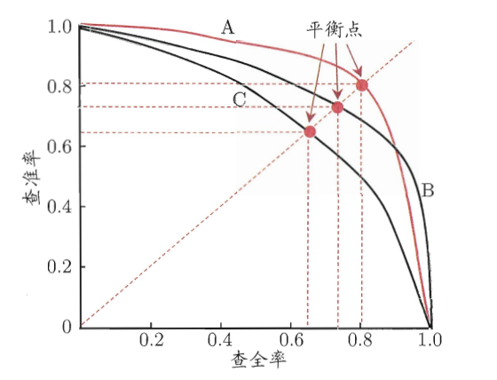
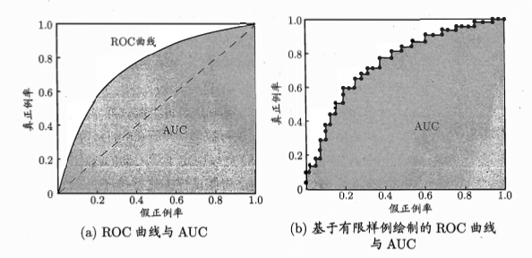
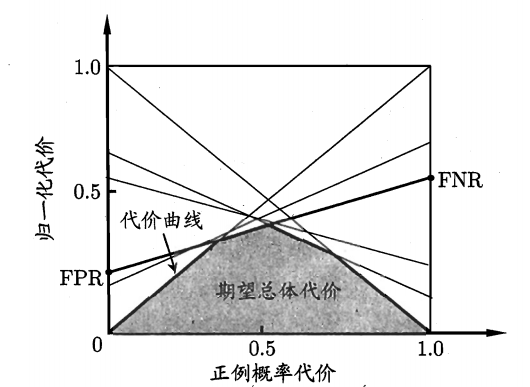
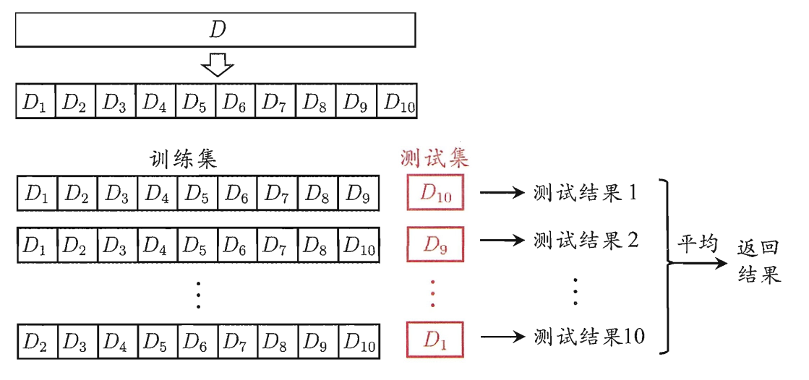

# 1 基础概念
## 1.1 机器学习
&emsp;&emsp;机器学习：假设用P来评估计算机程序在某任务类T上的性能，若一个程序通过利用经验E在T中任务上获得了性能改善，则我们就说关于T和P，该程序对E进行了学习。
&emsp;&emsp;经验E通常是从训练集中获取，任务T也就是我们一般使用的测试集测试目标任务。
&emsp;&emsp;机器学习中一般把数据分为训练集trainset和测试集testset，算法在trainset上进行学习得到经验E，然后应用于testset。
## 1.2 经验误差
&emsp;&emsp;分类任务中，
- 错误率：分类错误样本数占总样本数的比例；
- 精度：分类正确样本数占总样本数的比例,1-错误率；
- 经验误差：在训练集上的误差；
- 泛化误差：在测试集上的误差；
- 过拟合：在训练集上表现良好在测试集上表现差；
- 欠拟合：在训练集上表现差，在测试集上表现差。

&emsp;&emsp;模型选择：因为无法直接得到泛化误差，因此需要进行模型的筛选。

# 2 模型评估
&emsp;&emsp;
## 2.1 性能度量
&emsp;&emsp;对于数据集$D$,预测标签为$f(x)$，真实标签为$y$，需要比较二者得到误差。下面说明不同的误差计算方法和性能度量。
&emsp;&emsp;数据分布$D$，概率密度函数为$p$。
### 2.1.1 错误率和精度
&emsp;&emsp;错误率和精度如上面所提及。公式化的表示为：
$$
I(x,y)=\left\{\begin{array}
    {ll} 1,x == y\\0,x ≠ y
\end{array}\right.
$$
- 错误率：$E(f;D)=\frac{1}{m}\sum_{i=1}^{m}{I(f(x_i), y)}$
- 精度：$acc(f;D)=\frac{1}{m}\sum_{i=1}^{m}{(1 - I(f(x_i), y)})=1-E(f;D)$

### 2.1.2 查准率、查全率和$F_1$
- TP(True Positive):真正例；
- FP(False Positive):假正例；
- TN(True Negative):真反例；
- FN(False Negative):假反例。
- 查准率P：$P=\frac{TP}{TP+FP}$;
- 查全率R：$R=\frac{TP}{TP+FN}$;
- P和R是相互矛盾的，P高R低，P低R高。
&emsp;&emsp;由于PR相互矛盾，可以使用P-R曲线进行平衡，当$P=R$时取得BEP点，BEP越大模型越优秀。
&emsp;&emsp;相比于BEP,另一种改进是使用$F_1$。
$$
F_1=\frac{2*P*R}{P+R}=\frac{2*TP}{样本量-TP-TN}
$$
&emsp;&emsp;$F_1$引入$β$衡量$P,R$不同的重要程度。
$$
\left\{\begin{array}{ll}
F1, β=1 \\
P<R,β>1\\
P>R,0<β<1
\end{array}\right.
$$
$$
F_{β}=\frac{(1+β^2)*P*R}{β^2*P+R}
$$
&emsp;&emsp;当有$n$个混淆矩阵时，对$n$个混淆矩阵计算出$n$个$(P_i, R_i)$，得到：
- 宏查准率:$macro-P=\frac{1}{n}\sum^n_{i=1}P_i$;
- 宏查全率:$macro-R=\frac{1}{n}\sum^n_{i=1}R_i$;
- 宏$F_1$:$macro-F_1=\frac{2*macro-P*macro-R}{macro-P+macro-R}$
&emsp;&emsp;对不同元素平均得到$TP,FP,TN,FN$平均值$\bar{TP},\bar{FP},\bar{TN},\bar{FN}$:
- 微查准率:$micro-P=\frac{\bar{TP}}{\bar{TP}+\bar{FP}}$;
- 微查全率:$micro-R=\frac{\bar{TP}}{\bar{TP}+\bar{FN}}$;
- 宏$F_1$:$micro-F_1=\frac{2*micro-P*micro-R}{micro-P+micro-R}$

### 2.1.3 ROC和AUC
&emsp;&emsp;ROC的全称是Receiver Operating Characteristic Curve，中文名字叫“受试者工作特征曲线”，顾名思义，其主要的分析方法就是画这条特征曲线。

&emsp;&emsp;ROC最直观的应用就是能反映模型在选取不同阈值的时候其敏感性（sensitivity, FPR）和其精确性（specificity, TPR）的趋势走向。不过，相比于其他的P-R曲线（精确度和召回率），ROC曲线有一个巨大的优势就是，当正负样本的分布发生变化时，其形状能够基本保持不变，而P-R曲线的形状一般会发生剧烈的变化，因此该评估指标能降低不同测试集带来的干扰，更加客观的衡量模型本身的性能。
&emsp;&emsp;ROC横坐标为FPR,纵坐标为TPR。
- 真正例率：$TPR=\frac{TP}{TP+FN}$;
- 假正例率：$FPR=\frac{FP}{TN+FP}$。
&emsp;&emsp;AUC（Area Under Curve）被定义为ROC曲线下与坐标轴围成的面积，显然这个面积的数值不会大于1。
### 2.1.4 代价敏感错误率和代价曲线
&emsp;性能中引入代价敏感，令$p$为正例比例。$cost_{ij}$表示$i$错分为$j$的代价。
$$
P(+)cost=\frac{p*cost_{01}}{p*cost_{01}+(1-p)*cost_{10}}
$$
&emsp;&emsp;归一化代价:
$$
cost_norm=\frac{FNR*p*cost_{01}+FPR*(1-p)*cost_{10}}{p*cost_{01}+(1-p)*cost_{10}}
$$
&emsp;&emsp;将ROC曲线的每一个点转换成代价平面的一条线段，然后取所有线段的下界，围成的面积就是期望总体代价。

## 2.2 评估方法
&emsp;&emsp;训练时对trainset和testset的要求是尽可能的独立同分布和互斥。以下描述对数据集$D$进行拆分测试的方法。
### 2.2.1 留出法
&emsp;&emsp;流出法：将$D$按比例划分为两个互斥的集合$T,S, D=T∪S, S∩T=\empty$，在$T$上训练，$S$上测试。
&emsp;&emsp;注意：划分时应该保证数据集的分布一致性，避免因划分数据引入的偏差。
**分层采样：**
&emsp;&emsp;分类任务中，对不同类别的数据按比例筛选，保证$T,S$不同类别的比例相同。
&emsp;&emsp;$T,S$划分比例一般为$\frac{2}{3}-\frac{4}{5}$

### 2.2.2 交叉验证
&emsp;&emsp;交叉验证：将$D$划分为$k$个数据分布相同的互斥子集$D=D_1 ∪  D_2 ... ∪D_k, D_i∩D_j=∅(i≠j)$，然后训练时从$k$个子集中挑选$k-1$个子集作为训练集，剩下的作为测试集，重复$k$次，又称K折交叉验证。

&emsp;&emsp;当$k=数据量$时未留一法，效果不错但是耗时。
### 2.2.3 自助法（bootstrapping）
&emsp;&emsp;自助法：每次从$D$中有放回的随机采样一个样本放入$D^{'}$，重复多次，$D^{'}$作为训练集，剩下的样本作为测试集。
$$
\lim_{m→∞}(1-\frac{1}{m})^{\frac{1}{m}}→\frac{1}{e}≈0.368
$$
&emsp;&emsp;也就是说采样的时候大约36.8%的数据不会被采样。
&emsp;&emsp;自助法改变了初始数据分布引入了估计偏差，这是其缺陷之一。自助法比较适合数据量不足的情况，数据量足够的话可以使用交叉验证和留出法。