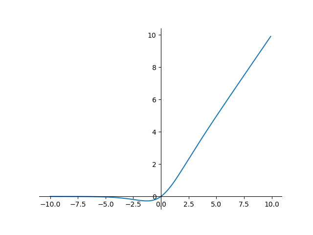

# 激活函数

## 一、简介
&emsp;&emsp; 一个节点的激活函数(Activation Function)定义了该节点在给定的输入或输入的集合下的输出。神经网络中的激活函数用来提升网络的非线性（只有非线性的激活函数才允许网络计算非平凡问题），以增强网络的表征能力。对激活函数的一般要求是：尽可能是非线性函数，而且导数尽可能的大（可以加速训练）。

## 二、激活函数种类
### 1、恒等函数
$$
f(x)=x \qquad\qquad\qquad f^{'}(x)=1
$$

### 2、单位阶跃函数
$$
f(x)=\left\{\begin{array}
    {ll} 0,x < 0\\1,x\ge 0
\end{array}\right.\qquad\qquad f^{'}(x)=\left\{\begin{array}
    {ll} 0,x \ne 0\\?,x= 0
\end{array}\right.
$$

### 3、逻辑函数
$$
f(x)=\sigma(x)=\frac{1}{1+e^{-x}}\qquad\qquad f^{'}(x)=f(x)(1-f(x))
$$

### 4、双曲正切函数
$$
f(x)=tanh(x)=\frac{(e^x-e^{-x})}{e^x+e^{-x}}\qquad \qquad f^{'}(x)=1-f(x)^2
$$

### 5、反正切函数
$$
f(x)=tan^{-1}(x)\qquad\qquad f^{'}(x)=\frac{1}{x^2+1}
$$

### 6、Softsign函数
$$
f(x)=\frac{x}{1+|x|}\qquad\qquad f^{'}(x)=\frac{1}{(1+|x|)^2}
$$

### 7、反平方根函数(ISRU)
$$
f(x)=\frac{x}{\sqrt{1+\alpha x^2}}\qquad \qquad f^{'}(x)=(\frac{1}{\sqrt{1+\alpha x^2}})^3
$$

### 8、线性整流函数(ReLU)
$$
f(x)= \left\{\begin{array}{ll}0,x<0\\x,x\ge 0
\end{array}\right.\qquad\qquad f^{'}(x)=\left\{\begin{array}{ll}0,x<0\\1,x\ge 0
\end{array}\right.
$$

### 9、带泄露线性整流函数(Leaky ReLU)
$$
f(x)= \left\{\begin{array}{ll}0.01x,x<0\\x,x\ge 0
\end{array}\right.\qquad\qquad f^{'}(x)=\left\{\begin{array}{ll}0.01,x<0\\1,x\ge 0
\end{array}\right.
$$

### 10、参数化线性整流函数(PReLU)
$$
f(x)= \left\{\begin{array}{ll}\alpha x,x<0\\x,x\ge 0
\end{array}\right.\qquad\qquad f^{'}(x)=\left\{\begin{array}{ll}\alpha,x<0\\1,x\ge 0
\end{array}\right.
$$

### 11、带泄露随机线性整流函数(RReLU)
$$
f(x)= \left\{\begin{array}{ll}\alpha x,x<0\\x,x\ge 0
\end{array}\right.\qquad\qquad f^{'}(x)=\left\{\begin{array}{ll}\alpha,x<0\\1,x\ge 0
\end{array}\right.
$$

### 12、指数线性函数(ELU)
$$
f(x)= \left\{\begin{array}{ll}\alpha(e^x-1),x<0\\x,x\ge 0
\end{array}\right.\qquad\qquad f^{'}(x)=\left\{\begin{array}{ll}f(\alpha,x)+\alpha,x<0\\1,x\ge 0
\end{array}\right.
$$

### 13、扩展指数线性函数(SELU)
$$
\begin{aligned}
    f(x)=\lambda \left\{\begin{array}{ll}\alpha(e^x-1),x<0\\x,x\ge 0   
\end{array}\right.  \\
\lambda=1.0507,\alpha=1.67326
\end{aligned}
\qquad\qquad f^{'}(x)=\lambda \left\{\begin{array}{ll}\alpha(e^x),x<0\\1,x\ge 0
\end{array}\right.
$$

### 14、S型线性整流激活函数(SReLU)
$$
\begin{aligned}
    f_{t_l,a_l,t_r,a_r}(x)=\left\{\begin{array}
        {ll}
        t_l+a_l(x-t_l),x\le t_l\\
        x,t_l<x<t_r\\
        t_r+a_r(x-t_r),x\ge t_r
    \end{array}\right.\\
    t_l,a_l,t_r,a_r为参数
\end{aligned}\qquad\qquad
f_{t_l,a_l,t_r,a_r}^{'}(x)=\left\{\begin{array}
        {ll}
        a_l,x\le t_l\\
        1,t_l<x<t_r\\
        a_r,x\ge t_r
    \end{array}\right.
$$

### 15、反平方根线性函数(ISRLU)
$$
f(x)= \left\{\begin{array}{ll}\frac{x}{\sqrt{1+\alpha x^2}},x<0\\x,x\ge 0
\end{array}\right.\qquad\qquad f^{'}(x)=\left\{\begin{array}{ll}(\frac{1}{\sqrt{1+\alpha x^2}})^3,x<0\\1,x\ge 0
\end{array}\right.
$$

### 16、自适应分段线性函数(APL)
$$
f(x)=max(0,x)+\sum_{s=1}^{S}a^s_{i}max(0,-x+b^s_i)\qquad\qquad f^{'}(x)=H(x)-\sum^{S}_{s=1}a^s_iH(-x+b^s_i)
$$
### 17、SoftPlus函数
$$
f(x)=\ln(1+e^x) \qquad\qquad f^{'}(x)=\frac{x}{2\sqrt{x^2+1}}+1
$$

### 18、弯曲恒等函数
$$
f(x)=\frac{\sqrt{x^2+1}-1}{2}+x\qquad\qquad f^{'}(x)=\frac{x}{2\sqrt{x^2+1}}+1
$$

### 19、Sigmoid Weighted Liner Unit(SiLU)
$$
f(x)=x\cdot \sigma(x) \qquad\qquad f^{'}(x)=f(x)+\sigma(x)(1-f(x))
$$

### 20、SoftExponential
$$
f(x)= \left\{\begin{array}
    {ll}
    -\frac{ln(1-\alpha(x+\alpha))}{\alpha}, \alpha < 0\\
    x,\alpha=0\\
    \frac{e^{\alpha x}-1}{\alpha},\alpha >0
\end{array}\right. \qquad\qquad f^{'}(x)=\left\{\begin{array}
    {ll}
    \frac{1}{1-\alpha(\alpha+x)},\alpha < 0\\
    e^{\alpha x},\alpha \ge 0
\end{array}\right.
$$

### 21、正弦函数
$$
f(x)= sin(x)\qquad\qquad f^{'}(x)=cos(x)
$$

### 22、Sinc函数
$$
f(x)=\left\{\begin{array}
    {ll}
    1,x=0 \\ \frac{sin(x)}{x},x\ne 0 \end{array}\right.\qquad \qquad
    f(x)=\left\{\begin{array}
    {ll}
    0,x=0 \\ \frac{cos(x)}{x}-\frac{sin(x)}{x},x\ne 0
\end{array}\right.
$$

### 23、高斯函数
$$
f(x)=e^{-x^2} \qquad\qquad f^{'}(x)=-2xe^{-x^2}
$$

