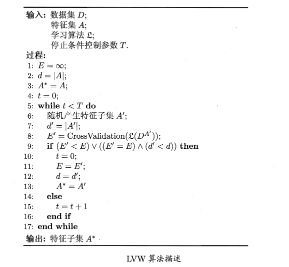
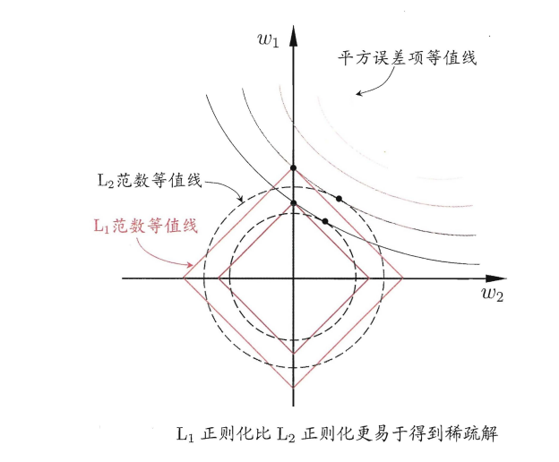

# 1 特征选择
## 1.1 基本概念
- 特征：对于指定数据集，数据的属性集中一般将这些属性称为特征；
- 相关特征：和当前学习任务相关的相关特征；
- 无关特征：和当前学习任务无关的特征；
- 特征选择：从给定的特征中选择出相关特征子集的过程；
- 冗余特征：当前特征包含的信息可以从其他特征推演而来的特征。

### 1.1.1 为什么要进行特征选择
1. 实际任务中经常遇到维数灾难问题，导致属性过多，从中挑选出重要的特征可以降低模型构建的负担；
2. 去除不相关特征可以降低学习任务的难度

### 1.1.2 如何进行特征选择
&emsp;&emsp;先从现有的特征集中产生候选子集进行特征集评估，再根据评估结果产生下一个特征集，不断重复直到得到满足要求的特征集。

## 1.2 子集搜索
&emsp;&emsp;子集搜索方法分为三类（贪心策略）：
1. 前向搜索：在上一次搜索的基础上不断增加新的特征直到性能开始出现下降；
2. 后向搜索：在上一次的搜索的基础上删除特征直到性能开始出现下降；
3. 双向搜索：在上一次搜索的基础上同时增加和删除特征。

## 1.3 子集评价
&emsp;&emsp;对于数据集$D$，$D$中第$i$类样本的比例为$p_i(i=1,...,|Y|)$,$A$为属性子集，假定根据其取值将$D$分为$V$个子集${D^1,...,D^V}$,每个子集中的样本在$A$上的取值相同，则子集$A$的信息增益为信息增益：
$$
Gain(A)=Ent(D)-\sum_{v=1}^V\frac{|D^v|}{|D|}Ent(D^v)
$$

$$
Ent(D)=-\sum_{i=1}^{|Y|}p_k log_2p_k
$$
&emsp;&emsp;信息增益$Gain(A)$越大，意味着特征子集$A$包含的有助于分类的信息越多。

## 1.2 特征选择方法分类
### 1.2.1 过滤式
&emsp;&emsp;过滤式方法先对数据集进行特征选择,然后再训练学习器,特征选择过程与后续学习器无关.这相当于先用特征选择过程对初始特征进行"过滤",再用过滤后的特征来训练模型。
&emsp;&emsp;Relief (Relevant Features)是一种著名的过滤式特征选择方法,该方法设计了一个"相关统计量"来度量特征的重要性.该统计量是一个向量,其每个分量分别对应于一个初始特征,而特征子集的重要性则是由子集中每个特征所对应的相关统计量分量之和来决定。于是,最终只需指定一个阔值$\tau$, 然后选择比$\tau$大的相关统计量分量所对应的特征即可;也可指定欲选取的特征个数$k$, 然后选择相关统计量分量最大的$k$个特征。
&emsp;&emsp;给定数据集$D={(x_1,y_1),...,(x_m,y_m)}$对于每个样本$x_i$在同类样本中寻找最近邻$x_{i,nh}$，称为猜中近邻，再从$x_i$的异类样本中寻找其近邻$x_{i,nm}$称为猜错近邻，之后相关统计量对应于属性$j$的分量为：
$$
\sigma^j=\sum_i-diff(x_i^j,x_{i,nh}^j)^2+diff(x_i^j,x_{i,nm}^j)^2
$$
&emsp;&emsp;其中$x_a^j$表示样本$x_a$在属性$j$上的取值，$diff$取决于属性$j$的类型，如果为离散型，则当$x_a^j==x_b^j$时值为0否则为1；若为连续型则值为$|x_a^j-x_b^j|$,且其值已经规范化到[0,1]之间。分量值越大则相应的属性分类能力越强。上面的公式为二分类版本，对应的多分类版本为：
$$
\sigma^j=\sum_i-diff(x_i^j,x_{i,nh}^j)^2+\sum_{l\ne k}(p_l\times diff(x_i^j,x_{i,l,nm}^j)^2)
$$
&emsp;&emsp;其中$p_l$为第$l$类样本在数据集$D$中所占比例。

### 1.2.2 包裹式
&emsp;&emspp;包裹式特征选择直接把最终将要使用的学习器的性能作为特征于集的评价准则.换言之，包裹式特征选择的目的就是为给定学习器选择最有利于其性能、"量身走做"的特征子集。
&emsp;&emsp;LVW (Las Vegas Wrapper)是一个典型的包裹式特征选择方法.它在拉斯维加斯方法 (Las Vegas method) 框架下使用随机策略来进行子集搜索,并以最终分类器的误差为特征子集评价准则。

### 1.2.3 嵌入式
&emsp;&emsp;嵌入式特征选择是将特征选择过程与学习器训练过程融为一体,两者在同一个优化过程中完成,即在学习器训练过程中自动地进行了特征选择。
&emsp;&emsp;对于线性回归模型，对于数据集$D$,优化目标为:
$$
min_w \sum_{i=1}^m(y_i-w^Tx_i)^2
$$
&emsp;&emsp;特征过多导致过拟合会引入正则化项缓解：
$$
min_w \sum_{i=1}^m(y_i-w^Tx_i)^2+\lambda ||w||^2_2
$$

#### 1.2.3.1 正则化
&emsp;&emsp;正则化是防止模型过拟合的手段，一般使用可以使L1,L2正则化。其中L1正则相比于L2正则能够获得稀疏解。如下图，假定$w$仅有两个属性,即$ω1,ω2$,将其作为两个坐标轴,然后在图中绘制出上述公式的第一项的"等值线",即在($w1$,$w2$)空间中平方误差项取值相同的点的连线,再分别绘制出L1范数与L2范数的等值线,即在$(w_1,w_2)$空间中L1范数取值相同的点的连线以及L2范数取值相同的点的连线,如图所示式上述公式的解要在平方误差项与正则化项之间折中 ,即出现在图中平方误差项等值线与正则化项等值线相交处.由图可看出,采用L1范数时平方误差项等值线与正则化项等值线的交点常出现在坐标轴上，即$ω1$或$ω2$为0,而在采用L2范数时,两者的交点常出现在某个象限中,即$ω1$或$ω2$均非0;换言之采用$L1$范数比$L2$范数更易于得到稀疏解。

# 2 稀疏学习
&emsp;&emsp;稀疏表示：给定特定的稠密矩阵能够将该矩阵表示为稀疏矩阵方便存储，计算和传输等操作。
## 2.1 字典学习
&emsp;&emsp;普通稠密表达的样本找到合适的字典,将样本转化为合适的稀疏表示形式,从而使学习任务得以简化,模型复杂度得以降低，也称稀疏编码。字典学习最简单的形式为:
$$
min_{B,\alpha_i}\sum_{i=1}^m||x_i-B\alpha_i||^2_2+\lambda\sum_{i=1}^m||\alpha_i||_1
$$
&emsp;&emsp;其中$B\in \mathbb{R}^{d\times k}$为字典矩阵，$k$为字典词汇量,$\alpha_i$便是$x_i$的稀疏表示可以通过类似于EM算法先固定$B$优化$\alpha_i$,再固定$\alpha_i$优化$B$。

## 2.2 压缩感知
&emsp;&emsp;根据部分信息来恢复全部信息。