# 1 感知机
## 1.1 神经元模型
&emsp;&emsp;如下图为神经元的模型，神经元接收到输入将和自身的阈值进行比较之后通过激活函数得到最终的输出。理想中的激活函数将输入映射为0,1，0表示神经元被抑制，1表示神经元兴奋，但是由于求解等问题简单的阶跃函数可导性和连续性太差不好求解因此一般采用类似的函数进行替代，可参考[23种激活函数]()
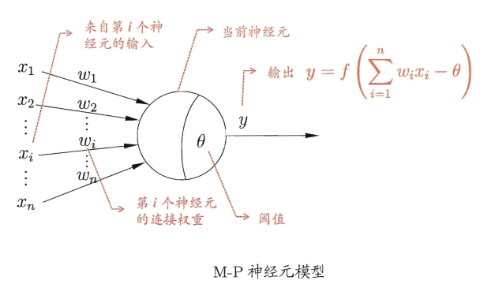
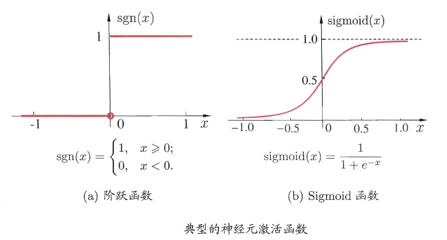

&emsp;&emsp;而多个神经元的链接便成为了神经网络。

## 1.2 感知机
&emsp;&emsp;感知机的模型如下：
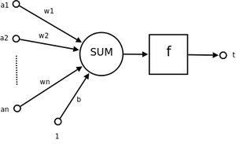

### 1.2.1 感知器收敛定理

&emsp;&emsp;对于感知器收敛是可证明的下面就给出相应的收敛定理证明，另外，感知器收敛的前提是数据是线性可分的。
&emsp;&emsp;在感知器中一般$b$只会选取一个固定的值比如+1，-1作为偏置，这里选择+1，因此可以将$b$和$w$合并，因此相应的输入$x$和$w$变成:
$$x=[+1, x_{1}, x_{2},...,x_{n}]^{T}$$
$$w=[w_{0}, w_{1}, w_{2},...,w_{n}]^{T}$$
&emsp;&emsp;其中$x$和$w$分别在第一位添加了一个维度，公式变得更加紧蹙，但是计算结果和过程都不会受到影响。原感知器模型就变成:
$$f(x)=\sum_{i=1}^{n}w_{i}x_{i}+b \Rightarrow f(x)=\sum_{i=1}^{n}w_{i}x_{i}=\textbf{w}^T\textbf{x}$$
&emsp;&emsp;感知器更新$w$的方式很简单基本就是惩罚措施，对于正确分类的情况$w$不做任何更新，对于错分的情况才更新$w$，可以认为感知器做错了就打一巴掌，指导他所有都做对了为止。基本的更新规则如下(第一个公式就是对于正确分类，第二个公式就是对于错误分类，$D_1$和$D_2$分别为两个类别):
$$
\begin{array}{ll}{w_{n+1}=w_{n}} & { x_n w_n^{T}>0 且 x_n\in D_1} \\ {w_{n+1}=w_n} & { x_nw^{T}  \leqslant 0且x_n \in D_2}\end{array}
$$

$$
\begin{array}{ll}{w_{n+1}=w_{n}-\eta_n x_n} & { x_n w_n^{T}>0 且 x_n\in D_2} \\ {w_{n+1}=w_n+\eta_n x_n} & { x_nw^{T}  \leqslant 0且x_n \in D_1}\end{array}
$$

&emsp;&emsp;$\eta$表示学习率，通常学习率只会和学习的快慢相关不会和最总的结果有很大的关系。因此我们现在假定学习率$\eta=1$且为常量，而且$w_0=0$，因此对于$w_n$的迭代可以得到：$w_{n+1}=x_1+x_2+...+x_n$，因为两个类别是线性可分的因此一定存在一个线性超平面得到最终的解，假定最终的解为$\textbf{w}_o$，因此可以定义一个常数$\alpha$,存在

$$\begin{aligned}
    &\alpha =\min_{x_n \in D_1} \textbf{w}_o^T \textbf{x}_n \\ &\Rightarrow\mathbf{w}_{o}^{T} \mathbf{w}_{n+1}=\mathbf{w}_{o}^{T} \mathbf{x}_1+\mathbf{w}_{o}^{T} \mathbf{x}_2+\cdots+\mathbf{w}_{o}^{T} \mathbf{x}_n \\ &\Rightarrow \mathbf{w}_{o}^{T} \mathbf{w}_{n+1} \geqslant n \alpha  \\   &\Rightarrow\left\|\mathbf{w}_{o}\right\|^{2}\|\mathbf{w}_{n+1}\|^{2} \geqslant n^{2} \alpha^{2} 因为\left\|\mathbf{w}_{o}\right\|^{2}\|\mathbf{w}_{n+1}\|^{2} \geqslant\left[\mathbf{w}_{o}^{T} \mathbf{w}_{n+1}\right]^{2}   \\ &\Rightarrow  \|\mathbf{w}_{n+1}\|^{2} \geqslant \frac{n^{2} \alpha^{2}}{\left\|\mathbf{w}_{o}\right\|^{2}}
\end{aligned}$$  

&emsp;&emsp;这里证明了$w_n$的下限，另一方面证明其的上限：

$$\begin{aligned}
    &\boldsymbol{w}_{n+1}=\boldsymbol{w}_n+\mathbf{x}_n  \\  &\Rightarrow  \|\mathbf{w}_{n+1}\|^{2}=\|\mathbf{w}_n\|^{2}+\|\mathbf{x}_n\|^{2}+2 \mathbf{w}^{\mathrm{T}}_n \mathbf{x}_n, 对上式两边同时平方\\ &\Rightarrow \|\mathbf{w}_{n+1}\|^{2} \leqslant \sum_{k=1}^{n}\|\mathbf{x}_k\|^{2} \leqslant n \beta, 其中\beta=\max _{x_n \in \mathbb{D}_{1}}\|\mathbf{x}_n\|^{2}
\end{aligned}$$

&emsp;&emsp;因此有:

$$\begin{aligned} &\frac{n^{2} \alpha^{2}}{\left\|\mathbf{w}_{o}\right\|^{2}}  \leqslant \|\mathbf{w}_{n+1}\|^{2} \leqslant \sum_{k=1}^{n}\|\mathbf{x}_k\|^{2} \leqslant n \beta, 其中\beta=\max _{x_n \in \mathbb{D}_{1}}\|\mathbf{x}_n\|^{2}, \alpha =\min_{x_n \in D_1} \textbf{w}_o^T \textbf{x}_n \\ &\Rightarrow \frac{n_{\max }^{2} \alpha^{2}}{\left\|\mathbf{w}_{\mathrm{o}}\right\|^{2}}=n_{\max } \beta  \exist n_{max} \\ &\Rightarrow n_{max}=\frac{\beta||\textbf{W}_o||^2}{\alpha^2} \end{aligned}$$

&emsp;&emsp;因此对于线性可分的数据集，对于$\eta=0,w_0=0$一定能在一定的迭代次数之后终止。而对于$\eta$非固定时，感知器总是能够在一定步数到达固定的$\eta$中的某个状态，也就是将固定$\eta$分解为多个任务，以不同的$\eta$进行迭代，但最终的效果是相同的，唯一不同的是需要迭代训练的次数增加或者减少。

&emsp;&emsp;感知器算法完整描述:

- 输入:数据：$x=[+1,x_1,x_2,...,x_n]^T$, 权值$w=[b,w_1, w_2,...,w_n]^T$,实际响应$y_n$期望响应:$d_n$,学习率$\eta$

- 1. 初始化，对输入数据和权重进行初始化；
  1. 激活，通过输入$x$和期望响应$d_n$激活感知器；
  2. 计算实际响应，$y_n=sgn(w_n^Tx_n)$,$sgn$为符号函数
  3. 更新权值:$w_{n+1}=w_n+\eta(d_n-y_n)x_n$
  4. $n=n+1$转2直到验证的准确率达到阈值为止。

  其中，$$d_n=\left\{\begin{array}{ll}{+1} & {x \in D_1} \\ {-1} & { { x \in D_2 }}\end{array}\right.$$

&emsp;&emsp;在学习过程需要注意的是，虽然感知器对线性可分模型一定收敛但是在实际应用中，需要慎重选取$\eta$,希望稳定的更新就需要比较小的$\eta$，可能速度过慢,希望快速更新就需要比较大的$\eta$可能会出现更新过快震荡的情况。

### 1.2.2 高斯环境下的感知器与贝叶斯分类器的关系
&emsp;&emsp;贝叶斯分类器对于二分类问题（两个类别分别为$D_1$,$D_2$），其平均风险为:
$$\begin{aligned}
    \mathcal{R}&=c_{11}p_1\int_{D_1}p_x(x|D_1)dx+c_{22}p_2\int_{D_2}p_x(x|D_2)dx\\&+c_{21}p_1\int_{D_1}p_x(x|D_1)dx+c_{12}p_2\int_{D_2}p_x(x|D_2)dx
\end{aligned}$$
&emsp;&emsp;其中:

- $P_i$标是变量$x$取自子空间$D_i$的先验概率,$i=1,2$且$p_1+p_2=1$
- $c_{ij}$将$$类识别为$i$类的代价，$i=1,2$
- $p_x(x|D_i)$标是变量$x$的条件概率密度函数,$i=1,2$

&emsp;&emsp;令:$D=D_1+D_2$，可以将上式改写为:
$$\begin{aligned}
    \mathcal{R}&=c_{11}p_1\int_{D_1}p_x(x|D_1)dx+c_{22}p_2\int_{D-D_1}p_x(x|D_2)dx\\&+c_{21}p_1\int_{D_1}p_x(x|D_1)dx+c_{12}p_2\int_{D-D_1}p_x(x|D_2)dx
\end{aligned}$$
&emsp;&emsp;又因$c_{11}<c_{21},c_{22}<c_{12}$且有$\int_Dp_x(x|D_1)dx=\int_Dp_x(x|D_2)dx=1$
&emsp;&emsp;则上式简化为
$$
\begin{aligned}
\mathcal{R} &=c_{21}p1 + c_{22}p2\\
&+\int_{D_1}[p_2(c_{12}-c_{22})p_x(x|D_2)-p_1(c_{21}-c_{11})p(x)(x|D_1)]dx
\end{aligned}
$$
&emsp;&emsp;上式中第一项为固定项，为了最小化代价应该最小化第二项，因此最优的分类策列是将使得$p_x(x|D_2)$越小越好，$p_x(x|D_1)$越大越好，假设条件
$$
\begin{aligned}
p_1(c_{21} - c_{11})p_x(x|D_1) \gt p_2(c_{12}-c_{22})p_x(x|D_2)
\end{aligned}
$$
&emsp;&emsp;定义
$$
\begin{aligned}
\Lambda(x)=\frac{p_x(x|D_1)}{p_x(x|D_2)}和\xi=\frac{p_2(c_{12}-c_{22})}{p_1(c_{21}-c_{11})}
\end{aligned}
$$
&emsp;&emsp;其中$\Lambda$是拟然比,$\xi$是检验阈值，二者恒正，则贝叶斯分类器可以表述为:
$$
\begin{aligned}
\left\{\begin{array}{ll} x \in D_1,\Lambda(x)>\xi\\ x \in D_2,\Lambda(x)\le\xi\end{array}\right.
\end{aligned}
$$
&emsp;&emsp;很明显这个分类器和感知器的分类策略很相似，因此贝叶斯分类器和感知器等价。
### 1.2.3 高斯分布下的贝叶斯分类器
&emsp;&emsp;对于高斯分布的情况存在下面的情况:
$$
\begin{aligned}
\left\{\begin{array}{ll} \mathbb{E}[X]=\mu_1,\mathbb{E}[(X-\mu_1)(X-\mu_1)^T]=C & X \in D_1\\ 
\mathbb{E}[X]=\mu_2,\mathbb{E}[(X-\mu_2)(X-\mu_2)^T]=C & X\in D_2\end{array}\right.
\end{aligned}
$$
&emsp;&emsp;其中C为协方差，是非对角，即$D_1$$D_2$是相关的，假设C是非奇异的，即逆矩阵$C^{-1}$存在。
&emsp;&emsp;$x$的条件概率密度韩式表示为多变量高斯分布为：
$$
\begin{aligned}
p_x(x|D_1)=\frac{1}{(2\pi)^{m/2}(\Delta(C))^{1/2}}e^{-\frac{1}{2}(x-\mu)^TC^{-1}(x-\mu_1)},i=1,2,m为x的维数
\end{aligned}
$$
&emsp;&emsp;可以进一步假设，数据时均衡的也就是分类成任何一个类的机会是等价的则有，且假设不同的错分类的代价相同，即:
$$
\begin{aligned}
    & p_1=p_2=\frac{1}{2} \\
    & c_{21}=c_{12},c_{11}=c_{22}=0
\end{aligned}
$$
&emsp;&emsp;则根据贝叶斯分类器中的情况可以得到$\Lambda$和$\xi$,并对其进行取对数有:
$$
\begin{aligned}
    \log{\Lambda(x)}&=-\frac{1}{2}(x-\mu_1)^TC^{-1}(x-\mu_1)+(x-\mu_2)^TC^{-1}(x-\mu_2)\\
    &=(\mu_1-\mu_2)^TC^{-1}x+\frac{1}{2}(\mu_{2}^TC^{-1}\mu_2-\mu_{1}^TC^{-1}\mu_1)\\
    &\log{\xi} = 0
\end{aligned}
$$
&emsp;&emsp;可以看到上述的表达式完全是一个线性的分类器的模型:
$$
\begin{aligned}
    & y=\textbf{w}^T\textbf{x}+b \\
    & \textbf{w} = (\mu_1-\mu_2)^TC^{-1} \\
    & b=\frac{1}{2}(\mu_{2}^TC^{-1}\mu_2-\mu_{1}^TC^{-1}\mu_1)
\end{aligned}
$$
### 1.2.4 总结
&emsp;&emsp;需要注意的是虽然高斯环境下的贝叶斯分类器和感知器类似，但是二者不同：
1. 感知器对数据的要求是线性可分，否则决策边界将不断震荡；而高斯环境下的贝叶斯分类器本身就是假设二者有重叠且相关的；
2. 感知器是最小化分类误差概率，和最小化分类误差还是有区别的；
3. 感知器收敛算法是分参数的；
4. 感知器实现简单。

## 1.3 多层感知机
&emsp;&emsp;单层感知机能够解决线性问题，但是不能解决非线性问题，最经典的便是疑惑问题，可以将感知机堆叠得到多层感知机便可以使其拥有非线性表证能力。


# 2 感知机的求解
&emsp;&emsp;由于感知机拥有神经元过多导致参数过多使用一般的学习算法无法快速学习，上世纪提出的误差反向传播算法(Error Backpropagation, BP)算法是现在圣经网络求解用的最多的。
## 2.1 反向传播算法原理
&emsp;&emsp;对于现有问题数据集$D={(x_1,y_1),...,(x_m,y_m)}, x_i∈R^d, y_i∈R^l$,下图是构建的三层感知机,激活函数使用sigmoid：
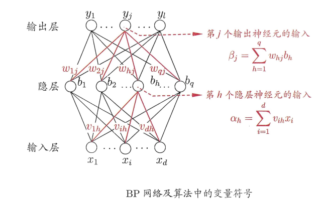
&emsp;&emsp;问题定义：输入$D$,输出$y={y_1,...,y_l}$，为了将输入的标签和输出区别开将输入标签定义为$g={g_1,...,g_m}$(groundtruth)。则网络在$D$上的均方误差为:
$$
E_k=\frac{1}{2}\sum_{i=1}^l(y_i - g_i)^2
$$
&emsp;&emsp;网络中有$(d + l + 1)q + 1$个参数需要确定（第一层$d×q$个，第二层$q×l$个，第二层q个阈值，第三层l个阈值），参数更新的规则为:
$$
v←v+Δv
$$
&emsp;&emsp;反向传播算法是通过链式法则进行传播比如对于$w_{hj}$，$w_{hj}$先影响到下一层的输入$β_j$,再影响到输出值$y_j$，最终影响到$E_k$，更新$w_hj$的规则是：
$$
Δw_{hj}=-η\frac{∂E_k}{∂w_{hj}}
$$
&emsp;&emsp;根据上面的链式法则可以得到：
$$
\frac{∂E_k}{∂w_{hj}}=\frac{∂E_k}{∂y_j}\frac{∂y_j}{∂β_j}\frac{∂β_j}{∂w_{hj}}
$$
&emsp;&emsp;其中
$$
E_k=\frac{1}{2}\sum_{i=1}^l(y_i - g_i)^2
$$

$$
y_j=\frac{1}{1+e^{-(β_j)}}
$$

$$
β_j=∑_{h=1}^q{w_{hj}b_h}
$$
&emsp;&emsp;即
$$
Δw_{hj}=ηa(g_i-y_i)βa_j(1-β_j)b_h
$$
&emsp;&emsp;其他参数同理，BP算法的步骤就是先前向传播计算输出，之后反向传播更新参数，参考[“反向传播算法”过程及公式推导（超直观好懂的Backpropagation)](https://blog.csdn.net/ft_sunshine/article/details/90221691)。
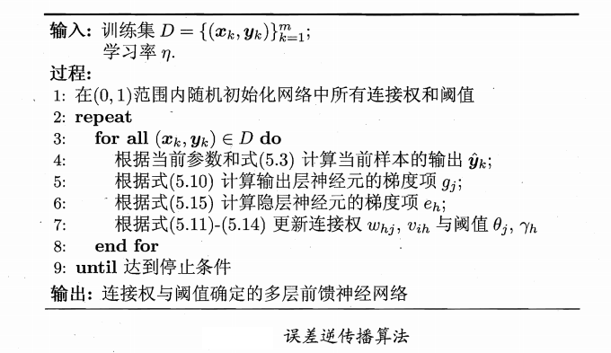

&emsp;&emsp;BP的目标是最小化均方误差，一般等到损失稳定收敛就停止训练。另外神经网络为了防止过拟合会引入正则化来简化模型，这便是另一个话题。

## 2.2 局部最小问题
&emsp;&emsp;神经网络在训练的过程中，不断地下降可能达到的并不是最小点而是局部最小点，因此需要使用其他方式避免：
- 以多组不同参数值初始化多个神经 网络 7 按标准方法训练后，取其 中误差
最小的解作为最终参数;
- 使用 "模拟*火" (simulated annealing) 技术,模拟退火在每一步都 以二定的概率接受 比当前解更差的结果，从而有助于 "跳出"局部极小;
- 使用随机梯度下降.与标准梯度下降法精确计算梯度不同，随机梯度下降法在计算梯度时加入了随机因素。

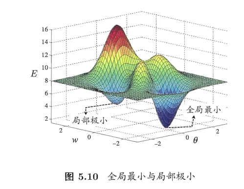

# 3 其他神经网络
## 3.1 RBF网络
&emsp;&emsp;RBF(Radial B描is Function，径向基函数)网络是一种单隐层前馈神经网络，它使用径向基函数作为隐层神经元激活函数，而输出层则是对隐层神经元输出的线性组合.假定输入为$d$维向量$x$输出为实值则RBF网络可表示为:
$$
φ(x)=∑_{i=1}^q{w_iq(x,c_i)}
$$
&emsp;&emsp;其中q为隐层神经元个数，$C_i$和$W_i$分别是第$i$个隐层神经元所对应的中心和权重， $ρ(x，C_i)$是径向基函数，这是某种沿径向对称的标量函数，通常定义为样本$x$到数据中心$C_i$之间欧氏距离的单调函数常用的高斯径向基函数形如:
$$
ρ(x,c_i)=e^{-β_j||x-c_i||^2}
$$
&emsp;&emsp;通常采用两步过程来训练RBF网络:第一步,确定神经元中心$c_i$,常用的方式包括随机采样、聚类等;第二步，利用BP算法等来确定参数$w_i$和$β_i$。
## 3.2 ART网络
&emsp;&emsp;竞争型学习 (competitive learning)是神经网络中一种常用的无监督学习策略在使用该策略时，网络的输出神经元相互竞争，每一时刻仅有一个竞争获胜的神经元被撤活，其他神经元的状态被抑制.这种机制亦称"胜者通吃" (winner-take-all) 原则。
## 3.3 SOM网络
&emsp;&emsp;SOM(Self-Organizing Map，自组织映射)网络是一种竞争学习型的无监督神经网锚，官能将高维输入数据映射到低维空间(通常为二维) ，同时保持输入数据在高维空间的拓扑结构，即将高维空间中相似的样本点映射到网络输出层中的邻近神经元。
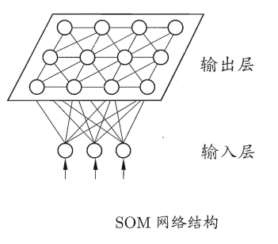
## 3.4 级联相关网络
&emsp;&emsp;一般的神经网络模型通常假定 网络结构是事先固定的，训练的目的是利用训练样本来确定合适的连接权、 阙值等参数.与此不同， 结构自适应网络则将网络结构也当作学 习的目 标之 一?并希望能在训练过程中找到最利合数据特点的网绵结构-级联相关 (Cascade-Correlation)网络是结构自适应网络的重要代表 。
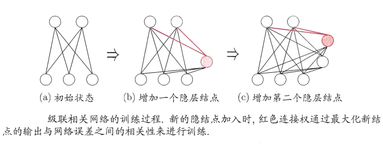
## 3.5 Elman 网络
&emsp;&emsp;递归神经网络" (recurrent neural networks)允许网络中出现环形结构，从而可让一些神经元的输出反馈回来作为输入信号.这样的结构与信息反馈过程，使得网络在 t 时刻的输出状态不仅与 t 时刻的输入有关还与 t 一 1 时刻的网络状态有关，从而能处理与时间有关的动态变化。
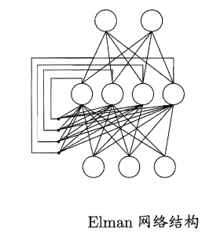
## 3.6 Boltzmann机
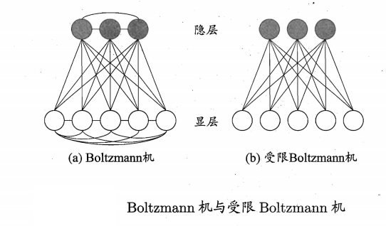

# 3 实现
## 3.1 单层感知机
### 3.1.1 实现
```python
class Perceptron(object):
    '''单层感知机
    '''
    def __init__(self, shape):
        super(Perceptron, self).__init__()

        self.w = np.ones(shape)      #weigth
        self.b = 1.5                                 #the bias
        self.activate_func = sgn

    def update(self,x,y,out,learning_rate):
        self.w += learning_rate * x.T * (y - out)

    def calclate(self, x):
        return self.activate_func(np.dot(self.w, x.T) + self.b)

    def loss_func(self, pre_y, gt_y):
        return (pre_y - gt_y) ** 2

    def train(self, x, y, epochs, learning_rate):
        losses = []
        for epoch in range(epochs):
            loss_tmp = []
            for i in range(x.shape[0]):
                out = self.calclate(x[i])
                loss_tmp.append(self.loss_func(out, y[i]))
                self.update(x[i], y[i], out, learning_rate)

            losses.append(sum(loss_tmp)/len(loss_tmp))
        return losses

    def predict(self, x):
        out = self.calclate(x)
        return out
    
    def test(self, x,y):
        label = self.predict(x)
        gt_count = np.sum(label==y)
        wrong_count = np.sum(label!=y)
        return wrong_count/(wrong_count+gt_count),gt_count/(wrong_count+gt_count)


    def get_params(self):
        return {'weight':self.w, 'bias':self.b}
```

### 3.1.2 结果
|数据|决策面|损失|
|-|-|-|
|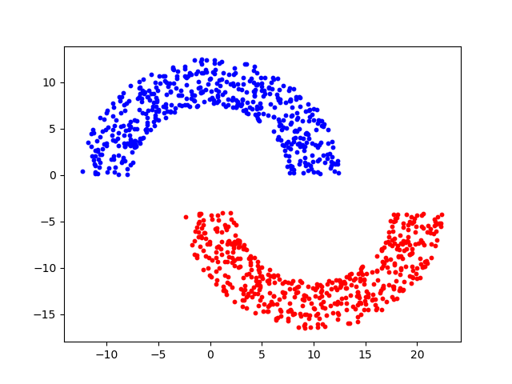|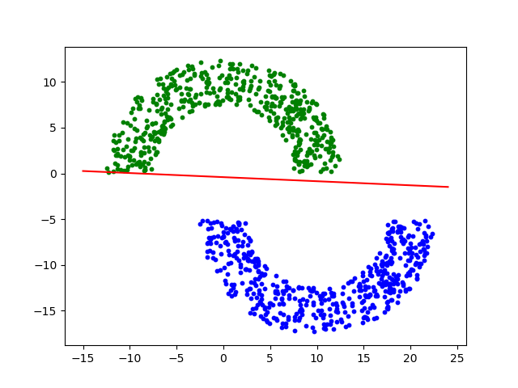|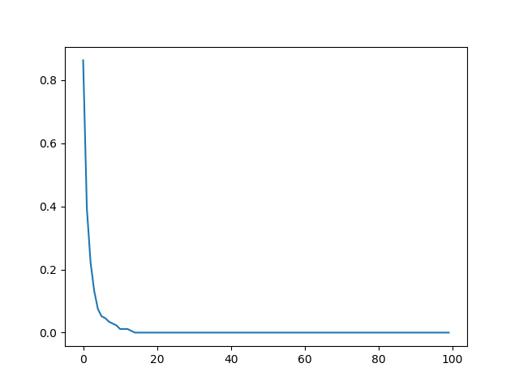|
|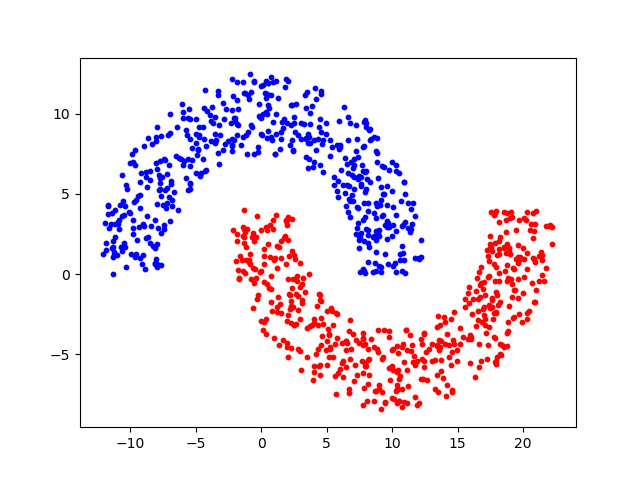|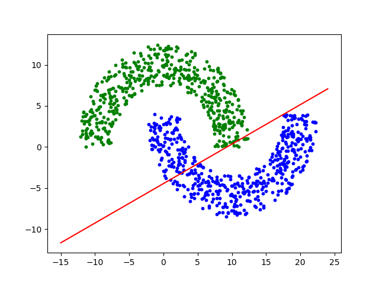|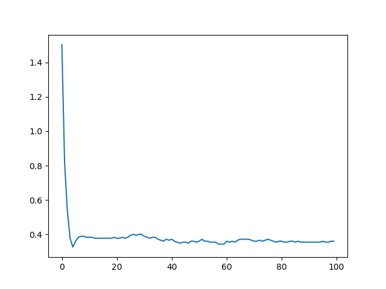|

|b=1.0|b=0.5|b=0.3|
-|-|-|
|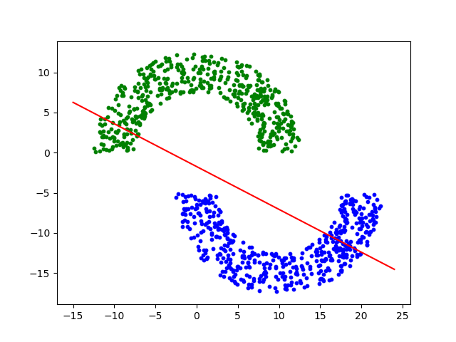||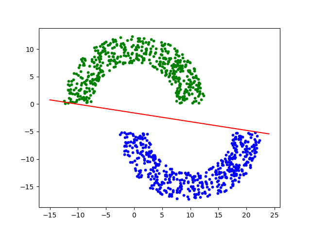|