# 1 线性模型
&emsp;&emsp;给定数据有$d$个属性，$x=(x_1;x_2,...,x_d)$，线性模型尝试通过学的一个各个属性的线性组合进行预测：
$$
f(x)=w_1x_1+w_2x_2+...+w_dx_d+b \Rightarrow f(x)=\bold{w}^T\bold{x}+b
$$
&emsp;&emsp;其中$\bold{w},b$便是学习过程中学到的参数。

## 1.1 线性回归
&emsp;&emsp;线性回归试图学习一个线性模型以尽可能的预测实际的输出标记。即学习一个$f(x)=w^T x+b$是的输出更接近于目标类别$y$，这个过程中可以使用均方误差作为性能度量指标，最小化均方误差便是目标：
$$
(\hat{w},\hat{b})=\argmin_{(w,b)}\sum_{i=1}^{m}(f(x_i)-y_i)^2=\argmin_{(w,b)}\sum_{i=1}^m(y_i-wx_i-b)^2
$$
&emsp;&emsp;使用最小二乘法求解$w,b$使得$E_{(w,b)}=\sum_{i=1}^m(y_i-wx_i-b)^2$最小化的过程即线性回归模型的最小二乘参数估计。
&emsp;&emsp;此种情况下$w,b$的最优解的闭式解为：
$$
w=\frac{\sum_{i=1}^m y_i(x_i - \bar{x})}{\sum_{i=1}^m x^2_i-\frac{1}{m}(\sum_{i=1}^m x_i)^2},b=\frac{1}{m}\sum_{i=1}^m (y_i-wx_i)
$$
&emsp;&emsp;其中$\bar{x}$=\frac{1}{m}\sum_{i=1}^m x_i。
&emsp;&emsp;当目标扩展开来目标试图学得$f(x)=\bold{w}^T \bold{x}+b$时便是多元线性回归。此时的解为（$X^TX$为满秩矩阵或者正定矩阵）：
$$
\hat{w}=(\bold{X}^T\bold{X})^{-1}\bold{X}^T\bold{y}
$$
&emsp;&emsp;最终的回归模型为：
$$
f(\hat{x}_i)=\hat{x}_i^T(\bold{X}^T\bold{X})^{-1}\bold{X}^T\bold{y}
$$
&emsp;&emsp;但是由于现实中$X^TX$满秩并不满足因此可以解出多个$\hat{w}$，选择最优的那个，或者引入正则化项。

## 1.2 对数线性回归
&emsp;&emsp;线性回归是直接毕竟输出，可以尝试让$e^{\bold{x}^T\bold{x}+b}\rightarrow y$只是对目标进行了非线性映射就得到了对数线性回归，求解后得到的目标函数为：
$$
y=g^{-1}(\bold{w}^T\bold{x}+b)
$$
&emsp;&emsp;$g$为映射函数，对数线性回归选择$g$为$e^x$。该模型为广义线性模型，$g$称之为联系函数。
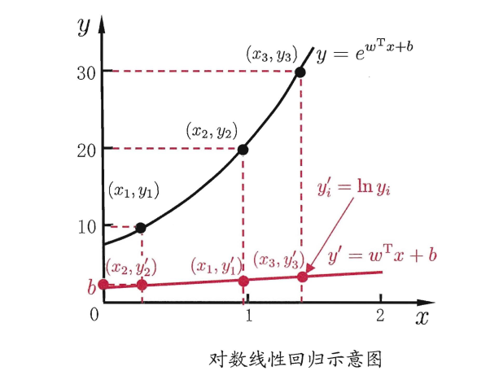

## 1.3 对几率回归
&emsp;&emsp;对几率回归是广义线性模型采用对几率函数(logistic function)在二分类问题上的应用。
$$
y=\frac{1}{1+e^{-z}}
$$
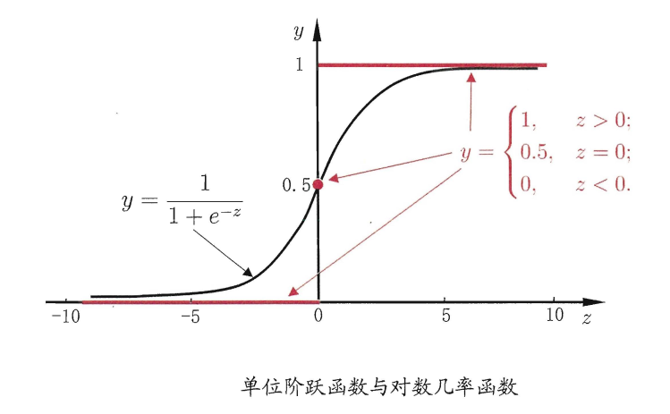
&emsp;&emsp;因此目标函数为:
$$
\begin{aligned}
& y=\frac{1}{1+e^{-(\bold{w}^T \bold{x} + b)}} \\
& \Rightarrow ln\frac{y}{1-y}=\bold{w}^T\bold{x}+b
\end{aligned}
$$
&emsp;&emsp;其中$\frac{y}{1-y}$为几率，$ln\frac{y}{1-y}$为对几率。若将$y$视为正例的概率，$1-y$视为反例的概率则可通过最大化:
$$
\begin{aligned}
&\ell(\bold{w},b)=\sum_{i=1}^m ln p(y_i|\bold{x_i};\bold{w},b)\\
&p(y=1|\bold{x})=\frac{e^{w^Tx+b}}{1+e^{w^Tx+b}},\\
&p(y=0|\bold{x})=\frac{1}{1+e^{w^Tx+b}},\\
\end{aligned}
$$
&emsp;&emsp;令$W=(w,b),\hat{x}=(x;1)$，则拟然想可写成：
$$
p(y_i|\bold{x_i};\bold{w},b)=y_ip_1(\hat{\bold{x}}_i;\bold{W})+(1-y_i)p_0(\hat{\bold{x}}_i;\bold{W})
$$
&emsp;&emsp;则优化目标等同于最小化
$$
\ell(\bold{W})=\sum_{i=1}^{m}(-y_i\bold{W}^T\hat{\bold{x}}_i+ln(1+e^{\bold{W}^T\bold{\hat{x}}_i}))
$$
&emsp;&emsp;可通过牛对迭代法梯度下降法等求最优解:
$$
\bold{\hat{W}}=\argmin_{\bold{W}}\ell(\bold{W})
$$
&emsp;&emsp;第$t+1$轮迭代更新公式为：
$$
\bold{W}^{t+1}=\bold{W}^t-(\frac{\partial^2\ell(\bold{W})}{\partial \bold{W} \partial \bold{W}^T})^{-1}\frac{\partial\ell(\bold{W})}{\partial\bold{W}}
$$

## 1.4 线性判别分析(Linear Discriminant Analysis)
&emsp;&emsp;LDA的基本思想：给定训练样例集，设法将样例投影到一条直 线上 ，使得同类样例的投影点尽可能接近、 异类样例 的投影点尽可能远离;在对新样本进行分类时，将其投影到 同样的这条直线上，再根据投影点的位置来确定新样本的类别。
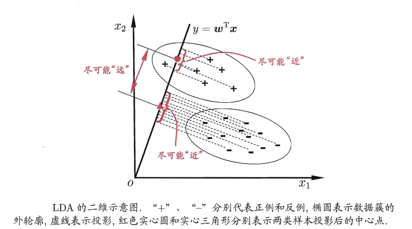
&emsp;&emsp;对于数据集$D={(x_i,y_i)}^m_{i=1},y_i\in {0,1}$，令$X_i,\mu_i,\sum_i,i\in {0,1} $分别表示类的集合，均值向量，协方差矩阵，将数据投影到只想$\bold{w}x$上后，正负样本的中心点为：$\bold{w}^T\mu_0,\bold{w}^T\mu_1$，两类样本的协方差为:$\bold{w}^T\sum_0\bold{w}, \bold{w}^T\sum_1\bold{w}$。
&emsp;&emsp;目标是将同类尽可能的近即最小化$\bold{w}^T\sum_0\bold{w}+\bold{w}^T\sum_1\bold{w}$，不同类尽可能的远则最大化$||\bold{w}^T\mu_0-\bold{w}^T\mu_1||^2_2$，同时考虑二者的话目标便是最大化:
$$
\begin{aligned}
J&=\frac{\bold{w}^T\mu_0-\bold{w}^T\mu_1||^2_2}{\bold{w}^T\sum_0\bold{w}+\bold{w}^T\sum_1\bold{w}}\\
&=\frac{\bold{w}^T(\mu_0-\mu_1)(\mu_0-\mu_1)^T\bold{w}}{\bold{w}^T(\sum_0+\sum_1)\bold{w}}
\end{aligned}
$$
&emsp;&emsp;定义类内散度矩阵$\bold{S}_w$，类间散度矩阵$\bold{S}_b$分别为:
$$
\begin{aligned}
&\bold{S}_w=\sum_0+\sum_1 \\
&\bold{S}_b=(\bold{\mu_0}-\bold{\mu_1})(\bold{\mu_0}-\bold{\mu_1})^T
\end{aligned}
$$
&emsp;&emsp;则优化目标为最大化,即$\bold{S}_b,\bold{S}_w$的广义瑞利商：
$$
J=\frac{\bold{w}^T\bold{S}_b\bold{w}}{\bold{w}^T\bold{S}_w\bold{w}}
$$
&emsp;&emsp;由于分子和分母都是关于$w$的二次项因此值域其方向有关与长度无关将式子等价于：
$$
\begin{aligned}
    &\min_{\bold{w}}-\bold{w}^T\bold{S}_b\bold{w}\\
&s.t.  \bold{w}^T\bold{S}_w\bold{w}=1
\end{aligned}
$$
&emsp;&emsp;利用拉格朗日乘子法便可求解得到：
$$
\bold{w}=\bold{S}^{-1}_w(\mu_0-\mu_1)
$$

## 1.5 多分类
&emsp;&emsp;多分类问题的一个解法便是将多分类问题拆分为多个二分类问题进行求解：
- 1. 一对一(OvO):将$n$个分类两两配对，生成$\frac{n(n-1)}{2}$个分类器，最终投票分类；
- 2. 一对其余(OvR):每次只训练针对一个类别的分类器；
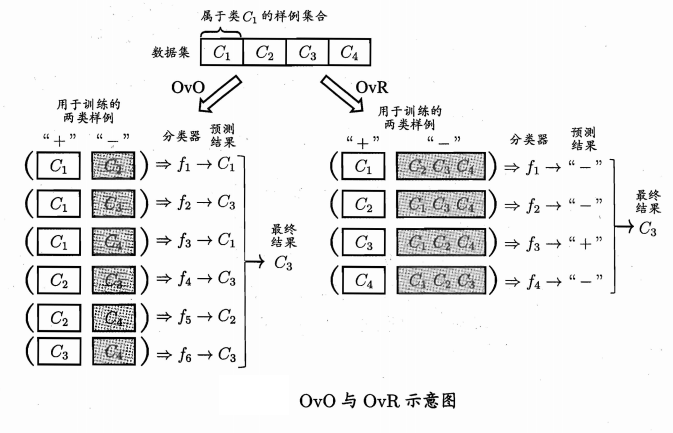
- 3. 多对多(MvM)：每次将若干个类作为正类，若干个其他类作为反类。MvM 的正、反类构造必须有特殊的设计，不能随意选取。
  - MvM采用错输出码(EOOC)对不同类别进行编解码：
    - 编码：对N个类别做M次划分， 每次划分将一部分类别划为正类，一部分划为反类，从而形成一个二分类训练集;这样一共产生M个训练集，可训练出 M 个分类器；
    - 解码：M 个分类器分别对测试样本进行预测，这些预测标记组成一个编码.将这个预测编码与每个类别各自的编码进行比较，返回其中距离最小的类别作为最终预测结果。
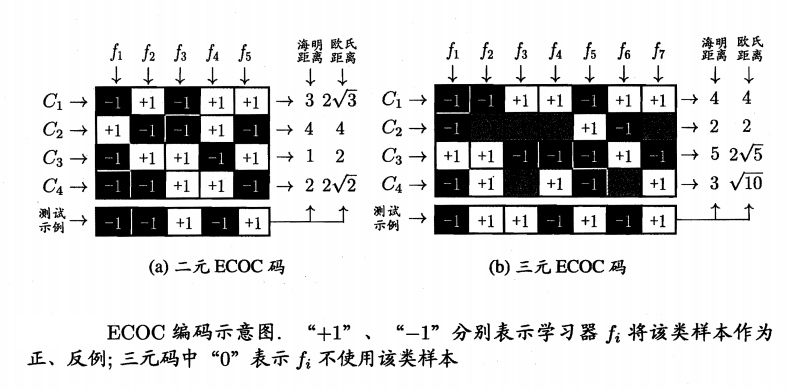

# 2 实现
## 2.1 代码
&emsp;&emsp;三个版本一个的迭代过程：
```python
def sigmoid(x):
    return 1.0 / (1 + np.exp(-x))
    
def grad_ascent(data, label):
    data = np.mat(data)
    label = np.mat(label).transpose()
    m, n = np.shape(data)
    alpha = 0.001
    epochs = 50000
    w = np.ones((n, 1))
    ws = []
    for epoch in range(epochs):
        h = sigmoid(data * w)
        err = label - h
        w = w + alpha * data.transpose() * err
        ws.append(w)
    return w, ws
    

def sto_grad_scent(data, label):
    data = np.array(data)
    m, n = np.shape(data)
    alpha = 0.001
    w = np.ones(n)
    ws = []    
    for i in range(500):
        for epoch in range(m):
            h = sigmoid(np.sum(data[epoch] * w))
            err = label[epoch] - h
            w = w + float(alpha) * float(err) * data[epoch]
            ws.append(w)
    return w, ws
    
def sto_grad_scent_II(data, label):
    data = np.array(data)
    m, n = np.shape(data)
    w = np.ones(n)
    ws = []
    for epoch in range(500):
        ids = list(range(m))
        for i in range(m):
            alpha = 0.0001 + 4 / (1.0 + i + epoch)
            rand_i = int(random.uniform(0, len(ids)))
            h = sigmoid(np.sum(data[rand_i] * w))
            err = label[rand_i] - h
            w = w + float(alpha) * float(err) * np.array(data[rand_i])
            del ids[rand_i]
            ws.append(w)
    return w, ws
```
## 2.2 结果

|更新算法|决策面|w0|w1|w2|
|-|-|-|-|-|
|第一版|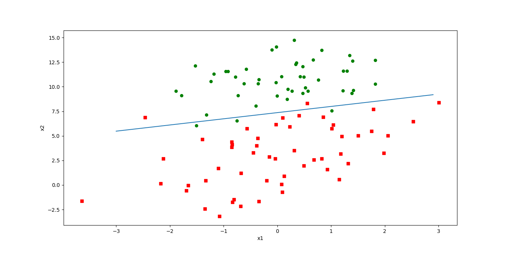|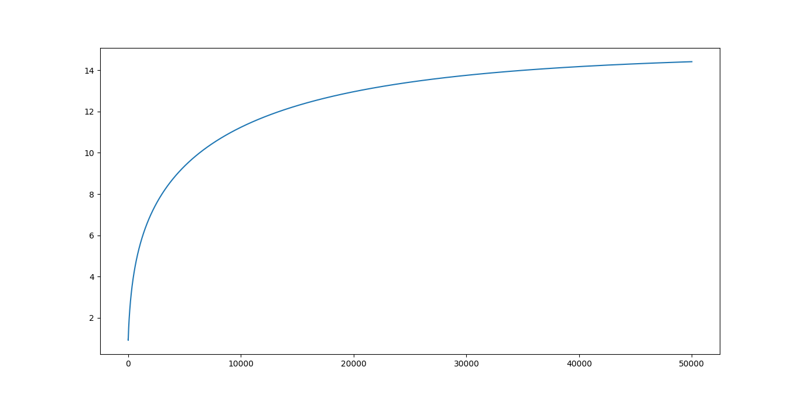|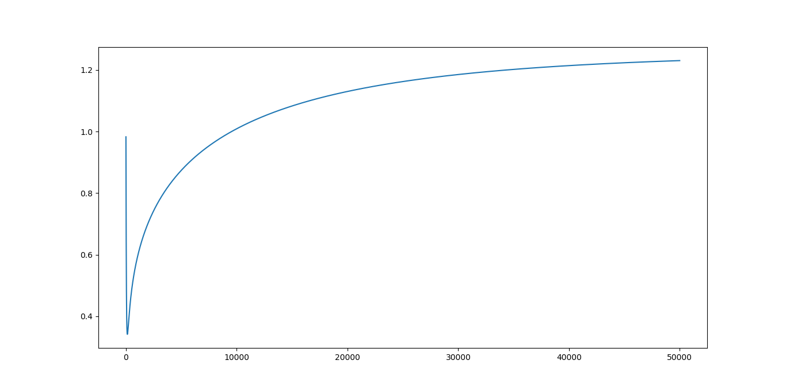|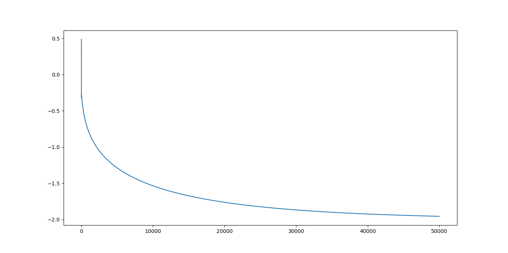|
|第二版|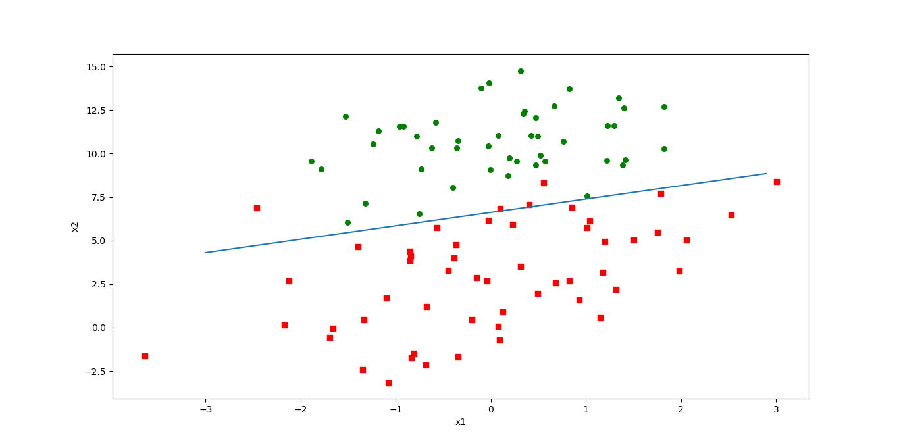|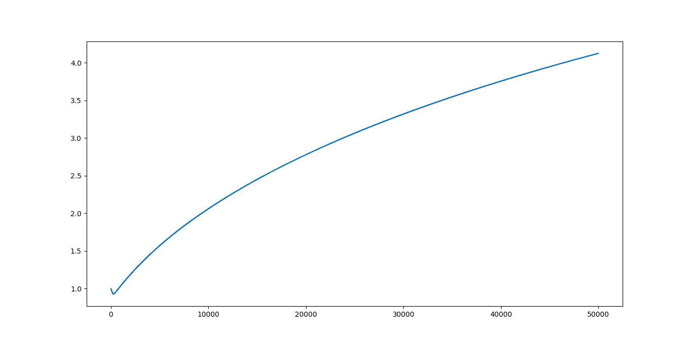|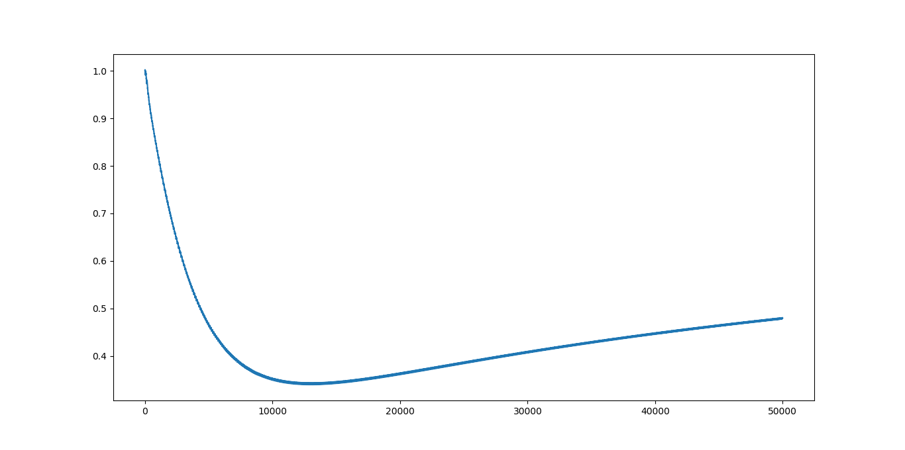|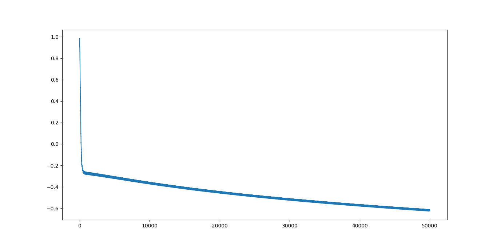|
|第三版|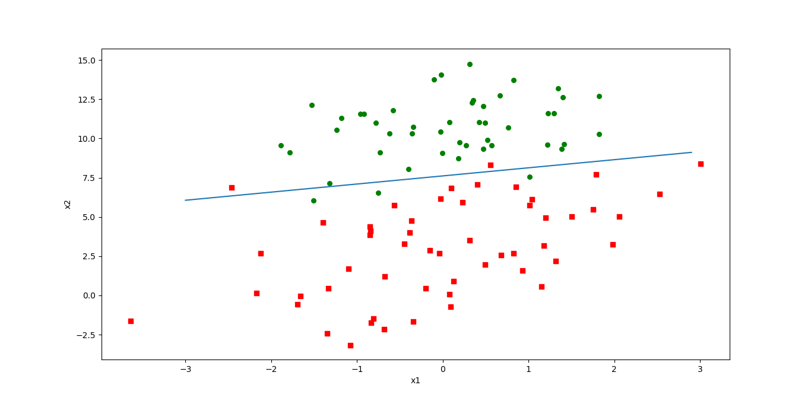|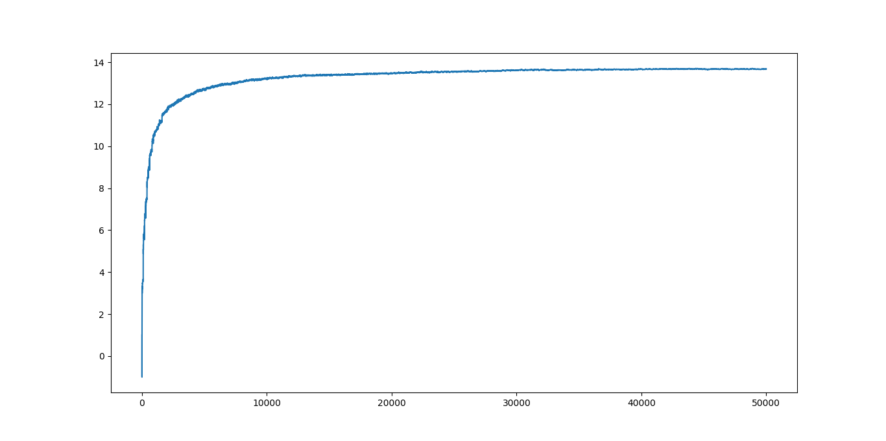|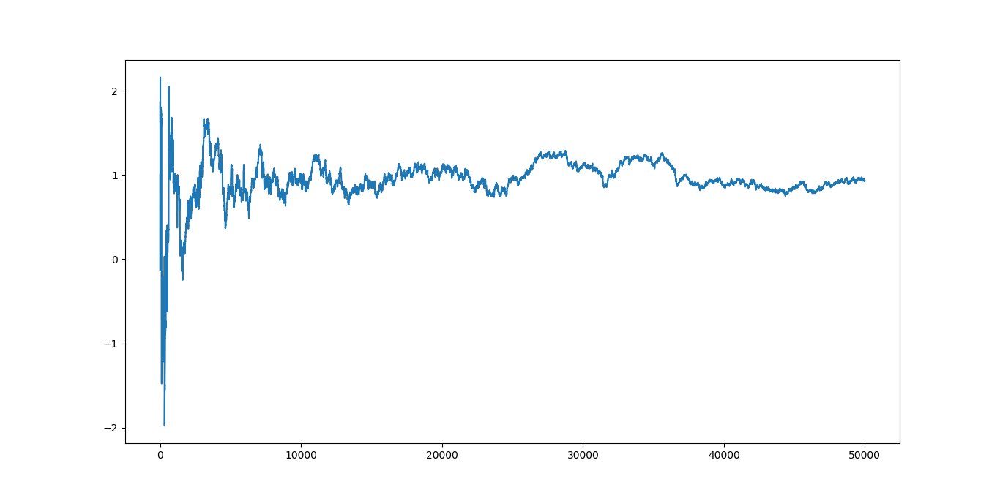|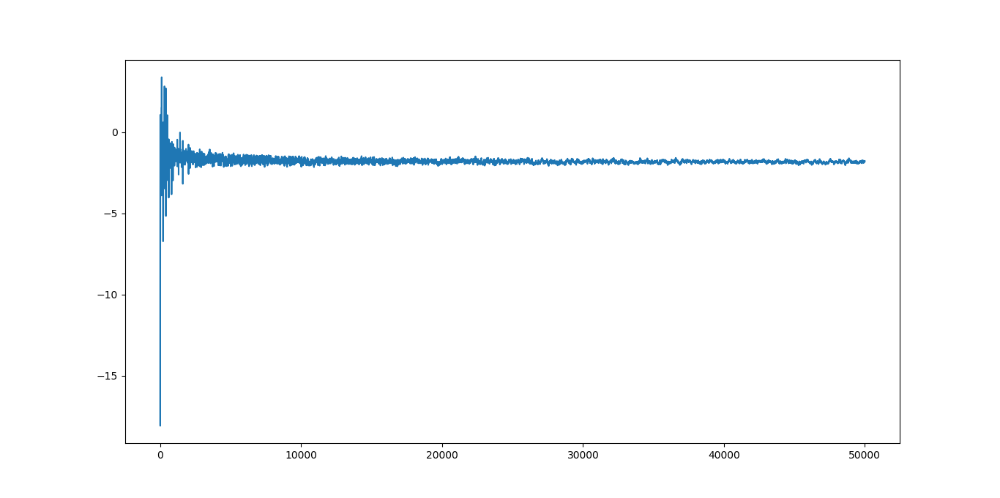|
