# 1 简介
&emsp;&emsp;聚类试图将数据集中的样本划分为若干个通常是不相交的子集，每个子集称为一个"簇" (cluster). 通过这样的划分，每个簇可能对应于一些潜在的概念(类别)。
## 1.1 性能度量
&emsp;&emsp;聚类的目标是经可能的降低簇内相似度，提高簇间相似度。聚类的性能度量指标有两类：
1. 外部指标，和相应的参考模型相比较；
2. 内部指标，直接考察聚类结果而不利用任何参考模型。

### 1.1.1 常用的外部指标
&emsp;&emsp;假定下载对数据集$D={x_1,x_2,...,x_m}$进行聚类，最终划分的簇为$C={C_1,...,C_{k_1}}$，而参考模型给定的簇为$S={S_1,...,S_{k_2}}$，则将$λ^c$和$λ^s$分别记做两个簇的标记向量，现在定义:
$$
\begin{aligned}
    &a=|SS|, SS={(x_i,x_j)|λ^c_i=λ^c_j, λ^s_i=λ^s_j,i<j}\\
    &b=|SD|, SD={(x_i,x_j)|λ^c_i=λ^c_j, λ^s_i≠λ^s_j,i<j}\\
    &c=|DS|, DS={(x_i,x_j)|λ^c_i≠λ^c_j, λ^s_i=λ^s_j,i<j}\\
    &d=|DD|, DD={(x_i,x_j)|λ^c_i≠λ^c_j, λ^s_i≠λ^s_j,i<j}\\
\end{aligned}
$$

- Jaccard系数(JC):
$$
\mathrm{JC}=\frac{a}{a+b+c}
$$
- FM指数(FMI):
$$
\mathrm{FMI}=\sqrt{\frac{a}{a+b} \cdot \frac{a}{a+c}}
$$
- Rand指数(RI):
$$
\mathrm{FMI}=\sqrt{\frac{a}{a+b} \cdot \frac{a}{a+c}}
$$
&emsp;&emsp;上面的系数值域为[0,1]，值越大越好
### 1.1.2 常用的内部指标
&emsp;&emsp;现有：

- DB指数(DBI):
- Dunn指数(DI):
&emsp;&emsp;上面的指标DBI越小越好，DI越大越好。
$$
\begin{aligned}
    & avg(C=\frac{2}{|C|(|C|-1)}∑_{1≤i<j≤|C|}dist(x_i,x_j)\\
    & diam(C)=max_{1≤i<j≤|C|} dist(x_i,x_j)\\
    & d_{min}(C_i,C_j)=min_{x_i∈C_i,x_j∈C_j}dist(x_i,x_j)\\
    &d_{cen}(C_i,C_j)=dist(μ_i,μ_j)
\end{aligned}
$$
&emsp;&emsp;其中$dist$表示两个样本之间的距离，$μ$为簇的中心点$μ=\frac{1}{|C|}∑_{1≤i≤|C|}x_i$
## 1.2 距离度量
&emsp;&emsp;参考[距离度量](http://139.129.116.33/2020/02/15/%E8%B7%9D%E7%A6%BB%E5%BA%A6%E9%87%8F/)

# 2 原型聚类
&emsp;&emsp;原型聚类亦称"基于原型的聚类" (prototype~based clustering)) 此类算法
假设聚类结构能通过一组原型刻画，算法先对原型进行初始化，然后对原型进行迭代更新求解.采用不同的原型表示、不同的求解方式将产生不同的算法。
## 2.1 k均值(k-means)
&emsp;&emsp;给定样本集$D={x_1,...,x_m}$,k-means通过聚类划分簇$C={C_1,C_2,...,C_k}$最小化平均误差：
$$
E=∑_{i=1}^{k}∑_{x∈C_i}||x-μ_i||^2_2,μ_i=\frac{1}{|C_i|}∑_{x∈C_i}x
$$
&emsp;&emsp;E越小簇内样本相似度越高。然而找到最优解是NP难问题，k-means采用贪心策略进行求解。
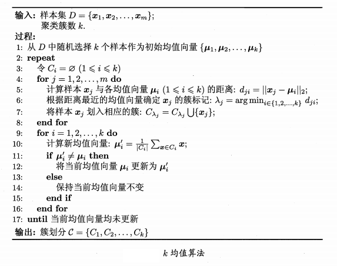

## 2.2 学习向量量化(Learning Vector Quantization, LVQ)
&emsp;&emsp;LVQ也是试图找到一组原型向量来刻画聚类结构， 但与一般聚类算法不同的是，LVQ假设数据样本带有类别标记，学习过程利用样本的这些监督信息来辅助聚类。
&emsp;&emsp;对于样本集$D={(x_1,y_1),..,(x_m,y_m)}$，每个样本$x_j$由$n$个属性描述的特征向量$(x_{j1},...,x_{jn})$,LVQ的目标是学习一组$n$维原型向量${p_1,...,p_q}$，每个原型向量表示一个聚类簇。
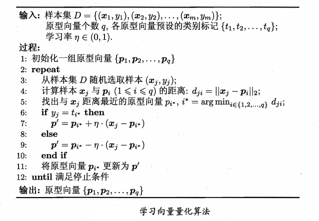

## 2.3 高斯混合聚类(Mixture-of-Gaussian)
&emsp;&emsp;高斯混合聚类采用概率模型来表达聚类原型。高斯分布概率密度函数为：
$$
p(x)=\frac{1}{{(2π)}^{\frac{n}{2}}|∑|^{\frac{1}{2}}}e^{-\frac{1}{2}(x-μ)^T∑^{-1}(x-μ)}
$$
&emsp;&emsp;其中$μ$为均值向量，$∑$为协方差矩阵，定义概率密度函数为$p(x|μ,∑)$，高斯混合分布为:
$$
p_{M}(x)=∑_{i=1}^kα_ip(x|μ_i,∑_i)
$$
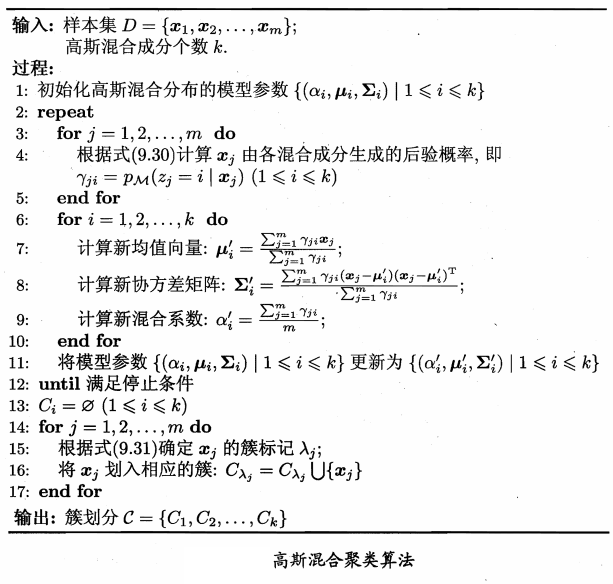

# 3 密度聚类
&emsp;&emsp;密度聚类亦称"基于密度的聚类" (density-based clustering) ，此类算法假设聚类结构能通过样本分布的紧密程度确定.通常情形下，密度聚类算法从样本密度的角度来考察样本之间的可连接性，并基于可连接样本不断扩展聚类簇以获得最终的聚类结果。
&emsp;&emsp;DBSCAN 是一种著君的密度粟类算法?它基于一组"邻域" (neighborhood) 参数 (E,MinPts) 来刻画样本分布的紧密程度，对于数据集$D={x_1,...,x_m}$则：
- ε-邻域：对$x_j∈D$其ε-邻域包含样本集$D$中与$x_j$的距离不大于ε的样本，即$N_{ε}(x_j)={x_i∈D|dist(x_i,x_j)≤ε}$;
- 核心对象：若$x_j$的ε-邻域至少包含MinPts个样本，即$|N_{ε}(x_j)≥MinPts|$则$x_j$是一个核心对象；
- 密度直达：若$x_j$位于$x_i$的ε-邻域中，且$x_i$是核心对象，即$x_j$由$x_i$密度直达；
- 密度可达：对于$x_i$与$x_j$，若存在样本虚了$p_1,p_2,...,p_n$,$p_1=x_i,p_n=x_j$且$p_{i+1}$由$p_i$密度直达，则$x_j$由$x_i$密度可达；
- 密度相连：对$x_i$与$x_j$，若存在$x_k$使得$x_i$与$x_j$均有$x_k$密度可达则二者密度相连。

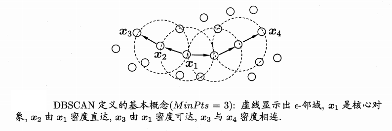
&emsp;&emsp;DBSCAN 将"簇"定义为:由密度可达关系导出的最大的密度相连样本集合,即$C$满足：
- 连接性：$x_i,x_j∈C$二者密度相连；
- 最大性：$x_i∈C$,$x_j$可由$x_i$密度可达则$x_j∈C$

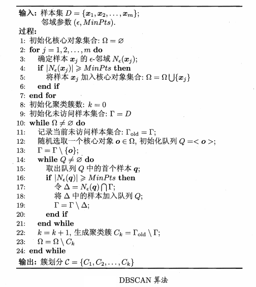

# 4 层次聚类
&emsp;&esmp;层次聚类(hierarchical clustering)试图在不同层次对数据集进行划分，从而形成树形的聚类结构 . 数据集的划分可采用"自 底向上 "的聚合策略，也可采用 "自 顶 向下" 的分拆策略。
&emsp;&emsp;AGNES 是一种采用自底 向上聚合策略的层次聚类算法.它先将数据集中的每个样本看作一个初始聚类簇，然后在算法运行的每一步中找 出距离最近的两个粟类簇进行合并，该过程不断重复，直至达到预设的聚类簇个数。
&emsp;&emsp;对于聚类簇$C_i$和$C_j$:
- 最小距离$d_{min}(C_i,C_j)=min_{x∈C_i,z∈C_j}dist(x,z)$;
- 最大距离$d_{max}(C_i,C_j)=max_{x∈C_i,z∈C_j}dist(x,z)$;
- 平均距离$d_{avg}(C_i,C_j)=\frac{1}{|C_i||C_j|}∑_{x∈C_i}∑_{z∈C_j}dist(x,z)$。
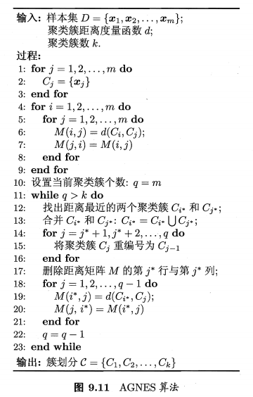
# 5 实现
## 5.1 python实现
### 5.1.1 k-means
```python
def k_means(data, k, epoch=10):
	m = np.shape(data)[0]
	cluster = np.mat(np.zeros((m, 2)))
	center = rand_center(data, k)
	cluste_changed = True
	while cluste_changed and epoch > 0:
		cluste_changed = False
		for i in range(m):
			min_dist = np.inf
			min_id = -1
			for j in range(k):
				dist = dist_eclud(center[j,:], data[i,:])
				if dist < min_dist:
					min_dist = dist
					min_id = j
				
				if cluster[i,0] != min_id:
					cluste_changed = True
				cluster[i,:] = min_id, min_dist ** 2
			
		for i in range(k):
			pts = data[np.nonzero(cluster[:,0].A == i)[0]]
			center[i,:] = np.mean(pts, axis=0)
		
		#draw_cluster(data, cluster, center)
		epoch -= 1
	return center, cluster
```
### 5.1.2 bink-means
```python
def bin_k_means(data, k):
	'''
	@brief	自顶向下
	'''
	m = np.shape(data)[0]
	cluster = np.mat(np.zeros((m, 2)))
	center = np.mean(data, axis=0).tolist()[0]
	center_list = [center]
	for i in range(m):
		cluster[i, 1] = dist_eclud(np.mat(center), data[i,:]) ** 2
		
	best_center_id = None
	best_center = None
	best_cluster = None
	while k > len(center_list):
		lowest_sse = np.inf
		for i in range(len(center_list)):
			pts = data[np.nonzero(cluster[:,0].A == i)[0]]
			cur_center, cur_cluster = k_means(pts, 2)
			sse_split = np.sum(cur_cluster[:,1])
			sse_nosplit = np.sum(cluster[np.nonzero(cluster[:,0].A == i)[0], 1])
			print('split sse is ', sse_split, 'no split sse is ', sse_nosplit)
			if sse_split + sse_nosplit < lowest_sse:
				best_center_id = i
				best_center = cur_center
				best_cluster = cur_cluster.copy()
				lowest_sse = sse_split + sse_nosplit
			
		best_cluster[np.nonzero(best_cluster[:,0].A == 1)[0], 0] = len(center_list)
		best_cluster[np.nonzero(best_cluster[:,0].A == 0)[0], 0] = best_center_id
		center_list[best_center_id] = best_center[0,:].tolist()[0]
		center_list.append(best_center[1:].tolist()[0])
		cluster[np.nonzero(cluster[:,0].A == best_center_id)[0],:]= best_cluster
		
		draw_bicluster(data, cluster, center_list)
		
	return np.mat(center_list), cluster
```
## 5.2 结果
### 5.2.1 k-means
||||
|-|-|-|
|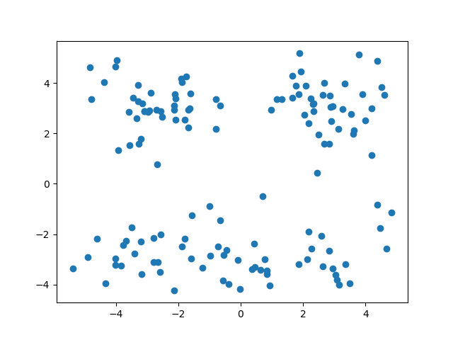|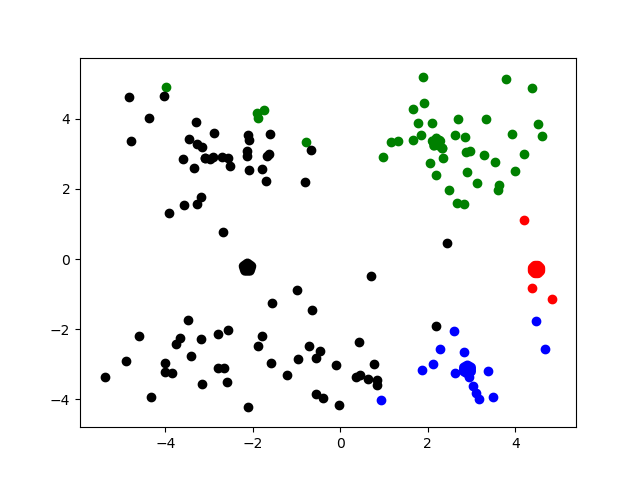|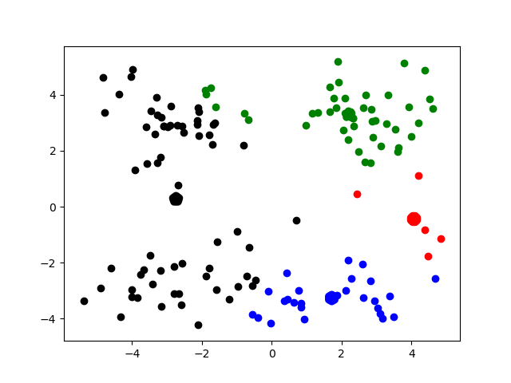|
|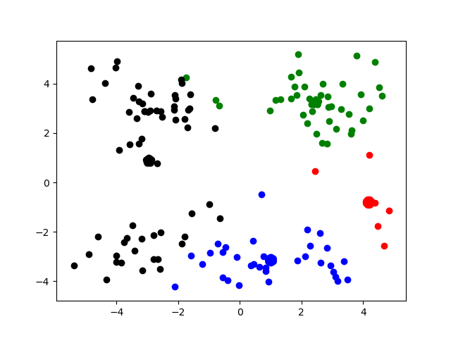|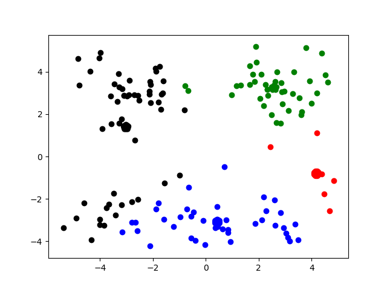|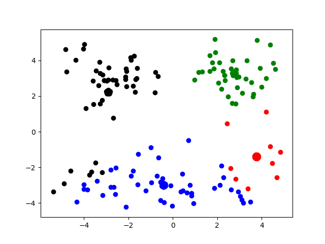|
|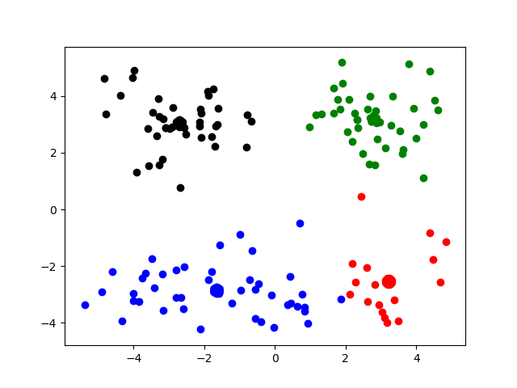|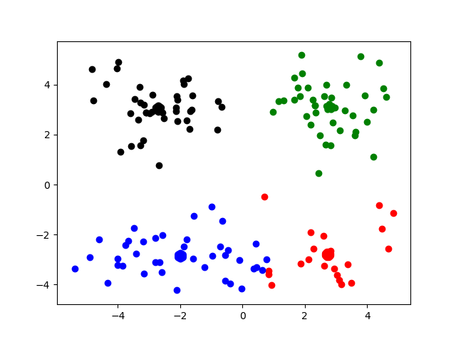||
||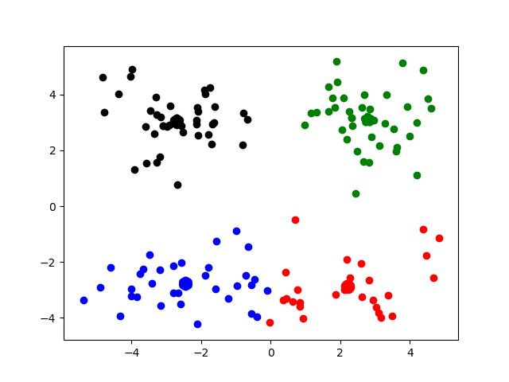||

### 5.2.2 bink-means
|第一次循环|第二次循环|第三次循环|
|-|-|-|
|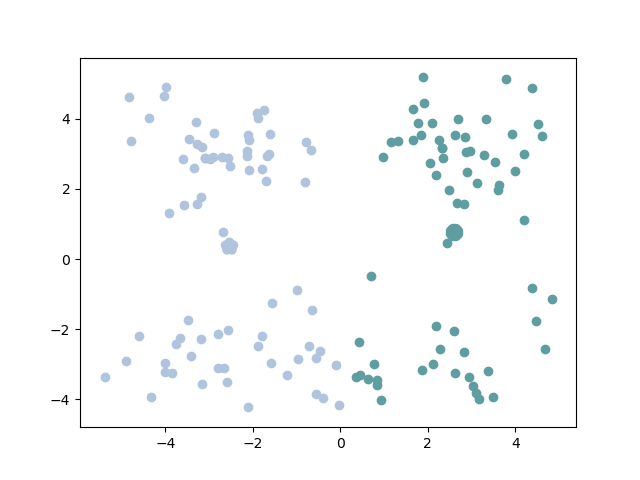|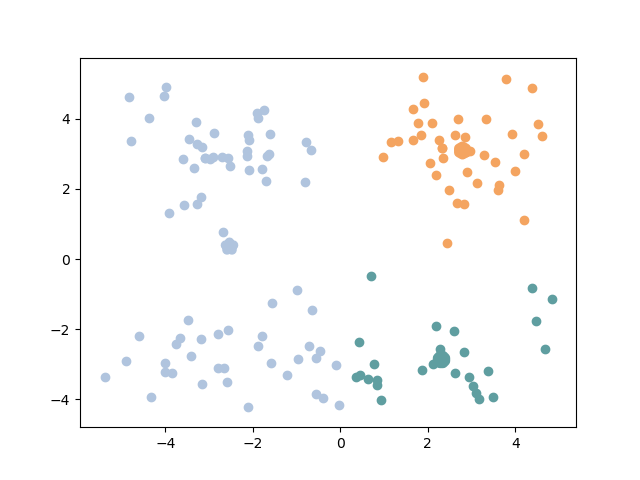|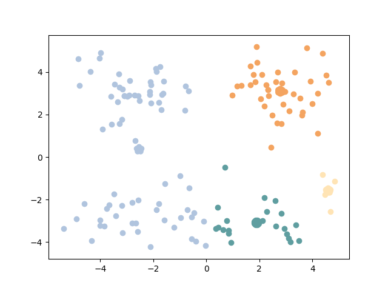|