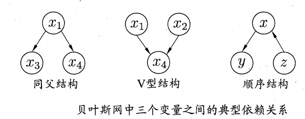
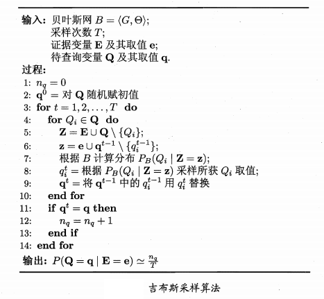

# 1 贝叶斯决策论
&emsp;&emsp;贝叶斯决策论是在概率框架下实施决策的基本方法。假设目标任务存在$N$中可能的类别标记${c_1, c_2, ..., c_N}$,$λ_{ij}$为将类$c_j$误分为$c_i$的损失，则基于后验概率$P(c_i|x)$所得到的期望损失即样本$x$上的条件风险为：
$$
R(c_i|x)=\sum_{j=1}^{N}{λ_{ij}P(c_j|x)}
$$
&emsp;&emsp;即希望通过找到一个判定准则$h(x)$以最小化总体风险：
$$
R(h)=𝔼_x[R(h(x)|x)]
$$
&emsp;&emsp;得到的最优的贝叶斯分类器为:
$$
h^{*}(x)=\argmax_{c∈y}{R(c|x)}
$$
&emsp;&emsp;将误判损失简化为:
$$
λ_{ij}=\begin{cases}
& 0, i=j \\
& 1
\end{cases}
$$
&emsp;&emsp;则条件风险为:
$$
R(c|x)=1-P(c|x)
$$
&emsp;&emsp;故最小化分类器误差即最大化后验概率$P(c|x)$
$$
h^{*}(x)=\argmax_{c∈y}P(c|x)
$$
&emsp;&emsp;但是由于现实中后验概率很难得到因此分为两种方法得到后验概率：
- 1. 判别式模型：根据有限的数据建模$P(c|x)$
- 2. 生成式模型：利用联合概率分布$P(x,c)$建模得到$P(c|x)$:

$$
P(c|x)=\frac{P(c)P(x|c)}{P(x)}
$$
&emsp;&emsp;其中$P(c)$是类的先验概率，P(x|c)是样本$x$相对于类别标记$c$的条件概率，亦称拟然，$P(x)$适用于归一化的证据因子。

# 2 朴素贝叶斯分类器
&emsp;&emsp;利用上面的贝叶斯决策论来估计后验概率最大的问题是条件概率$P(x|c)$本身是所有属性上的联合概率，而无法从有限的样本中估计。
&emsp;&emsp;朴素贝叶斯分类器采用独立同分布假设：假设已知类别之间所有属性相互独立，则上面的后验概率可写为：
$$
P(c|x)=\frac{P(c)P(x|c)}{P(x)}=\frac{P(c)}{P(x)}∏_{i=1}^{d}P(x_i|c)
$$
&emsp;&emsp;其中$d$为属性数目，$x_i$为样本$x$在第$i$个属性上的取值。因此最终的判定准则为:
$$
h_{nb}(x)=\argmax_{c∈y}P(c)∏_{i=1}^{d}P(x_i|c)
$$
&emsp;&emsp;因此令$D_c$为类别$c$的样本集合，$D_{c,x_i}$为$D_c$中第i个属性取值为$x_i$的样本集合则：
$$
P(c)=\frac{|D_c|}{|D|},P(x_i|c)=\frac{|D_{c,x_i}|}{D_c}
$$
&emsp;&emsp;进一步改进，为了避免其他属性携带的信息被未出现的属性值抹去，即概率值为0，引入拉普拉斯平滑，令$N$为$D$中可能的类别数量，$N_i$为第$i$个属性可能的取值数，则：
$$
\hat{P}(c)=\frac{|D_c|+1}{|D|+N},\hat{P}(x_i|c)=\frac{|D_{c,x_i}|+1}{|D_c|+N_i}
$$

# 3 半朴素贝叶斯分类器
&emsp;&emsp;朴素贝叶斯分类器的独立性假设很难成立，因此引入一部分属性之间存在依赖关系的半朴素贝叶斯分类器。独依赖估计" (One-Dependent Estimator，简称 ODE)是半朴素贝叶斯分类器最常用的一种策略。顾名思议，所谓"独依赖"就是假设每个属性在类别之外最多仅依赖于一个其他属性，即：
$$
P(c|x)∝P(c)∏_{i=1}^d P(x_i|c,pa_i)
$$
&emsp;&emsp;$pa_i$为属性$x_i$所依赖的属性，为$x_i$的父属性。
&emsp;&emsp;而如何为每个属性指定一个father，有以下几种做法：
- 1. SPODE(Super-Parent ODE)方法。所有的属性指定一个超父；
- 2. TAN(Tree Augmented naive Bayes)方法。在最大带权生成树算法的基础上通过以下步骤形成的树结构：
  - 1).计算任意两个属性之间的互信息:
$$
I(x_i,x_j|y)=\sum_{x_i,x_j;c∈y}{P(x_i,x_j|c)log\frac{P(x_i,x_j|c)}{P(x_i|c)P(x_j|c)}}；
$$
  - 2).以属性为结点构建完全图，任意两个结点之间的边的权重为$I(x_i,x_j|y)$；
  - 3).构建以此完全图的最大带权生成树，挑选root，将边置为有向边；
  - 4).加入类别结点$y$，增加从$y$到每个属性的有向边。
- 3. AODE(Averaged One-Dependent Estimator)方法。AODE是一种基于集成学习机制、更为强大的独立依赖分类器。AODE将每个属性作为超父属性后见SPODE，然后将能够有足够训练数据支撑的SPODE集成：
$$
P(c|x)∝∑^d_{i=1, |D_{x_i}≥m^{'}|}{P(c,x_i)∏_{j=1}^{d}P(x_j|c,x_i)}
$$   
$$
\hat{P}(c,x_i)=\frac{|D_{c,x_i}|+1}{|D|+N_i},\hat{P}(x_j|c,x_i)=\frac{|D_{c,x_i,x_j}|+1}{|D_{c,x_i}|+N_j}
$$ 
&emsp;&emsp;$N_i$为第$i$个属性可能的取值数，$D_{c,x_i}$为类别$c$在第$i$个属性上取值为$x_i$的样本集合，$D_{c,x_i,x_j}$是类别为$c$在第$i$和第$j$个属性上取值分别为$x_i,x_j$的样本集合。

# 4 贝叶斯网
&emsp;&emsp;贝叶斯网络也称为信念网络，借助有向无环图刻画属性之间的依赖关系，并使用条件概率表来描述属性的联合概率分布。
&emsp;&emsp;贝叶斯网$B$由结构$G$和参数$Θ$两部跟构成，$B=⟨G,Θ⟩$,网络结构$G$是一个有向无环图，每个节点对应一个属性，如两个属性有直接依赖关系，则将二者通过一条边链接，参数$Θ$定量描述这种依赖关系，如果属性$x_i$在$G$中的父节点集为$π_i$，则$Θ$包含了每个属性的条件概率表$\theta_{x_i|π_i}=P_B(x_i|\pi_i)$。

## 4.1 结构
&emsp;&emsp;贝叶斯网络有效的表达了属性之间的关系，给定父节点网络假设每个属性和它的非后裔结点独立对于$B=⟨G,Θ⟩$属性$x_1,...,x_d$的联合概率分布为：
$$
P_B(x_1,x_2,...,x_d)=∏_{i=1}^d P_B(x_i|π_i)=∏_{i=1}^dθ_{x_i|π_i}
$$
&emsp;&emsp;如下图可以明显的看到结点之间可能存在的三种关系，$x_3$和$x_4$在给定$x_1$时独立记为$x_3⊥x_4|x_1$，联合概率分布为:
$$
P(x_1,x_3,x_4)=P(x_1)P(x3|x_1)P(x_4|x_1)
$$

&emsp;&emsp;换句话说当$x_1$未知时$x_3,x_4$不独立，第二个$V$结构中相反,$x_4$确定$x_1,x_2$不独立，反之不独立。
&emsp;&emsp;可以用有向分离的方式分析网络中的属性间的条件独立性：
- 1. 找出有向图中的所有 V 型结构，在 V 型结构的两个父结点之间加上一条无向边;
- 2. 将所有有向边改为无向边。

&emsp;&emsp;由此产生的称之为道德图，令父节点相连的过程称为道德化。
&emsp;&emsp;基于道德图能直观、迅速地找到变量间的条件独立性。假定道德图中有变量$x,y$和变量集合$z = {z_i}$，若变量$x$和$y$能在图上被$z$分开，即从道德图中将变量集合$z$去除后 ，$x$和$y$分属两个连通分支，则称变量$x$和$y$被$z$有向分离，$x⊥y|z$ 成立。

## 4.2 学习
&emsp;&emsp;贝叶斯网络学习过程中使用的评分函数常基于信息论准则，此类准则将学习问题看作一个数据压缩任务，学习的目标是找到一个能以最短编码长度描述训练数据的模型，此时编码的长度包括了描述模型自身所需的字节长度和使用该模型描述数据所需的字节长度。最小长度的编码机制就是当前最优的编码，即最小描述长度准则。
&emsp;&emsp;给定训练集$D={x_1,x_2,...,x_m}$和贝叶斯网络$B=⟨G,Θ⟩$,$B$在$D$上的评分函数为：
$$
s(B|D)=f(θ)|B|-LL(B|D)
$$
&emsp;&emsp;其中$|B|$为贝叶斯网络的参数个数，$f(θ)$表示描述每个参数$θ$所需字节数，而$LL(B|D)=\sum_{i=1}^{m}log P_B(x_i)$为贝叶斯网络的对数拟然。
&emsp;&emsp;目标便是最小化$s(B|D)$。
&emsp;&emsp;如果$f(θ)=1$则每个参数用1个字节表示得到$AIC$:
$$
AIC(B|D)=|B|-LL(B|D)
$$
&emsp;&emsp;如果$f(θ)=\frac{1}{2}log m$则得到BIC:
$$
BIC(B|D)=\frac{log m}{2}|B|-LL(B|D)
$$
&emsp;&emsp;最理想的是直接根据贝叶斯网定义的联合概率分布来精确计算后验概率,这样的"精确推断"己被证明是NP难的。
&emsp;&emsp;从所有可能的网络结构空间搜索最优贝叶斯网结构是一个 NP难问题，难以快速求解.有两种常用的策略能在有限时间内求得近似解:第一种是贪心法，例如从某个网络结构出发，每次调整一条边(增加、删除或调整方，直到评分函数值不再降低为止;第二种是通过给网络结构施加约束来削减将结构限定为树形(半朴素贝叶斯分类器 搜索空间，例如将网络结构限定为树形结构等。
## 4.3 推断
&emsp;&emsp;当网络结点较多、连接稠密时，难以进行精确推断，此时需借助"近似推断"，通过降低精度要求，在有限时间内求得近似解。在现实应用中，贝叶斯网的近似推断常使用吉布斯采样 (Gibbs sampling，这是一种随机采样方法。

&emsp;&emsp;由于马尔可夫链通常需很长时间才能趋于平稳分布，因此吉布斯采样算法的收敛速度较慢。此外，若贝叶斯网中存在极端概率 "0" 或"1" ，则不能保证马尔可夫链存在平稳分布，此时吉布斯采样会给出错误的估计结果。