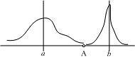
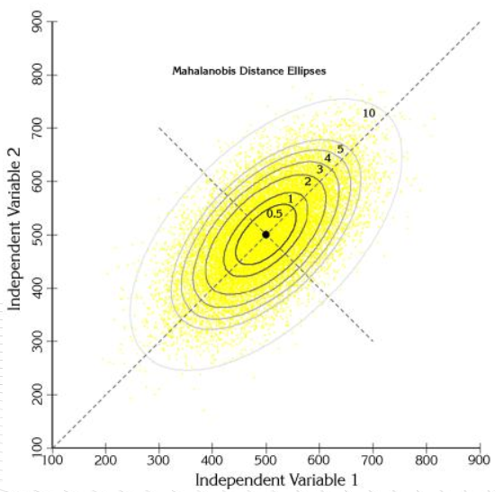

&emsp;&emsp;距离度量选取为两个点$a(x_{11}, x_{12}, ..., x_{1n}), b(x_{21}, x_{22}, ..., x_{2n}), n为维度$。
# 1 欧氏距离
&emsp;&emsp;欧氏距离是平时用的最多的度量方式：
$$
d_{ab}=\sqrt{\sum{(x_{1k} - x_{2k})^2}_{k=1}^{n}}
$$

# 2 曼哈顿距离
&emsp;&emsp;顾名思义，在曼哈顿街区要从一个十字路口开车到另一个十字路口，驾驶距离显然不是两点间的直线距离。这个实际驾驶距离就是“曼哈顿距离”。曼哈顿距离也称为“城市街区距离”(City Block distance)。
$$
d_{ab}=\sum{|x_{1k}-x_{2k}|}_{k=1}^{n}
$$
# 3 切比雪夫距离(Chebyshev Distance)
&emsp;&emsp;国际象棋中，国王可以直行、横行、斜行，所以国王走一步可以移动到相邻8个方格中的任意一个。国王从格子(x1,y1)走到格子(x2,y2)最少需要多少步？这个距离就叫切比雪夫距离。
$$
d_{ab}=\max{|x_{1i}-x_{2i}|}_i
$$
# 4 闵可夫斯基距离(Minkowski Distance)
&emsp;&emsp;闵氏距离不是一种距离，而是一组距离的定义，是对多个距离度量公式的概括性的表述。闵氏距离定义,两个n维变量a和b间的闵可夫斯基距离定义为：
$$
d_{ab}=(\sum_{k=1}^n{|x_{1k}-x_{2k}|^p})^{\frac{1}{p}}
$$
- $p=1$，曼哈顿距离；
- $p=2$，欧氏距离；
- $p\leftarrow \infty$,切比雪夫距离；
# 5 马氏距离(Mahalanobis Distance)

&emsp;&emsp;上图有两个正态分布的总体，它们的均值分别为a和b，但方差不一样，则图中的A点离哪个总体更近？或者说A有更大的概率属于谁？显然，A离左边的更近，A属于左边总体的概率更大，尽管A与a的欧式距离远一些。这就是马氏距离的直观解释。
&emsp;&emsp;概念：马氏距离是基于样本分布的一种距离。物理意义就是在规范化的主成分空间中的欧氏距离。所谓规范化的主成分空间就是利用主成分分析对一些数据进行主成分分解。再对所有主成分分解轴做归一化，形成新的坐标轴。由这些坐标轴张成的空间就是规范化的主成分空间。

&emsp;&emsp;马氏距离定义:有$M$个样本向量$X_1~X_m$，协方差矩阵记为$S$，均值记为向量$μ$，则其中样本向量$X$到$μ$的马氏距离表示为：
$$
D(x)=\sqrt{(X-μ)^TS^{-1}(X-μ)}
$$
&emsp;&emsp;向量$X_i$与$X_j$之间的马氏距离定义为：
$$
D(X_i, X_j)=\sqrt{(X_i-X_j)^TS^{-1}(X_i-X_j)}
$$
&emsp;&emsp;若协方差矩阵是单位矩阵（各个样本向量之间独立同分布），则Xi与Xj之间的马氏距离等于他们的欧氏距离（若协方差矩阵是对角矩阵，则就是标准化欧氏距离）。
&emsp;&emsp;特点：
- 量纲无关，排除变量之间的相关性的干扰；
- 要求总体样本数大于样本的维数，否则得到的总体样本协方差矩阵逆矩阵不存在， 这种情况下， 用欧式距离计算即可。

# 6 余弦距离(Cosine Distance)
&emsp;&emsp;几何中，夹角余弦可用来衡量两个向量方向的差异；机器学习中，借用这一概念来衡量样本向量之间的差异。
&emsp;&emsp;如果两个物品在同一条水平线上，则其夹角为零，对应的余弦值为1，代表完全相似。如果两个物品处于垂直的方向上，其夹角为90度，那么其余弦值为0，代表毫不相干。
$$
cos(\theta)=\frac{\sum{x_{1k}x_{2k}}_{k=1}^{n}}{\sqrt{\sum{x_{1k}^2}_{k=1}^n}\sqrt{\sum{x_{2k}^2}_{k=1}^n}}
$$

# 7 汉明距离(Hamming Distance)
&emsp;&emsp;汉明重量：是字符串相对于同样长度的零字符串的汉明距离，也就是说，它是字符串中非零的元素个数：对于二进制字符串来说，就是1的个数，所以11101的汉明重量是4。因此，如果向量空间中的元素a和b之间的汉明距离等于它们汉明重量的差$a-b$。

# 8 杰卡德距离(Jaccard Distance)
&emsp;&emsp;杰卡德相似系数(Jaccard similarity coefficient)：两个集合A和B的交集元素在A，B的并集中所占的比例，称为两个集合的杰卡德相似系数，用符号$J(A,B)$表示：
$$
J(A,B)=\frac{A\intercal B}{A∪B}
$$
&emsp;&emsp;杰卡德相距离(Jaccard Distance)：与杰卡德相似系数相反，用两个集合中不同元素占所有元素的比例来衡量两个集合的区分度：
$$
J_{\sigma}(A,B)=1-J(A,B)=\frac{|A∪B|-|A∩B|}{|A∪B|}
$$
# 9 标准化欧氏距离 (Standardized Euclidean Distance)
&emsp;&emsp;标准化欧氏距离是针对欧氏距离的缺点而作的一种改进。标准欧氏距离的思路：既然数据各维分量的分布不一样，那先将各个分量都“标准化”到均值、方差相等。假设样本集X的均值(mean)为m，标准差(standard deviation)为s，X的“标准化变量”表示为(如果将方差的倒数看成一个权重，也可称之为加权欧氏距离(Weighted Euclidean distance))：
$$
X^{*}=\frac{X-m}{s}
$$
&emsp;&emsp;标准化欧氏距离公式：
$$
d_{ab}=\sqrt{\sum_{k=1}^{n}{(\frac{x_{1k}-x_{2k}}{s_k})^2}}
$$
# 10 相关距离(Correlation distance)
&emsp;&emsp;相关系数：是衡量随机变量X与Y相关程度的一种方法，相关系数的取值范围是[-1,1]。相关系数的绝对值越大，则表明X与Y相关度越高。当X与Y线性相关时，相关系数取值为1（正线性相关）或-1（负线性相关）：
$$
ρ=\frac{Cov(X,Y)}{√{D(X)}√{D(Y)}}=\frac{E((X-EX)(Y-EY))}{√{D(X)}√{D(Y)}}
$$
&emsp;&emsp;相关距离:
$$
D_{xy}=1-ρ_{XY}
$$

# 11 信息熵(Information Entropy)
&emsp;&emsp;以上的距离度量方法度量的皆为两个样本（向量）之间的距离，而信息熵描述的是整个系统内部样本之间的一个距离，或者称之为系统内样本分布的集中程度（一致程度）、分散程度、混乱程度（不一致程度）。系统内样本分布越分散(或者说分布越平均)，信息熵就越大。分布越有序（或者说分布越集中），信息熵就越小。
$$
Entropy(X)=\sum_{i=1}^{n}{-p_i log_2p_i}
$$