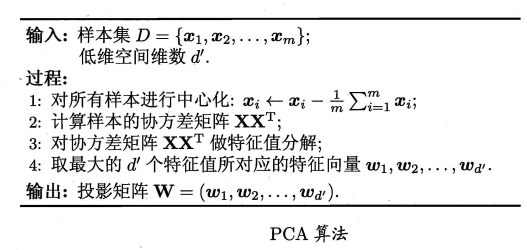

# 1 降维
&emsp;&emsp;任意测试样本 a 附近任意小的 6 距
离范围内总能找到一个训练样本，即训练样本的来样密度足够大，或称为"密度采样" (dense sample)。密度采样是部分机器学习方法的前提。事实上，在高维情形下 出 现的数据样本稀疏、 距离计算困 难等问题，是所有机器学习方法共同面 临 的严重 障碍， 被称为" 维数灾难" (curse of dimensionality) 。缓解维数灾难的一个重要途径是降维 (dimension reduction)， 亦称" 维数约简，即通过某种数学变换将原始高维属性空间转变为 一个低维"子空间"(subspace)，在这个子空间中样本密度大幅提高 ，距离计算也变得更为容易。
## 1.1 低维嵌入
&emsp;&emsp;低维嵌入是任务对于高维空间的数据仅仅学习任务相关的低维分布。

&emsp;&emsp;若要求原始空间中样本之间的距离在低维空间中得以保持，即得到"多维缩放" (Multiple Dimensional Scaling，简称 MDS)。
&emsp;&emsp;假设$m$个样本在原始空间的距离矩阵为$D∈\mathbb{R}^{m×m},dist_{ij}∈ℝ$，目标是活的样本在$\hat{d}$维空间的表示$Z∈ℝ^{\hat{d}×m},\hat{d}≤d$,且该空间中任意两个样本的距离等于原始空间的距离。
&emsp;&emsp;令$B=Z^TZ∈ℝ^{m×m}$则：
$$
dist^2_{ij}=||z_i||^2+||z_j||^2-2z_i^Tz_j=b_{ii}+b_{jj}-2b_{ij},b_ij=z_i^Tz_j
$$
&emsp;&emsp;对样本$Z$进行中心化，即$∑_{i=1}^mz_i=0$,则$∑_{i=1}^mb_{ij}=∑_{j=1}^m b_{ij}=0$:
$$
∑_{i=1}^m dist^2_{ij}=tr(B)+mb_{jj}
$$

$$
∑_{j=1}^m dist^2_{ij}=tr(B)+mb_{ii}
$$

$$
∑_{i=1}^m∑_{j=1}^m dist^2_{ij}=2m tr(B)
$$
&emsp;&emsp;tr表示矩阵的迹,tr(B)=∑_{i=1}^m||z_i||^2,令：
$$
dist^2_{i∙}=\frac{1}{m}∑_{j=1}^m dist^2_{ij}
$$

$$
dist^2_{∙j}=\frac{1}{m}∑_{i=1}^m dist^2_{ij}
$$

$$
dist^2_{∙∙}=\frac{1}{m^2}∑_{i=1}^m ∑_{j=1}^m dist^2_{ij}
$$

$$
⇒b_{ij}=-\frac{1}{2}(dist^2_{ij}-dist^2_{i∙}-dist^2_{∙j}+dist^2_{∙∙})
$$
&emsp;&emsp;对$B$进行特征值分解，$B=VΛV^T$，其中$Λ=diag(λ_1,λ_2,...,λ_d)$为对角矩阵，$λ_1≥...≥λ_d$,$V$为特征向量矩阵，假定其中有$\hat{d}$个非0特征值构成对角阵（$\hat{Λ}为相应的对角阵$，$\hat{V}$表示相应的特征向量矩阵）则：
$$
Z=\hat{Λ}^{\frac{1}{2}}\hat{V}^T∈ℝ^{\hat{d}×m}
$$
&emsp;&emsp;在现实应用中为了有效降维，往往仅需降维后的距离与原始空间中的距离尽可能接近?而不必严格相等。


## 1.2 主成成分分析
&emsp;&emsp;对于正交属性空间中的样本点，如果存在可以对所有样本进行恰当表达的超平面则：
- 最近重构性:样本点到这个超平面的距离都足够近;
- 最大可分性.样本点在这个超平面上的投影能尽可能分开。
&emsp;&emsp;假定对数据样本进行中心化即$\sum_{i}x_i=0$;假定投影变换后的新坐标系为${w_1,w_2,...,w_d}$,$w_i$为标准正交基向量，即$||w_i||_2=1,w_i^Tw_j=0(i、\ne j)$,若丢弃新坐标系中的部分坐标，即将维度降低到$\hat{d}<d$,则样本点$x_i$在低维坐标中的投影为$z_i=(z_{i1};...;z_{i}),z_{ij}=w^T_jx_i$,如果基于$z_i$重构$x_i$,则$x_i=\sum_{j=1}^{\hat{d}}z_{ij}w_j$,原样本点和重构后的样本点的距离为：
$$
\sum_{i=1}^{m}||\sum_{j=1}^{\hat{d}z_{ij}w_j-x_i}||^2=\sum_{i=1}^m z_i^Tz_i-2\sum_{i=1}^mz_i^TW^Tx_i+const \varpropto - tr(W^T(\sum_{i=1}^mx_ix_i^T)W)
$$
&emsp;&emsp;PCA的优化目标便是最小化：
$$
min_{W} -tr(W^TXX^TW), s.t. W^TW=I
$$

$$
max_w tr(W^TXX^TW), s.t. W^TW=I
$$
&emsp;&emsp;上面的公式第一个是最小化样本点到平面的距离，第二个是最大化方差基本等价。

&emsp;&emsp;引入拉格朗日乘子对上式进行解：
$$
XX^TW=\lambda W
$$
&emsp;&emsp;对$XX^T$进行特征分解，将求得的特征值排序$\lambda_1\ge...,\ge\lambda_d$,然后取前$\hat{d}$个特征值，其特征向量便构成$W=(w_1,...,w_{\hat{d}})$


## 1.3 核化线性降维
&emsp;&emsp;线性阵维方法假设从高维空间到低维空间的函数映射是线性的，然|旬，在
不少现实任务中，可能需要非线性映射才能找到恰当的低维嵌入。

&emsp;&emsp;非线性阵维的 一种常用 方法，是基于核技巧对线性 降维方法进行"核
化" (kernelized)。
&emsp;&emsp;对于PCA假设目标是将数据投影到$W$确定的超平面上，即要求解：
$$
(\sum_{i=1}^m z_iz_i^T)W=\lambda W
$$
&emsp;&emsp;其中$z_i$是样本点$x_i$在高维特征空间中的像，则：
$$
W=\sum_{i=1}^m z_i\frac{z_i^TW}{\lambda}=\sum_{i=1}^m z_i \alpha_i
$$
&emsp;&emsp;假定原始属性空间中的样本点$x_i$通过映射$\phi$产生，即$z_i=\phi(x_i),i=1,...,m$,则
$$
(\sum^m\phi(x_i)\phi(x_i)^T)W=\lambda W
$$

$$
W=\sum_{i=1}^m\phi(x_i)\alpha_i
$$
&emsp;&emsp;引入核函数$\kappa(x_i,x_j)=\phi(x_i)^T\phi(x_j)$,则：
$$
KA=\lambda A
$$
&emsp;&emsp;$K$为核矩阵，$(K)_{ij}=\kappa(x_i,x_j), A=(\alpha_i;...,\alpha_m)$，求解同PCA。

## 1.4 流行学习
&emsp;&emsp;流形学(manifold learning)是一类借鉴了拓扑流形概念的降维方法.
"流形"是在局部与欧氏空间同胚的空间，换言之，它在局部具有欧氏空间的性质，能用欧氏距离来进行距离计算.这给降维方法带来了很大的启发:若低维流形嵌入到高维空间中,则数据样本在高维空间的分布虽然看上去非常复杂，但在局部上仍具有欧氏空间的性质，因此，可以容易地在局部建立阵维映射关系，然后再设法将局部映射关系推广到全局。


## 1.5 度量学习
&emsp;&emsp;在机器学习中对高维数据进行降维的主要目的是希望找-个合适的低
维空间，在此空间中进行学习能比原始空间性能更好.事实上，每个空间对应了在样本属性上定义的一个距离度量，而寻找合适的壁间，实质上就是在寻找一个合适的距离度量.那么，为何不直接尝试"学习"出一个合适的距离度量呢,这就是度量学习 (metric learning) 的基本动机.

# 2 实现
## 2.1 pca
```python
def pca(datamat, topnfeat=9999999):
    meanvals = mean(datamat, axis=0)
    meanremoved = datamat - meanvals #remove mean
    covmat = cov(meanremoved, rowvar=0)
    eigvals,eigvects = linalg.eig(mat(covmat))
    eigvalind = argsort(eigvals)            #sort, sort goes smallest to largest
    eigvalind = eigvalind[:-(topnfeat+1):-1]  #cut off unwanted dimensions
    redeigvects = eigvects[:,eigvalind]       #reorganize eig vects largest to smallest
    lowddatamat = meanremoved * redeigvects#transform data into new dimensions
    reconmat = (lowddatamat * redeigvects.t) + meanvals
    return lowddatamat, reconmat
```
