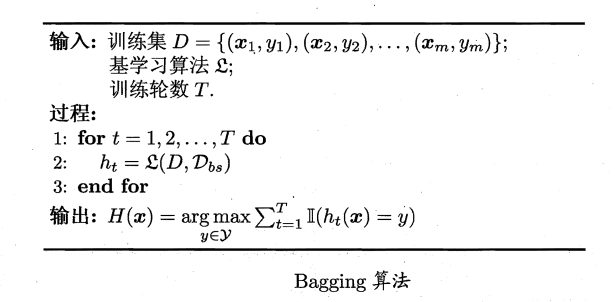

# 1 集成学习分类
&emsp;&emsp;集成学习方法使用多种学习算法来获得比单独使用任何单独的学习算法更好的预测性能。集成学习中的学习其类型相同为则称集成学习是同质的，，对应的个体学习器为基学习器，学习算法为基学习算法；反之为异质的，个体学习器称为组件学习器。
&emsp;&emsp;集成学习目标是获得更好的性能但是多个学习器的集成一般只能保证获得高于最差低于最好的性能，因此如何保证集成学习的性能强度也是关键。
## 1.1 Boosting
&emsp;&emsp;Boosting通过在训练新模型实例时更注重先前模型错误分类的实例来增量构建集成模型。算法的基本机制：先从初始训练集训练出一个基学习器，再根据基学习器的表现对训练样本分布进行调整，使得先前基学习器做错的训练样本在后续受到更多关注，然后基于调整后的样本分布来训练下一个基学习器;如此重复进行，直至基学习器数目达到事先指定的值。Boosting的学习算法中最具代表性的便是AdaBoost。
&emsp;&emsp;AdaBoost的模型表示为：
$$
H(\boldsymbol{x})=\sum_{t=1}^{T} \alpha_{t} h_{t}(\boldsymbol{x})
$$
&emsp;&emsp;目标是最小化指数损失函数：
&emsp;&emsp;算法步骤如下:


1. 初始化每个样本的权重为$\frac{1}{m}$;
2. 训练$T$个分类器;
3. $h(t)$为当前分类器，计算训练器误差$ε_t$;
4. 如果误差符合条件则不再更新权重；
5. 更新当前分类器的权重$α_t$;
6. 更新每个样本的权重，$Z_t$为$∑{D_t(x)}$
7. 得到最终的联合分类器。

&emsp;&emsp;其中更新$α_t$的推导为：
$$
\frac{\partial \ell_{\exp }\left(\alpha_{t} h_{t} | \mathcal{D}_{t}\right)}{\partial \alpha_{t}}=-e^{-\alpha_{t}}\left(1-\epsilon_{t}\right)+e^{\alpha_{t}} \epsilon_{t}
$$
&emsp;&emsp;令上式为0得到解:
$$
\alpha_{t}=\frac{1}{2} \ln \left(\frac{1-\epsilon_{t}}{\epsilon_{t}}\right)
$$
AdaBoost的优点是低泛化误差，分类准确率高，不用担心过拟合；缺点是对离群点比较敏感。

## 1.2 Bagging

1. 从原始样本集中抽取训练集。每轮从原始样本集中使用Bootstraping的方法抽取n个训练样本（在训练集中，有些样本可能被多次抽取到，而有些样本可能一次都没有被抽中）。共进行k轮抽取，得到k个训练集。（k个训练集之间是相互独立的）;
2. 每次使用一个训练集得到一个模型，k个训练集共得到k个模型;
3. 对分类问题：将上步得到的k个模型采用投票的方式得到分类结果；对回归问题，计算上述模型的均值作为最后的结果。

## 1.3 随机森林
&emsp;&emsp;随机森林(Random Forest，简称RF)是 Bagging的一个扩展变体.盯在以决策树为基学习器构建 Bagging 集成的基础上，进一步在决策树的训练过程中引入了随机属性选择.具体来说，传统决策树在选择划分属性时是在当前结点的属性集合(假定有 d 个属性)中选择一个最优属性;而在RF 中，对基决策树的每个结点，先从该结点的属性集合中随机选择一个包含k,个属性的子集，然后再从这个子集 中选择一个最优属性用 于划分. 这里 的参数k控制了 随机性的引入程度 ;若令 k = d ， 则基决策树的构建与 传统决策树相同。

## 1.4 stacking

&emsp;&emsp;训练一个多层(一般是两层，本文中默认两层)的学习器结构，第一层(也叫学习层)用n个不同的分类器(或者参数不同的模型)将得到预测结果合并为新的特征集，并作为下一层分类器的输入。


# 2 集成策略
## 2.1 平均法
- 简单平均：
$$
H(\boldsymbol{x})=\frac{1}{T} \sum_{i=1}^{T} h_{i}(\boldsymbol{x})
$$
- 加权平均：
$$
H(\boldsymbol{x})=\sum_{i=1}^{T} w_{i} h_{i}(\boldsymbol{x})
$$
## 2.2 投票法
- 绝对多数投票法：即若某标记得票过半数，则预测为该标记;否则拒绝预测；
$$
H(\boldsymbol{x})=\left\{\begin{array}{ll}
{c_{j},} & {\text { if } \sum_{i=1}^{T} h_{i}^{j}(\boldsymbol{x})>0.5 \sum_{k=1}^{N} \sum_{i=1}^{T} h_{i}^{k}(\boldsymbol{x})} \\
{\text { reject, }} & {\text { otherwise. }}
\end{array}\right.
$$
- 相对多数投票法：即预测为得票最多的标记，若同时有多个标记获最高票，则从中随机选取一个;
$$
H(\boldsymbol{x})=c_{\arg \max } \sum_{i=1}^{T} h_{i}^{j}(\boldsymbol{x})
$$
- 加权投票法
$$
H(\boldsymbol{x})=c_{\text {arg } \max } \sum_{i=1}^{T} w_{i} h_{i}^{j}(\boldsymbol{x})
$$
# 3 多样性
&emsp;&emsp;集成学习应该尽可能的保证学习器的多样性。
## 3.1 多样性度量
- 不合度量：值域为 [0 ， 1]. 值越大则多样性越太.
$$
d i s_{i j}=\frac{b+c}{m}
$$

- 相关系数：值域为[-1,1]，0表示不相关，-1负相关，1正相关
$$
\rho_{i j}=\frac{a d-b c}{\sqrt{(a+b)(a+c)(c+d)(b+d)}}
$$
- Q-统计量
$$
Q_{i j}=\frac{a d-b c}{a d+b c}
$$
- $κ$统计量：$p_1$是两个分类器取得一致的概率;$p_2$是两个分类器偶然达成一致的概率:
$$
\kappa=\frac{p_{1}-p_{2}}{1-p_{2}}
$$

$$
\begin{array}{l}
{p_{1}=\frac{a+d}{m}} \\
{p_{2}=\frac{(a+b)(a+c)+(c+d)(b+d)}{m^{2}}}
\end{array}
$$
## 3.2 多样性增强
- 数据样本扰动：给定初始数据集， 可从中产生出不同的数据子集， 再利用不 同 的数据子集训练出不同的个体学习器;
- 输入属性扰动:训练样本通常由一组属性描述，不同的"子空间" (subspace，即属性子集)提供了观察数据的不同视角：

- 输出表示扰动:对输出表示进行操纵以增强多样性.可对训练样本的类标记稍作变动;
- 算法参数扰动
# 4 实现
## 4.1 Adaboost
```python
def classify(data, dim, thresh, thresh_op):
    ret = np.ones((np.shape(data)[0], 1))
    if thresh_op == 'lt':
        ret[data[:,dim] <= thresh] = -1.0
    else:
        ret[data[:,dim] > thresh] = -1.0
    return ret
    
def build_stump(data, label, d):
    data = np.mat(data)
    label = np.mat(label).T
    m,n = np.shape(data)
    steps = 10
    best_stump = {}
    bast_cls_est = np.mat(np.zeros((m, 1)))
    min_err = np.inf
    for i in range(n):
        range_min = data[:,i].min()
        randge_max = data[:,i].max()
        step_size = (randge_max - range_min) / steps
        for j in range(-1, steps + 1):
            for op in ['lt', 'gt']:
                thresh = range_min + j * step_size
                pred_val = classify(data, i, thresh, op)
                err = np.mat(np.ones((m, 1)))
                err[pred_val == label] = 0
                weight_err = d.T * err
                if weight_err < min_err:
                    min_err = weight_err
                    bast_cls_est = pred_val.copy()
                    best_stump['dim'] = i
                    best_stump['thresh'] = thresh
                    best_stump['op'] = op
    
    return best_stump, min_err, bast_cls_est
    

def ada_train(data, label, epoch=100):
    weak_cls = []
    m = np.shape(data)[0]
    d = np.mat(np.ones((m, 1))/m)
    agg_cls_est = np.mat(np.zeros((m, 1)))
    for i in range(epoch):
        best_stump, err, cls_est = build_stump(data, label, d)
        alpha = 0.5 * float(np.log((1-err)/max(err, 1e-16)))
        best_stump['alpha'] = alpha
        weak_cls.append(best_stump)
        expilsion = np.multiply(-1 * alpha * np.mat(label).T, cls_est)
        d = np.multiply(d, np.exp(expilsion))
        d = d/ d.sum()
        agg_cls_est += alpha * cls_est
        agg_err = np.multiply(np.sign(agg_cls_est) != np.mat(label).T, np.ones((m, 1)))
        err_rate = agg_err.sum()/m
        #print('error is ', err_rate)
        if err_rate == 0.0:
            break
    return weak_cls, agg_cls_est

def ada_classify(data,classifier):
    data = np.mat(data)#do stuff similar to last agg_cls_est in adaBoostTrainDS
    m = np.shape(data)[0]
    agg_cls_est = np.mat(np.zeros((m,1)))
    for i in range(len(classifier)):
        cls_est = classify(data,classifier[i]['dim'],\
                                 classifier[i]['thresh'],\
                                 classifier[i]['op'])#call stump classify
        agg_cls_est += classifier[i]['alpha']*cls_est
    return np.sign(agg_cls_est)
```
## 4.2 结果


